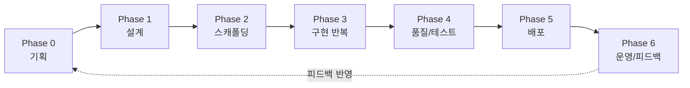

# 프로세스 기준 문서 (PROCESS)

> 이 문서는 프로젝트의 **최상위 기준**이다. 모든 작업은 여기 정의된 단계(Phase)와 하위 작업(Step) 순서를 따르며,
> 각 단계는 **산출물이 완성되고 사용자 승인(게이트 통과)을 받아야** 다음 단계로 넘어간다.
> 지금 어느 단계에 있는지는 이 문서 맨 아래 "현재 위치"에 기록한다.

## 전체 흐름

## 적용 대상과 요청 유형

이 프로세스는 앱뿐 아니라 **기능 추가, 시스템/자동화, 라이브러리/API 등 모든 유형의 요청**에 적용된다.
Phase 0.1에서 **가장 먼저 요청 유형을 판별**하고, 아래 표에 따라 각 Phase를 조정한다. 판별 결과와 조정 내용은 PRD 상단에 기록한다.

| 유형 | 예시 | 프로세스 조정 |
|------|------|--------------|
| **새 프로덕트** | 웹/모바일/데스크톱 앱, 신규 서비스 | 조정 없음 — Phase 0~6 전체 수행 |
| **기존 시스템에 기능 추가** | 운영 중인 코드베이스에 새 기능·개선 | Phase 1에 "기존 구조·컨벤션 분석" 하위 작업 추가. Phase 2는 스캐폴딩 대신 "개발 환경 재현 + 기존 테스트 통과 확인"으로 대체. 규모가 작으면 PRD·설계를 `docs/features/<기능명>.md` 한 파일(미니 PRD + 미니 설계)로 통합 가능 |
| **시스템/자동화/파이프라인** | 배치 작업, 봇, 데이터 파이프라인, 내부 도구 | 사용자 시나리오를 "트리거 → 처리 → 결과/부수효과" 형식으로 작성. Phase 4에 실패·재시도·멱등성 점검을 필수 추가. UI 관련 항목(4.2, 4.6)은 해당 시에만 |
| **라이브러리/API** | SDK, 내부 API, 공용 모듈 | 시나리오 = 호출 예시 코드, 성공 기준 = API 계약과 테스트. Phase 4에 하위 호환성 점검 추가. 배포 = 버전 릴리스 |

유형이 표에 없거나 복합적이면(예: 앱 + 파이프라인), 가장 가까운 유형을 기준으로 조정안을 제안하고 사용자 확인을 받는다.

## 문서 지도

| 문서 | 역할 | 주로 만들어지는 단계 | 갱신되는 시점 |
|------|------|--------------------|--------------|
| `PROCESS.md` (이 문서) | 전체 작업 흐름의 기준 | 프로젝트 시작 시 | 프로세스 자체를 바꿀 때만 |
| `PRD.md` | 무엇을, 왜 만드는가 | Phase 0 | 범위 변경 시 (코드보다 먼저) |
| `TECH-SPEC.md` | 어떻게 만드는가 | Phase 1 | 설계 변경 시 (코드보다 먼저) |
| `ROADMAP.md` | 지금 무엇을 만들 차례인가 | Phase 2 말 | 슬라이스 완료·추가 시마다 |
| `DECISIONS.md` | 왜 그렇게 결정했는가 | 전 단계 | 중요 결정이 나올 때마다 |
| `CLAUDE.md` | 세션마다 적용되는 작업 규칙·컨벤션 | Phase 2 | 컨벤션 확정·변경 시 |

---

## Phase 0 — 기획 (Discovery & PRD)

**목적**: 코드를 한 줄도 쓰기 전에 "누구의 어떤 문제를 어떻게 풀 것인가"를 확정한다.

| # | 하위 작업 | 방식 |
|---|----------|------|
| 0.1 | 요청 유형 판별 + 아이디어 인터뷰 | 먼저 위 유형 표에서 유형 확정, 이후 3~5개씩 질문, 추측 금지 |
| 0.2 | 문제·타겟 사용자 정의 | 페르소나 1~2개로 압축 (내부 도구면 실제 사용 주체) |
| 0.3 | 핵심 시나리오 도출 | 3~5개, 유형에 맞는 형식 — 앱: "열고 → 하고 → 얻는다" / 시스템: "트리거 → 처리 → 결과" / API: 호출 예시 |
| 0.4 | 범위 확정 | MVP / 후순위 / **안 만들 것** 3분류 |
| 0.5 | 성공 기준·리스크 정리 | 측정 가능한 조건으로 |

- **산출물**: `PRD.md` 완성본
- **게이트**: 사용자가 PRD를 읽고 승인. 승인 전에는 설계·코드 작업 금지.

## Phase 1 — 설계 (Tech Design)

**목적**: PRD를 실현할 기술적 방법을 확정한다. 화면보다 데이터 모델을 먼저 잡는다.

| # | 하위 작업 | 방식 |
|---|----------|------|
| 1.1 | 플랫폼·스택 선정 | 선택지 2~3개 + 트레이드오프 제시 → 사용자 결정 |
| 1.2 | 데이터 모델 설계 | 엔티티·필드·관계 |
| 1.3 | 아키텍처 설계 | 컴포넌트 관계·데이터 흐름 다이어그램 |
| 1.4 | 외부 서비스/API 확정 | 비용·제한 포함 |
| 1.5 | 폴더 구조 설계 | 각 폴더의 책임 명시 |

- **산출물**: `TECH-SPEC.md` 완성본, `DECISIONS.md`에 주요 결정 기록
- **게이트**: 사용자가 TECH-SPEC 승인.

## Phase 2 — 스캐폴딩 (Scaffolding)

**목적**: 빌드→실행→테스트가 되는 뼈대를 만든다. 기능은 아직 없어도 파이프라인이 먼저다.
(유형이 "기존 시스템에 기능 추가"면 이 Phase는 "개발 환경 재현 + 기존 테스트 통과 확인 + 기존 컨벤션 파악"으로 대체한다.)

| # | 하위 작업 | 완료 확인 방법 |
|---|----------|---------------|
| 2.1 | 저장소 초기화 (git, 폴더 구조) | TECH-SPEC의 구조와 일치 |
| 2.2 | 린터·포매터 설정 | 명령 한 번으로 실행됨 |
| 2.3 | 테스트 러너 설정 | 샘플 테스트 1개 통과 |
| 2.4 | "Hello World" 골격 실행 | 실제 실행 화면/출력 확인 |
| 2.5 | `CLAUDE.md` 컨벤션 기록 | 실행·테스트 명령, 커밋 규칙 기재 |
| 2.6 | `ROADMAP.md` 작성 | MVP를 수직 슬라이스로 분해, 우선순위 부여 |

- **산출물**: 실행 가능한 프로젝트 골격, `ROADMAP.md`
- **게이트**: 사용자가 실행 결과와 로드맵 승인.

## Phase 3 — 구현 (반복 사이클)

**목적**: 로드맵의 슬라이스를 하나씩 완결한다. **한 사이클에 슬라이스 하나만.**

각 슬라이스의 사이클:

| # | 하위 작업 | 규칙 |
|---|----------|------|
| 3.1 | 문서 확인 | `ROADMAP.md`에서 대상 확인, `PRD.md`·`TECH-SPEC.md` 범위 재확인 |
| 3.2 | 구현 | 문서에 없는 기능 임의 추가 금지 |
| 3.3 | 실행 검증 | 실제로 실행해(앱 구동·명령 실행·API 호출 등 유형에 맞게) 완료 조건 충족을 확인 |
| 3.4 | 테스트 작성 | 핵심 로직 + 이번 슬라이스의 완료 조건 |
| 3.5 | 커밋 | 슬라이스 단위로 작게 |
| 3.6 | 문서 갱신 | `ROADMAP.md` 상태 갱신, 설계가 바뀌었으면 해당 문서 먼저 수정 |

- **게이트**: 슬라이스마다 사용자에게 결과 보고. 방향 수정은 이때 받는다.

## Phase 4 — 품질/테스트 (QA & Hardening)

**목적**: "정상 경로만 동작하는 프로덕트"를 "완성된 프로덕트"로 만든다. MVP 슬라이스가 모두 ✅일 때 시작.
(유형별 필수 추가 — 시스템/자동화: 실패·재시도·멱등성 / API: 하위 호환성. UI 없는 유형은 4.2·4.6 생략 가능.)

| # | 하위 작업 | 도구/방식 |
|---|----------|----------|
| 4.1 | 엣지 케이스 점검 | 빈 데이터, 긴 입력, 네트워크 실패, 동시 입력 |
| 4.2 | 로딩·에러·빈 상태 정비 | UI가 있으면 모든 화면에 3종 세트 |
| 4.3 | 코드 리뷰 | `/code-review` 실행 후 지적사항 처리 |
| 4.4 | 보안 점검 | `/security-review` — 인증, 입력 검증, 시크릿 노출 |
| 4.5 | 성능 점검 | 측정 먼저, 느린 곳만 최적화 |
| 4.6 | 접근성·UX 디테일 | 키보드 탐색, 대비, 반응형 |

- **산출물**: 점검 결과와 수정 내역 (ROADMAP 하단에 기록)
- **게이트**: 사용자가 배포 가능 상태임을 승인.

## Phase 5 — 배포 (Release)

| # | 하위 작업 |
|---|----------|
| 5.1 | 배포 환경·CI/CD 구성 (수동 배포 금지) |
| 5.2 | 환경 변수·시크릿 정리 (`.env.example` 최신화) |
| 5.3 | 에러 모니터링·최소 사용 지표 연결 |
| 5.4 | 배포 실행 및 프로덕션 동작 확인 |

- **게이트**: 프로덕션에서 핵심 시나리오가 동작함을 확인.

## Phase 6 — 운영/피드백 (Operate & Iterate)

| # | 하위 작업 |
|---|----------|
| 6.1 | 사용자 피드백·에러 로그 수집 |
| 6.2 | 피드백을 `PRD.md`의 시나리오·범위에 반영 |
| 6.3 | `ROADMAP.md`에 새 슬라이스 추가 → Phase 3으로 회귀 |

---

## 공통 규칙

1. **게이트 통과 없이 다음 Phase 진입 금지.** 여러 Phase를 한 턴에 진행하지 않는다.
2. **문서가 코드보다 먼저 바뀐다.** 구현 중 설계 변경이 필요하면 승인 → 문서 갱신 → 코드 순서.
3. **추측 금지.** 정보가 부족하면 질문한다.
4. **매 응답 끝에 "현재 위치(Phase.Step) / 다음 액션"을 한 줄로 표시한다.**

## 현재 위치

> **Phase 3 — 슬라이스 1 스파이크 판정 통과(Claude 표면 21/21, 2026-08-22) → 유지보수 사이클 진행 중**
> **정본 2종**: 판정 실기록 = docs/spike-judgment-log.md · 유지보수 계획 = **docs/MAINTENANCE-PLAN.md**(Phase M0~M5, 현재 M0 게이트 대기).
> 남은 순서: **M0 게이트(오너 결정 3건)** → M1 계측기 → M2 검색 정확도 수정 → M3 문구 → M4 재판정 → M5 Codex 21문 → main 병합 승인 → Phase N(관계 한글화)
> 사전 자료 검토 완료: req_node_relation.txt(KG 추출 프롬프트), KG_Demon Slayer_Draft_01.json(예시 그래프), 리디안_지식그래프/GraphRAG_1st(동작하는 3D 시각화 웹앱 — Vite+React+react-force-graph-3d, 테스트·린트·Vercel 배포 구성 보유)
