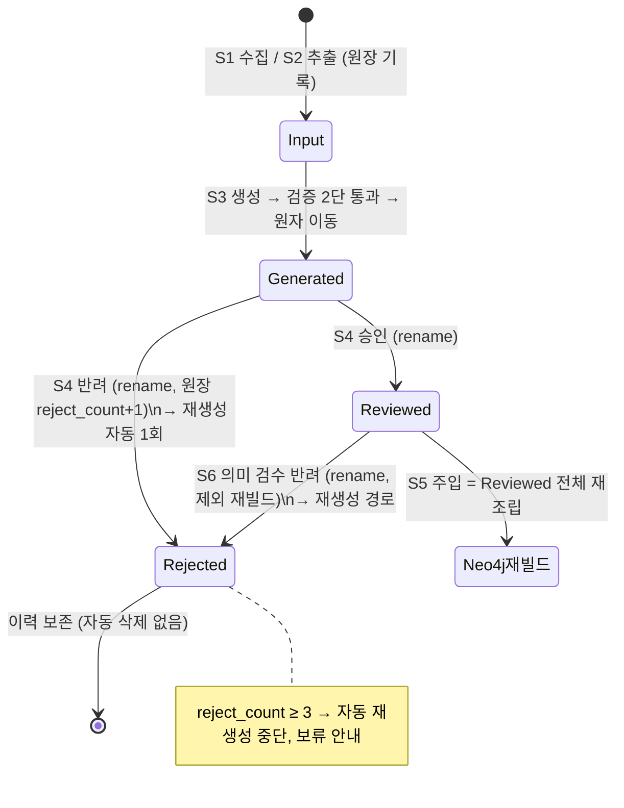
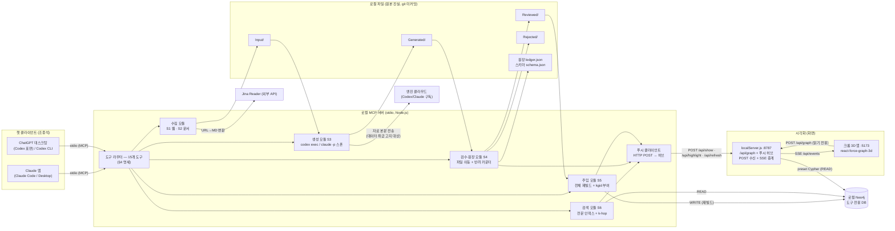
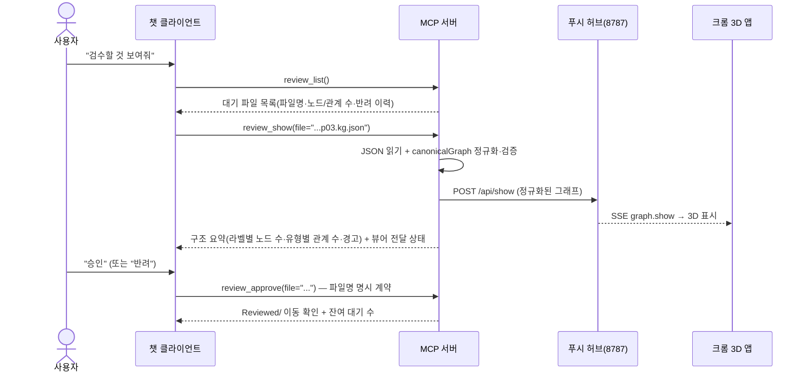
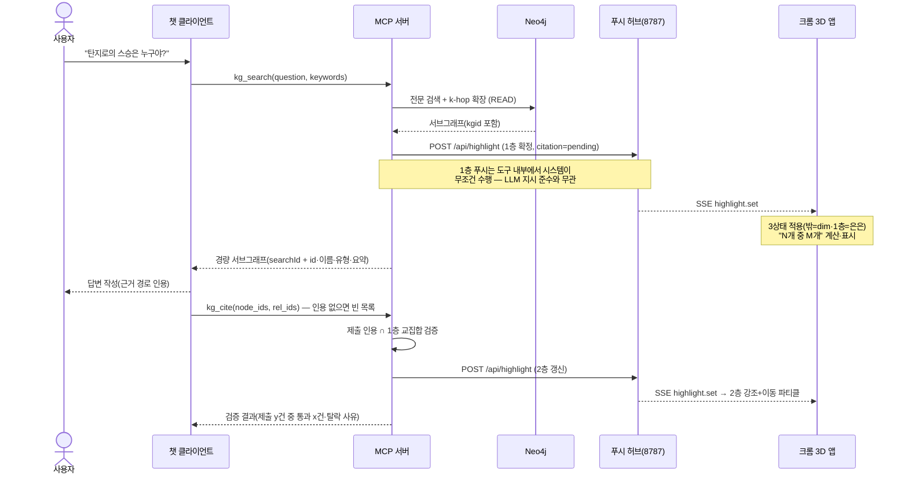

# 기술 설계 (TECH-SPEC) — 리디안 지식그래프 (GraphRAG_1st 확장)

> 상태: v1 초안 — 설계 패널 4인(스택·데이터모델·아키텍처/MCP·검색) 산출 조립본, 심층 검수 진행 중 | 최종 수정: 2026-08-21
> 입력: docs/PRD.md v3(승인본)이 유일한 요구사항 입력. 확정 결정은 docs/DECISIONS.md.
> 절 구성: [1. 플랫폼과 스택 / 5. 폴더 구조 / 6. 개발 환경] → [2. 데이터 모델] → [3. 아키텍처·MCP 도구·푸시 프로토콜] → [4. 검색·질의응답 설계]
# 1. 플랫폼과 스택

## 1.1 구현 언어·런타임 확정 — Node.js 단일 통일

**결정: 전 컴포넌트를 Node.js(≥ 22.12, 권장 24 LTS) + JavaScript(ESM)로 통일한다. Python은 혼용하지 않는다.**

| 판단 기준 | A안. Node.js 단일 (채택) | B안. Node + Python 혼용 (배제) |
|---|---|---|
| 기존 자산 결합 | `canonicalGraph.js`(정규화 계층)·`neo4j-driver`·React 앱을 **그대로 import** — 파이프라인과 시각화가 같은 정규화 코드를 공유해 드리프트 원천 차단 | 정규화·검증 로직을 Python으로 이중 구현해야 함 — "생성기가 만든 JSON을 시각화가 못 읽는" 불일치의 온상 |
| MCP 서버 | 공식 `@modelcontextprotocol/sdk`(TypeScript/JS)가 stdio 서버의 1급 지원 | Python SDK도 존재하나, 그것 때문에 런타임 2개를 유지할 이유가 없음 |
| PDF·이미지 추출 | `unpdf`(MIT) + `tesseract.js`(Apache-2.0, WASM)로 MVP 요건(디지털 PDF + 이미지 베스트에포트) 충족. **네이티브 설치 없이 Windows에서 동작** | PyMuPDF는 **AGPL — MIT 저장소와 충돌**. pdfplumber 등 MIT 대안도 있으나 품질 이점이 MVP 요건을 초과 |
| 클론 재현성 (PRD 2차 사용자) | 시각화 앱이 이미 Node를 요구하므로 **추가 런타임 0개**. `git clone` → `npm install` 로 끝 | Windows에서 Python 설치 + venv + pip가 통째로 추가됨 — README 부담과 트러블슈팅 표면이 배로 늘어남 |
| KG 엔진 호출 | `codex exec`/`claude -p`는 어차피 **외부 CLI 서브프로세스** — 어느 언어에서 불러도 동일 | 동일 (혼용의 이점 없음) |

- 배제한 B안의 재검토 조건: 후순위 기능 "스캔본 고품질 OCR" 도입 시점에 한해 Python 사이드카(또는 네이티브 Tesseract) 재평가.
- **TypeScript 미도입**: 기존 앱이 순수 JS(JSX)이며, 1인 + AI 개발 규모에서 빌드 스텝 추가는 비용만 늘린다. 전 패키지 **ESM(`"type": "module"`) + JSDoc 타입 주석**으로 통일한다. MCP 도구의 입력 검증은 SDK가 요구하는 스키마 선언(zod)으로 충분히 커버된다.
- 런타임 하한 근거: 기존 앱의 Vite 7이 Node 22.12+를 요구한다. 루트 `package.json`에 `"engines": { "node": ">=22.12" }` 를 명시한다.

## 1.2 컴포넌트별 스택 총괄

| 컴포넌트 (PRD) | 위치 | 핵심 기술 |
|---|---|---|
| 웹 크롤러 S1 | `pipeline/src/crawl/` | Node 내장 `fetch` + Jina Reader API, `robots-parser`, `tldts`(등록 도메인 2단계 라벨), `gray-matter`(프론트매터) |
| 문서 추출기 S2 | `pipeline/src/extract/` | `unpdf`(디지털 PDF 텍스트), `tesseract.js`(이미지 OCR, kor+eng) — 전부 로컬 실행 |
| KG 생성기 S3 | `pipeline/src/generate/` | `codex exec` / `claude -p` 헤드리스 서브프로세스 어댑터 (§1.4) |
| Neo4j 주입기 S5 | `pipeline/src/inject/` | `neo4j-driver` 5.x (기존 앱과 동일 계열) |
| MCP 서버 S1~S6 | `mcp-server/` | `@modelcontextprotocol/sdk` stdio 서버 — pipeline 함수를 **in-process import**로 호출 |
| 시각화 확장 | `visualization-3d/` | 기존 스택 그대로(React 18 + react-force-graph-3d + Vite 7) + localServer에 수신 채널(POST /api/highlight + SSE) 신설 |
| 공유 계층 | `shared/` | canonicalGraph(기존 이동), 파일명 sanitize, URL 정규화, 엔티티 키, .env 로더 |

## 1.3 신규 의존성과 라이선스 (MIT 호환 원칙)

의존성 최소주의: HTTP는 Node 내장 `fetch`, .env는 자체 로더(기존 localServer 패턴 승계), 테스트는 기존 Vitest를 그대로 쓴다. 신규 추가는 아래 6개가 전부다.

| 패키지 | 라이선스 | 용도 | 비고 |
|---|---|---|---|
| `@modelcontextprotocol/sdk` | MIT | MCP stdio 서버 | 공식 SDK |
| `unpdf` | MIT | PDF 텍스트 추출 | 내부 엔진은 Mozilla pdf.js(Apache-2.0). 순수 JS — 네이티브 빌드 없음 |
| `tesseract.js` | Apache-2.0 | 이미지 OCR (베스트에포트) | WASM — 네이티브 Tesseract 설치 불필요. 언어팩(kor+eng, 약 20MB)은 최초 1회 다운로드 후 로컬 캐시(`data/ocr-cache/`) — **문서 내용은 외부로 나가지 않음**(S2 로컬 전용 원칙과 무모순) |
| `robots-parser` | MIT | robots.txt 존중 (S1) | |
| `tldts` | MIT | 등록 도메인(eTLD+1) 판정 — 파일명 "메인이름" 규칙의 기술 기반 | 인터뷰의 tldextract(Python) 대응 JS 라이브러리 |
| `gray-matter` | MIT | YAML 프론트매터 읽기/쓰기 | |

Apache-2.0은 MIT 저장소에 포함 가능한 허용적 라이선스다(단방향 호환). AGPL 계열(PyMuPDF 등)은 전면 배제.

**PDF 추출 지정: `unpdf`.** 디지털 PDF의 텍스트 레이어 추출이 MVP 판정 기준(성공 기준 2)이며, unpdf는 pdf.js 엔진을 서버리스 빌드로 내장해 Windows/Node에서 의존성 없이 동작한다. 스캔 PDF(텍스트 레이어 없음)는 추출 결과가 비어도 정상 — 프론트매터에 `extraction: empty` 표기(PRD 베스트에포트 정의). unpdf에 문제가 생기면 `pdfjs-dist`(Apache-2.0) legacy 빌드 직접 사용으로 대체 가능(동일 엔진이라 이행 비용 낮음).

## 1.4 KG 생성 엔진 2종 호출 방식 (codex exec / claude -p)

### 설계 원칙: 엔진 = "텍스트 입력 → JSON 텍스트 출력" 순수 함수

파일 읽기·쓰기·검증은 전부 **우리 파이프라인 코드**가 수행하고, 엔진에는 에이전트적 파일 조작을 시키지 않는다. 이유: 산출물 위치·개수(Input 1파일 = JSON 1개)의 결정성을 코드가 보장해야 체크포인트 재개와 검수 목록이 성립한다.

```
[generate 오케스트레이터 (pipeline)]
  1. Input MD 읽기 → 프롬프트 조립 (shared/prompts/kg-generation.md + data/schema.json의 허용 유형 치환)
  2. 엔진 어댑터 호출 (아래 계약)
  3. stdout/출력파일 → JSON.parse → canonicalGraph 정규화 → 스키마(허용 유형) 검증
  4. 통과 시에만 Generated/<원본이름>.kg.json 원자적 쓰기(tmp에 쓰고 rename)
     → "Generated/에는 완전한 JSON만 놓인다"(PRD S3) 보장
```

### 공통 어댑터 계약

```js
// pipeline/src/generate/engines/ — codex.js, claude.js가 동일 시그니처 구현
/**
 * @param {{ prompt: string, timeoutMs: number, model?: string, cwd: string }} req
 * @returns {Promise<{ ok: true, text: string }
 *                 | { ok: false, kind: 'timeout'|'rate_limit'|'crash'|'bad_output',
 *                     summary: string }>}   // summary는 실패 보고 원칙에 따라 챗 응답용
 */
export async function run(req) { ... }
```

### 호출 명령 (Windows 네이티브 — 검증 사실 반영)

두 CLI 모두 npm 설치 시 **`.cmd` 심(shim)** 으로 깔린다. Node의 보안 패치(CVE-2024-27980) 이후 `spawn('codex', ...)`처럼 .cmd를 직접 spawn하면 Windows에서 `EINVAL`로 실패한다. 따라서 공용 헬퍼 `shared/src/winSpawn.js`가 **`cmd /c` 래퍼**로 감싼다. `{ shell: true }` 옵션은 인자 이스케이프가 셸 해석에 노출되므로 쓰지 않는다 — 인자는 배열로 유지하고 `cmd /c` 앞단만 붙인다.

```js
// shared/src/winSpawn.js — 요지
spawn('cmd', ['/c', bin, ...args], { cwd, stdio: ['pipe', 'pipe', 'pipe'] });
// 비-Windows(클론 사용자)에서는 spawn(bin, args) 그대로.
```

**본문 전달 규칙: 프롬프트(자료 본문 포함)는 절대 argv로 넘기지 않는다.** ① cmd 명령줄 8,191자 한계 ② 따옴표·한글 이스케이프 문제를 동시에 회피 — **stdin으로 파이프**하는 것을 1안, 실패 시 `data/tmp/`의 임시 파일(ASCII 파일명) 경로 전달을 2안으로 한다.

| 항목 | Codex 어댑터 | Claude 어댑터 |
|---|---|---|
| 명령 골격 | `cmd /c codex exec --skip-git-repo-check -s read-only -C <data/tmp> -o <출력파일> -` (프롬프트는 stdin) | `cmd /c claude -p --output-format json --max-turns 1` (프롬프트는 stdin, cwd=`data/tmp`) |
| 결과 수취 | `-o/--output-last-message` 파일에서 최종 메시지 읽기 (stdout 인코딩 이슈 회피). `--output-schema`(JSON Schema 강제) 사용 여부는 스파이크에서 확정 | stdout의 결과 JSON에서 `result` 필드 추출, `is_error` 필드로 실패 판별 |
| 도구/부작용 차단 | 샌드박스 `read-only` | 헤드리스는 승인 없는 도구 실행이 기본 차단됨 + 도구 차단 플래그(`--disallowedTools` 등)를 스파이크에서 확정 |
| 모델 지정 | `-m <model>` (KG_ENGINE_MODEL 설정 시) | `--model <model>` (동일) |

- **cwd를 `data/tmp/`로 고정하는 이유**: 저장소 루트에서 실행하면 리포의 CLAUDE.md/AGENTS.md 프로젝트 지침이 헤드리스 세션에 주입되어 KG 생성 프롬프트를 오염시킨다. 빈 작업 폴더에서 실행해 순수 생성으로 유지한다.
- 세부 플래그는 2026-08 기준 지식이며, **정확한 플래그 세트는 하이라이트 스파이크 직후의 "엔진 스모크 테스트"(각 엔진 1회 실행)에서 확정**하고 그 결과를 DECISIONS.md에 기록한다(PRD 성공 기준 3의 "두 엔진 각각 검증" 일부 선행).
- 실패 분류: 프로세스 비정상 종료/타임아웃/출력의 한도 안내 문구 감지 → `rate_limit`/`timeout`/`crash`로 분류해 요약을 챗으로 반환(실패 보고 원칙). 한도 중단 시 "같은 명령 재실행 = 미생성분만 재개"는 S3 오케스트레이터가 Generated/ 존재 여부로 판정한다(별도 상태 파일 불필요).

### 엔진 선택 설정 — ".env 기본 + 명령 인자 우선" 구현

```js
// pipeline/src/generate/resolveEngine.js
const VALID = ['codex', 'claude'];
export function resolveEngine(toolArg, env = process.env) {
  const v = toolArg ?? env.KG_ENGINE ?? 'codex';   // 우선순위: 도구 인자 > .env > 내장 기본
  if (!VALID.includes(v)) return { ok: false, summary: `엔진 값 "${v}" 인식 불가 (codex|claude)` };
  return { ok: true, engine: v };
}
```

MCP의 생성 도구는 선택 인자 `engine`을 받아 이 함수에 그대로 전달한다 — 인자를 지정하면 **그 실행에 한해** 우선(PRD 확정 8항)하고, 설정 파일(.env)은 바꾸지 않는다.

---

# 5. 폴더 구조 (모노레포)

## 5.1 전체 구조 — 기존 GraphRAG_1st에 추가

npm workspaces 모노레포로 확장한다. 클론 1회 + `npm install` 1회로 전 컴포넌트가 설치된다.

```
GraphRAG_1st/
├─ package.json                  # [신규] 루트: workspaces 선언 + 공통 스크립트 (§6.1)
├─ .gitignore                    # [갱신] data/·.env 커밋 금지 (§5.3)
├─ .env.example                  # [신규] 전체 환경변수 문서 (커밋, §6.3)
├─ .env                          # 실제 값 — 커밋 금지
├─ LICENSE  /  README.md         # 기존 유지 (MIT)
│
├─ examples/                     # [신규] 커밋되는 유일한 데이터 — 명시 선정 예시
│  └─ KG_Demon Slayer_Draft_01.json   # 루트에서 이동 (README 링크 갱신)
│
├─ data/                         # [신규] ★ 전체 gitignore — 사용자 로컬 원본 진실
│  ├─ Input/                     # S1·S2 산출 MD
│  ├─ Generated/                 # S3 산출 KG JSON (완전한 것만)
│  ├─ Reviewed/                  # S4 승인분 — Neo4j 재빌드의 원본 진실
│  ├─ Rejected/                  # S4·S6 반려분 (삭제 아님)
│  ├─ ledger.json                # 원장: URL 정규화 키→수집 상태·실패 기록·차단 표시·반려 누적 횟수
│  ├─ schema.json                # 사용자 스키마(허용 노드·관계 유형) — 초기값은 shared에서 복사
│  ├─ tmp/                       # 엔진 임시 입출력 (ASCII 파일명)
│  └─ ocr-cache/                 # tesseract.js 언어팩 캐시
│
├─ shared/                       # [신규] @readian/shared — 모두가 공유하는 단일 진실
│  ├─ package.json
│  ├─ src/
│  │  ├─ canonicalGraph.js       # visualization-3d/src/lib에서 이동 (§5.2)
│  │  ├─ naming.js               # 파일명 규칙 v2·Windows sanitize(금지문자·예약이름·길이 상한)
│  │  ├─ urlNormalize.js         # URL 정규화 (S1 스킵 판정 키 — 규칙 상세는 S1 절)
│  │  ├─ entityKey.js            # 엔티티 병합 키 정규화 (규칙 상세는 S5 절)
│  │  ├─ env.js                  # 루트 .env 로더 (§6.4)
│  │  ├─ paths.js                # KG_DATA_DIR 해석 + 하위 폴더 상수·자동 생성
│  │  └─ winSpawn.js             # cmd /c 래퍼 spawn (§1.4)
│  ├─ schema/schema.default.json # 초기 스키마 (커밋 — Phase 1 스키마 절에서 내용 확정)
│  └─ prompts/kg-generation.md   # KG 생성 지시문 템플릿 ({schema} 치환 자리)
│
├─ pipeline/                     # [신규] @readian/pipeline — S1·S2·S3·S5 실행 엔진
│  ├─ package.json
│  ├─ src/
│  │  ├─ crawl/                  # S1: BFS·도메인 경계·Jina 변환·멱등 스킵
│  │  ├─ extract/                # S2: PDF·이미지 → MD (로컬 전용)
│  │  ├─ generate/               # S3: 오케스트레이터 + engines/{codex,claude}.js + resolveEngine.js
│  │  ├─ inject/                 # S5: 전체 재빌드·병합·출처 속성
│  │  └─ ledger.js               # 원장 읽기/쓰기 (원자적 갱신)
│  ├─ bin/                       # 수동 실행·디버그용 얇은 CLI (collect.js, generate.js, inject.js)
│  └─ tests/
│
├─ mcp-server/                   # [신규] @readian/mcp-server — 챗 조종석
│  ├─ package.json
│  ├─ src/
│  │  ├─ index.js                # stdio 엔트리 (Claude·Codex 클라이언트가 이것을 기동)
│  │  ├─ tools/                  # 도구 정의 — pipeline 함수를 in-process 호출, 결과 요약 반환
│  │  └─ vizClient.js            # 시각화 서버로 그래프 표시·하이라이트 POST (닫힘 감지 포함)
│  └─ tests/
│
├─ scripts/
│  └─ setup.js                   # [신규] 최초 1회 부트스트랩 (§6.5)
│
└─ visualization-3d/             # 기존 앱 — 내부 구조 불변 + 최소 확장
   ├─ server/localServer.js      # [확장] POST /api/highlight + GET /api/events(SSE) 신설 (상세는 시각화 절)
   └─ src/lib/canonicalGraph.js  # [축소] shared 재-export 심 1줄 (§5.2)
```

## 5.2 책임과 의존 방향

| 폴더 | 책임 (한 줄) | 하면 안 되는 것 |
|---|---|---|
| `shared/` | 파이프라인·MCP·시각화가 공유하는 정규화 규칙·명명 규칙·경로·환경 로더 | 네트워크·DB 접근 금지 (순수 함수만) |
| `pipeline/` | 자료를 이동시키는 모든 실행 로직 (수집→추출→생성→주입) | 챗 응답 포맷팅 금지 — 구조화된 결과 객체만 반환 |
| `mcp-server/` | 챗 명령 ↔ pipeline 함수 연결 + 결과 요약을 챗 문장으로 + 시각화 푸시 | 비즈니스 로직 보유 금지 (전부 pipeline·shared에) |
| `visualization-3d/` | 화면 — 그래프 렌더 + 수신 채널 | 파이프라인 데이터 폴더 직접 접근 금지 (신호 수신만) |
| `data/` | 사용자 로컬 데이터의 단일 루트 — 백업 안내 대상(README) | 커밋 금지 (전체) |
| `examples/` | 공개 데모용으로 명시 선정된 데이터만 | 사용자 생성 데이터 투입 금지 |

**의존 방향 (단방향 강제)**: `shared` ← `pipeline` ← `mcp-server`, `shared` ← `visualization-3d`. MCP 서버는 pipeline을 **같은 프로세스에서 import**한다(서브프로세스는 KG 엔진 CLI뿐) — 프로세스 경계가 하나 줄어 실패 보고가 예외 객체 그대로 전달된다.

**canonicalGraph 이동 방식**: 파일을 `shared/src/`로 이동하고, 기존 위치에는 `export * from '@readian/shared/canonicalGraph';` 재-export 심을 남긴다. 기존 앱의 import 경로·테스트 15종이 무수정으로 통과하고, 생성기·주입기·시각화가 같은 정규화 코드를 쓰게 된다(게이트 검증에서 확인된 "정규화 계층 재사용 가능" 이행).

**data/를 저장소 안에 두는 이유**: 클론 사용자와 본인 모두 경로 설정 없이 즉시 동작(제로 설정)하고, `.gitignore`가 커밋을 원천 차단한다. 다른 드라이브로 옮기고 싶으면 `KG_DATA_DIR` 하나만 바꾸면 된다(§6.3). 폴더들은 없으면 `shared/paths.js`가 자동 생성하므로 클론 직후에도 오류가 없다.

## 5.3 .gitignore 정책 (PRD 공개 저장소 위생 원칙의 구현)

루트 `.gitignore`에 추가한다(기존 항목 유지):

```gitignore
# 의존성·산출물
node_modules/
dist/
coverage/

# ★ 사용자 데이터 전체 — Input/Generated/Reviewed/Rejected/원장/스키마/임시 (PRD 위생 원칙)
data/

# 환경 변수 — 자격증명·키
.env
.env.*
!.env.example

*.log
```

- **커밋되는 데이터는 `examples/` 와 `shared/schema/schema.default.json`, `shared/prompts/` 뿐**이다. 사용자 스키마(`data/schema.json`)와 원장은 원본 진실이므로 로컬 백업 대상(README 고지 — PRD 리스크 절 이행).
- `visualization-3d/.gitignore`(기존)는 그대로 둔다. 이중 방어가 되어도 무해하다.

---

# 6. 개발 환경

## 6.1 실행 명령 체계 (루트 package.json)

```json
{
  "name": "graphrag-1st",
  "private": true,
  "type": "module",
  "engines": { "node": ">=22.12" },
  "workspaces": ["shared", "pipeline", "mcp-server", "visualization-3d"],
  "scripts": {
    "setup":      "node scripts/setup.js",
    "dev:all":    "npm run dev:full -w visualization-3d",
    "dev:viz":    "npm run dev -w visualization-3d",
    "dev:api":    "npm run dev:api -w visualization-3d",
    "mcp:stdio":  "node mcp-server/src/index.js",
    "mcp:inspect":"npx @modelcontextprotocol/inspector node mcp-server/src/index.js",
    "test":       "npm test --workspaces --if-present"
  }
}
```

| 명령 | 하는 일 | 언제 쓰나 |
|---|---|---|
| `npm run setup` | 최초 부트스트랩 (§6.5) | 클론 직후 1회 |
| `npm run dev:all` | 시각화 API 서버(8787) + Vite(5173) 동시 기동 — 기존 `dev:full` 재사용 | **평상시 이것 하나** — "크롬 3D 앱은 화면" 준비 완료 상태 |
| `npm run mcp:stdio` | MCP 서버 수동 기동 | 디버그 전용 — 평상시엔 Claude/Codex 클라이언트가 자동 기동 |
| `npm run mcp:inspect` | MCP Inspector로 도구를 챗 없이 단독 테스트 | 도구 개발 중 |
| `npm test` | 전 워크스페이스 Vitest 실행 | 슬라이스 완료 시마다 |
| `pipeline/bin/*.js` | `node pipeline/bin/generate.js --engine claude` 식 수동 실행 | MCP 우회 디버그 (조작 원칙의 "수동 대체 수단") |

일상 운영 형태: 터미널에서 `npm run dev:all` 1개 + 크롬에서 `http://localhost:5173` — 나머지는 전부 챗(MCP)이 조종한다. MCP 서버는 사용자가 띄우는 프로세스가 아니라 **챗 클라이언트가 stdio로 기동·종료를 관리**하므로 dev:all에 포함하지 않는다.

## 6.2 MCP 클라이언트 등록 (1회성 설치 액션 — README 수록 내용)

MCP 서버 엔트리가 `node <절대경로>` 형태(node.exe는 진짜 실행 파일)라서 **클라이언트 쪽에서는 cmd /c 문제가 없다**. `npm run setup`이 아래 명령을 사용자 환경의 절대경로를 채워 출력해 준다.

```
# Claude Code / Claude Desktop
claude mcp add readian-kg -- node "C:\...\GraphRAG_1st\mcp-server\src\index.js"

# Codex (ChatGPT 데스크탑·CLI) — ~/.codex/config.toml
[mcp_servers.readian-kg]
command = "node"
args = ["C:\\...\\GraphRAG_1st\\mcp-server\\src\\index.js"]
```

## 6.3 .env.example (신규 환경변수 전체 목록)

루트 `.env` **단일 파일**로 통일한다(기존 `visualization-3d/.env.local`도 계속 인식 — 하위 호환).

```bash
# ══ Neo4j — 주입기·MCP 검색·시각화 공용 ══
NEO4J_URI=bolt://localhost:7687
NEO4J_USERNAME=neo4j
NEO4J_PASSWORD=replace-me
NEO4J_DATABASE=neo4j            # 도구 전용 DB/DBMS 권장 — README 설치 절 참조
NEO4J_SOURCE_ENABLED=true       # [기존 변수] 시각화 Neo4j 모드 — 로컬은 true

# ══ 시각화 서버 ══
API_PORT=8787                   # [기존 변수] localServer 포트
VIZ_SERVER_URL=http://localhost:8787   # MCP→시각화 푸시 대상 (그래프 표시·하이라이트)

# ══ KG 생성 엔진 (S3) ══
KG_ENGINE=codex                 # codex | claude — 챗 명령에서 지정하면 그 실행에 한해 우선
KG_ENGINE_MODEL=                # 비우면 각 CLI의 기본 모델
KG_ENGINE_TIMEOUT_MS=600000     # Input 파일 1건 생성 제한 시간 (10분)

# ══ 웹 수집 (S1) ══
JINA_API_KEY=                   # 무료 키 — 발급 절차는 README (크롤링 사용 시에만 필요)

# ══ 데이터 위치 ══
KG_DATA_DIR=./data              # Input/Generated/Reviewed/Rejected/원장/스키마의 루트 (저장소 기준 상대 또는 절대)
```

원칙: **PRD가 값을 확정한 것(페이지 상한 기본 10, 반려 3회 한도, BFS 등)은 환경변수로 빼지 않고 코드 상수**로 둔다 — 설정 표면을 늘리면 클론 재현성이 나빠진다. 크롤링 요청 간격 등 예절 상수도 S1 절의 코드 상수다.

## 6.4 환경 로딩 규칙 — shared/src/env.js

- dotenv 의존성 없이 자체 로더(기존 localServer의 `loadEnvLocal` 패턴을 일반화해 승계).
- **탐색 기준은 cwd가 아니라 모듈 파일 위치**: `env.js`에서 상위로 올라가 저장소 루트의 `.env`를 찾는다. 근거: MCP 서버는 Claude/Codex 클라이언트가 **임의의 cwd에서** 기동하므로 cwd 기반 로딩은 반드시 깨진다. `node --env-file`도 같은 이유(경로 고정·부재 시 에러)로 쓰지 않는다.
- 우선순위: 이미 설정된 `process.env` > 루트 `.env`. 값은 어떤 로그에도 출력하지 않는다(기존 앱 관례 유지).
- localServer.js에는 루트 `.env` 로딩을 추가하되 기존 `.env.local`이 우선하도록 한다(비파괴 확장).

## 6.5 부트스트랩 — scripts/setup.js (클론 재현성의 핵심)

`npm run setup` 1회가 수행하는 것: ① `data/` 하위 폴더 전체 생성 ② `shared/schema/schema.default.json` → `data/schema.json` 복사(없을 때만) ③ `.env.example` → `.env` 복사(없을 때만) ④ Node 버전·`codex`/`claude` CLI 존재 점검 결과를 표로 출력 ⑤ §6.2의 MCP 등록 명령을 절대경로를 채워 출력. 실패해도 각 단계는 독립적이며 재실행 안전(멱등).

## 6.6 테스트 러너 — Vitest 통일

- 기존 앱이 Vitest 3이므로 **전 워크스페이스 Vitest**로 통일. 루트 `npm test`가 `--workspaces --if-present`로 순회한다.
- 테스트 정책(1인 + AI 규모에 맞게 3종만):
  1. **순수 로직 단위 테스트** — naming·urlNormalize·entityKey·resolveEngine·ledger: 입출력 표 기반. Windows 금지 문자·예약 이름(CON, NUL 등)·한글 파일명 케이스 필수 포함.
  2. **엔진 어댑터 계약 테스트** — 실제 codex/claude 대신 **가짜 실행 스크립트**(고정 JSON을 뱉는 node 스크립트)를 spawn해 stdin 전달·타임아웃·실패 분류를 검증. 실 구독을 소모하지 않는다.
  3. **기존 시각화 테스트 무수정 통과** — canonicalGraph 이동(재-export 심) 후 기존 tests/ 15종이 그대로 통과하는 것이 이동 완료 판정.
- 네트워크(Jina·Neo4j)를 실제로 때리는 테스트는 만들지 않는다 — 실연동 검증은 로드맵의 슬라이스별 수동 스모크(성공 기준 1~9)로 대체.

## 6.7 Windows 네이티브 주의점 (설계에 반영된 검증 사실)

| # | 사실 | 설계 반영 |
|---|---|---|
| 1 | npm 설치 CLI(`codex`, `claude`)는 `.cmd` 심 — Node 보안 패치 이후 직접 spawn 시 `EINVAL` | `shared/winSpawn.js`의 **`cmd /c` 래퍼** 일원화. `shell: true`는 인자 이스케이프 위험으로 금지 (§1.4) |
| 2 | cmd 명령줄 8,191자 한계 | 자료 본문·프롬프트는 argv 금지 — stdin 파이프(1안)/임시 파일(2안) (§1.4) |
| 3 | MCP stdio 프로토콜은 stdout을 점유 | mcp-server 전역에서 `console.log` 금지, 진단은 **stderr 전용** — stdout 오염 시 클라이언트 연결이 조용히 깨진다 |
| 4 | 파일명 금지 문자(`: / ? * " < > \|`) + 예약 이름(CON, PRN, AUX, NUL, COM1~9, LPT1~9) + 끝 공백/마침표 금지 | `shared/naming.js`가 일괄 sanitize. PRD 파일명 규칙의 구현 지점 |
| 5 | MAX_PATH 260자 | 메인이름을 80자에서 절단(원제목은 프론트매터에 전체 보존 — PRD와 무모순) |
| 6 | `fs.rename`은 드라이브 경계에서 `EXDEV` 실패 | `data/` 하위 이동(Generated→Reviewed 등)은 같은 볼륨이라 안전. `KG_DATA_DIR`를 다른 드라이브로 바꾼 경우 대비 copy+unlink 폴백 |
| 7 | 한글 인자·경로의 셸 해석 문제 | 엔진 임시 파일은 `data/tmp/`에 **ASCII 파일명**으로 생성, 경로 조립은 항상 `node:path` |
| 8 | 헤드리스 CLI가 cwd의 CLAUDE.md/AGENTS.md를 읽음 | 엔진 실행 cwd를 `data/tmp/`로 고정 — 리포 지침의 프롬프트 오염 차단 (§1.4) |

## 6.8 클론 직후 스모크 순서 (README 골격)

```
git clone → npm install → npm run setup → (.env에 Neo4j 값 입력)
→ npm run dev:all → 크롬 http://localhost:5173 확인
→ §6.2 MCP 등록 → 챗에서 "그래프 보여줘" (예시 데이터) → 하이라이트 데모
```

---

# 2. 데이터 모델

> 담당 범위: KG 스키마(허용 노드·관계 유형), KG JSON 파일 스키마, Neo4j 물리 모델, 파일 시스템 데이터 모델(폴더 수명주기·원장·프론트매터), 산출물 무결성 보장.
> 근거 코드: `GraphRAG_1st/visualization-3d/src/lib/canonicalGraph.js`(검증 계층), `server/core/mapper.js`(Neo4j→화면 매핑, labels[0]만 사용), `server/core/config.js`(NEO4J_DATABASE), 예시 데이터 `GraphRAG_1st/KG_Demon Slayer_Draft_01.json`(라벨 14종·관계 48종 실사용 확인).

## 2.0 설계 원칙 요약

| 원칙 | 내용 |
|---|---|
| **폴더가 곧 상태** | 파이프라인 상태(생성 대기/검수 대기/승인/반려)는 파일이 어느 폴더에 있는지로 표현한다. 별도 상태 DB 없음. 원장(ledger)은 "수집 멱등·차단·반려 횟수"만 담당한다. |
| **stem이 곧 자료 ID** | Input 파일명에서 확장자를 뺀 것(예: `20260821143012_readians_p01`)이 전 파이프라인의 자료 식별자다. Generated/Reviewed/Rejected의 파일명, Neo4j 출처 속성, 원장이 모두 이 stem으로 연결된다. |
| **과소병합 > 과병합** | 엔티티 병합은 보수적 정확 일치만 한다. 잘못 안 합쳐진 것은 눈에 보이지만(검수 가능), 잘못 합쳐진 것은 그래프를 조용히 오염시킨다. |
| **기존 검증기 재사용** | KG JSON의 구조 검증은 기존 `canonicalGraph.js` 규칙을 그대로 계승하고, 파이프라인은 그 위에 스키마 검증만 얹는다(모노레포 `shared/`로 이동 재사용). |

## 2.1 KG 스키마 — 허용 노드·관계 유형 (Phase 1 확정 초기값)

### 2.1.1 스키마 파일

| 항목 | 확정 내용 |
|---|---|
| 파일 | `shared/schema/kg-schema.default.json` — **저장소에 커밋되는 기본본** (클론 재현용) |
| 런타임 사본 | `data/schema/kg-schema.json` — 최초 실행 시 기본본을 자동 복사. 챗 명령의 조회·수정은 이 사본을 대상으로 하며, **커밋 금지**(.gitignore — PRD "스키마 파일은 로컬 데이터" 준수) |
| 형식 | JSON 단일 파일 (챗 명령으로 기계 수정·검증이 쉬운 형식) |
| 버전 | `schema_version` 정수. 챗 수정 명령이 성공할 때마다 +1, `updated_at` 갱신. 생성된 모든 KG JSON은 자기가 사용한 `schema_version`을 meta에 기록한다 → PRD "변경은 새 생성분부터(소급 없음)"의 추적 근거 |

```json
{
  "schema_version": 1,
  "updated_at": "2026-08-21T00:00:00+09:00",
  "node_labels": [ { "label": "Person", "ko": "인물", "desc": "실존·가상 인물" } ],
  "relationship_mode": "core_plus_free",
  "core_relationships": [ { "type": "MEMBER_OF", "ko": "소속" } ],
  "relationship_name_rule": "^[A-Z][A-Z0-9_]{1,39}$",
  "instructions_ko": [ "…(2.1.4의 언어·명명 지시)" ]
}
```

### 2.1.2 초기 노드 라벨 — 16종 (폐쇄 목록)

예시 데이터(KG_Demon Slayer_Draft_01.json)에 실제 사용된 14종 전부 + 범용 지식 자료용 2종(Concept, Work). 예시 라벨을 전부 포함해야 데모 데이터와 신규 생성분의 라벨 체계가 일치하고, 기존 시각화 색상·필터가 그대로 작동한다.

| 라벨 | 한국어 | 용도 | 출처 |
|---|---|---|---|
| Person | 인물 | 실존·가상 인물 | 예시 |
| Organization | 조직 | 단체·기관·기업·부대 | 예시 |
| Family | 가문/가족 | 혈연·가문 집단 | 예시 |
| Place | 장소 | 지리적 장소·지역·건물 | 예시 |
| Event | 사건 | 일어난 일·행사·시험·사고 | 예시 |
| TimePeriod | 시대/기간 | 시대·연대·기간 | 예시 |
| Species | 종족 | 생물종·종족 | 예시 |
| Object | 사물 | 물건·도구·물질 | 예시 |
| Weapon | 무기 | 무기류 | 예시 |
| Technique | 기술 | 기술·기법·능력·호흡법 | 예시 |
| Mission | 임무 | 임무·과업 | 예시 |
| Training | 수련/훈련 | 수련·교육 과정 | 예시 |
| MediaRange | 매체 범위 | 화수·권수 등 매체 구간 | 예시 |
| StorySegment | 이야기 구간 | 서사 구간 단위 | 예시 |
| **Concept** | 개념 | 추상 개념·이론·용어·제도·프로세스 | 신규(범용 지식) |
| **Work** | 작품/문헌 | 책·작품·문서·매체 산출물 | 신규(범용 지식) |

노드 라벨은 **폐쇄 목록(strict)**: 생성 결과에 목록 외 라벨이 있으면 스키마 검증 실패로 처리한다(해당 파일은 Generated/에 진입하지 못함 → 재생성 대상). 라벨 추가가 필요하면 챗 명령으로 스키마를 먼저 수정한다.

### 2.1.3 관계 유형 — 핵심 15종 + 규칙 준수 자유 확장 (추천안)

예시 데이터가 이미 48종의 자유 서술형 관계(`ATTEMPTED_TO_TAKE_FOR_TREATMENT` 등)를 사용하고 있어, 관계까지 폐쇄 목록으로 강제하면 반려·재생성이 빈발해 구독 한도를 소모한다. 따라서 **2단계 정책**을 기본으로 한다(오너 확인 항목 — open 목록 참조):

- **핵심 15종**: LLM에게 "우선 이 중에서 선택"을 지시. 검색·질의 시 안정적으로 기댈 수 있는 통제 어휘.
- **자유 확장**: 핵심에 적합한 것이 없으면 명명 규칙 `^[A-Z][A-Z0-9_]{1,39}$`(영문 대문자 스네이크, 2~40자)을 지키는 새 유형 허용. 규칙 위반만 검증 실패이며, 목록 외 신규 유형은 **통과 + 생성 결과 요약에 "신규 관계 유형 n종" 보고**(구조 검수 때 눈으로 확인).

| 핵심 관계 | 의미 | 핵심 관계 | 의미 |
|---|---|---|---|
| IS_A | 분류(~의 일종) | HAS_AGENT | 사건의 행위 주체 |
| MEMBER_OF | 소속 | HAS_TARGET | 사건의 대상 |
| PART_OF | 부분-전체 | HAS_INSTRUMENT | 사건의 수단·도구 |
| LOCATED_IN | 위치 | CAUSED | 원인 |
| OCCURRED_DURING | 발생 시기 | RESULTED_IN | 결과 |
| PARTICIPATED_IN | 참여 | PRECEDES | 시간 선행 |
| USES | 사용 | KNOWS | 인지·친분 |
| RELATED_TO | 기타 연관(최후 수단) | | |

### 2.1.4 `{schema}` 주입 — req_node_relation.txt 연결

- 프롬프트 템플릿: `shared/prompts/req_node_relation.txt` (저장소 커밋). 템플릿 안의 `{schema}` 플레이스홀더를 생성 파이프라인이 **스키마 렌더러**의 출력으로 치환한다.
- 렌더러(`shared/schema/renderSchema.js` — 유일한 변환 지점): `kg-schema.json` → 아래 형태의 마크다운 텍스트.

```
[허용 노드 유형 — 이 목록 외 라벨 금지]
- Person(인물): 실존·가상 인물
- …(16종)

[관계 유형 — 아래 목록에서 우선 선택, 없을 때만 대문자 스네이크(영문)로 새로 명명]
- MEMBER_OF(소속), IS_A(분류), …(15종)

[명명·언어 규칙]
- 노드 name은 원문 언어의 표기를 유지한다(한국어 자료는 한국어).
- 고유명사는 자료에 등장하는 가장 완전한 정식 명칭으로 통일한다(별명·약칭 금지). 같은 대상은 반드시 같은 name으로 쓴다.
- 모든 노드는 properties.name(비어있지 않은 문자열)을 반드시 갖는다.
```

"정식 명칭 통일" 지시는 2.3.2 병합 규칙(정확 일치)의 성립 조건이므로 스키마 파일의 `instructions_ko`에 포함해 렌더링한다.

## 2.2 KG JSON 파일 스키마 (Generated/·Reviewed/·Rejected/ 산출물)

기존 `canonicalGraph.js` 검증 계층과 **완전 호환**을 확인했다: 검증기는 최상위에서 `nodes`·`relationships`만 읽고 여분 키를 무시하므로, 최상위 `meta` 추가는 기존 3D 앱(드래그앤드롭 포함)에서 그대로 통과한다.

```json
{
  "meta": {
    "input_file": "20260821143012_readians_p01.md",
    "schema_version": 1,
    "engine": "codex",
    "generated_at": "2026-08-21T14:35:00+09:00"
  },
  "nodes": [
    { "id": "0", "label": "Person", "properties": { "name": "카마도 탄지로", "role": "주인공" } }
  ],
  "relationships": [
    { "type": "MEMBER_OF", "start_node_id": "0", "end_node_id": "1", "properties": {} }
  ]
}
```

규약:
- **노드 id**: 파일 내 로컬 고유 문자열("0","1",…). 파일 간 충돌은 무관 — Neo4j 주입 시 (라벨, name_key)로 병합되므로 전역 id가 아니다.
- **reviewed 파일명은 meta에 넣지 않는다**: 승인/반려는 파일 이동(rename)이므로, Reviewed 파일명은 주입 시점에 파일 시스템에서 읽어 출처 속성으로 기록한다(이동 시 파일 내용 수정 불필요).
- **검증 2단**(생성 직후, Generated/ 진입 조건):

| 단계 | 규칙 | 위반 시 |
|---|---|---|
| 1. 구조 (canonicalGraph 계승) | 최상위 객체, nodes/relationships 배열, 노드 id 고유·비어있지 않음, 관계의 참조 무결성, 노드 ≥1 | 실패 (Generated/ 진입 불가) |
| 2. 스키마·주입 호환 (신규) | ① label ∈ node_labels(폐쇄) ② 관계 type이 명명 규칙 정규식 통과 ③ 모든 노드 properties.name 존재·비어있지 않은 문자열 ④ meta 필수 필드 존재 ⑤ 속성 값은 스칼라(string/number/boolean) 또는 동종 스칼라 배열만 — 중첩 객체 금지(Neo4j 속성 제약) ⑥ 예약 속성명(name_key, reviewed_files, input_files) 사용 시 제거 + 경고 | ①~⑤ 실패, ⑥ 자동 교정 |

검증기는 `canonicalGraph.js`를 `shared/lib/`로 이동해 시각화 앱과 파이프라인이 공유하고, 2단계 검증은 `shared/lib/kgSchemaValidate.js`로 신규 작성한다.

## 2.3 Neo4j 물리 모델

### 2.3.1 라벨·속성 규약

- **단일 라벨 원칙**: 노드당 라벨 1개. 근거: 기존 `mapper.js`가 `labels[0]`만 화면에 사용하므로 다중 라벨은 표시 왜곡을 낳는다. 도구 마커용 보조 라벨도 쓰지 않는다(식별은 속성으로 — 2.3.4).
- **시스템 속성** (주입기가 기록, LLM 산출 속성과 별도 예약):

| 속성 | 타입 | 대상 | 의미 |
|---|---|---|---|
| `name` | string | 노드 | 표시 이름. 원 표기(NFC), 첫 등장(선착) 표기 유지 |
| `name_key` | string | 노드 | 병합 키(2.3.2 정규화 결과). 도구 주입 데이터의 서명이기도 함 |
| `reviewed_files` | string[] | 노드·관계 | 이 요소가 나온 Reviewed JSON 파일명 목록(정렬·중복 제거). **재빌드 제외의 키** |
| `input_files` | string[] | 노드·관계 | 원 Input 파일명 목록 |

출처 속성이 배열인 이유: 병합된 노드는 여러 자료에서 나오므로 단일 값으로는 PRD의 "각 노드·관계에 출처 기록"을 만족할 수 없다. PRD의 `reviewed_file`/`input_file` 요구를 복수형 배열로 구현한 것이다.

### 2.3.2 엔티티 병합 키와 정규화 규칙

- **병합 키 = (라벨, name_key)** — PRD "정규화된 (이름, 노드 유형)"의 구현.
- **name_key 정규화 함수** (결정적, 파이프라인 유일 구현 `shared/lib/normalizeName.js`):

```js
nameKey = name
  .normalize('NFC')        // 유니코드 NFC (한글 자모 결합 통일)
  .trim()                  // 양끝 공백 제거
  .replace(/\s+/g, ' ')    // 내부 연속 공백·탭·개행 → 스페이스 1개
  .toLowerCase();          // 영문 대소문자 통합 (한글 무영향)
```

- 그 이상(전각/반각, 별칭, 부분 일치)은 하지 않는다 — 과병합 방지. "탄지로" vs "카마도 탄지로"는 병합되지 않으며, 이는 스키마 지시문의 "정식 명칭 통일"(2.1.4)로 상류에서 해결한다. 별칭 사전은 후순위.
- **관계 중복 제거 키 = (시작 노드 병합 키, type, 끝 노드 병합 키)**. 동일 키 관계는 하나로 합치고 속성은 아래 규칙으로 병합.
- **속성 병합 규칙(속성 보존·보강)**: 재빌드는 Reviewed/ 파일을 **파일명 오름차순(= 배치 타임스탬프 순)**으로 처리한다. 없는 속성 키는 추가, 이미 있는 키에 다른 값이 오면 **선착 값 유지**(먼저 처리된 파일 우선). 결과: 같은 입력 집합이면 몇 번 재빌드해도 같은 결과(멱등·결정적 — PRD S5 준수).

### 2.3.3 제약·인덱스

- **유니크 제약**: 스키마의 각 라벨 L에 대해 주입기가 재빌드 시 자동 생성 —
  `CREATE CONSTRAINT kg_uniq_<L> IF NOT EXISTS FOR (n:<L>) REQUIRE n.name_key IS UNIQUE`
  (스키마 파일에서 라벨 목록을 읽어 생성하므로 라벨 추가 시 자동 추종.)
- **검색용 인덱스**: 존재만 명시 — 전 라벨의 `name` 등 텍스트 속성을 대상으로 하는 full-text 인덱스 1개(`kg_fulltext`)를 주입기가 재빌드 마지막 단계에서 보장 생성한다. 대상 속성·분석기 등 상세 정의는 **검색 설계 섹션(§검색)이 소유**하며, 데이터 모델은 "주입기가 생성을 보장한다"는 계약만 진다.

### 2.3.4 도구 전용 DB 식별과 삭제 안전장치

- **1차 방벽 — 전용 DB 전제**: `.env`의 `NEO4J_DATABASE`(기존 config.js 그대로 재사용, 기본값 `neo4j`). README는 본 도구 전용 DBMS 인스턴스(Neo4j Desktop 기준) 사용을 안내한다. ※ Neo4j Community는 다중 데이터베이스를 지원하지 않으므로 "전용 DB" = 전용 인스턴스가 현실적 형태.
- **2차 방벽 — 속성 조건부 삭제**: 재빌드의 삭제는 항상
  `MATCH (n) WHERE n.reviewed_files IS NOT NULL DETACH DELETE n`
  — 출처 속성 보유분만 지운다(PRD 문언 그대로). `MATCH (n) DETACH DELETE n` 같은 전체 삭제는 금지.
- **보호 확인**: 재빌드 시작 시 `reviewed_files IS NULL`인 노드 수를 세어 0이 아니면 결과 요약에 "도구 외 데이터 n개 존재 — 건드리지 않음"을 보고한다(실패 보고 원칙과 정합).

### 2.3.5 재빌드 간 식별자 동기화의 데이터 기반 (검색·하이라이트 섹션에 제공하는 계약)

Neo4j `elementId`는 재빌드마다 바뀐다(PRD 리스크 항목). 데이터 모델은 **(라벨, name_key)가 재빌드 불변의 논리 식별자**임을 보장하고 모든 노드에 `name_key`를 저장한다. 검색·하이라이트 설계는 "화면과 검색이 같은 재빌드 세대의 elementId를 쓰거나, name_key로 재매칭"하는 동기화 프로토콜을 이 기반 위에서 정의한다(상세는 해당 섹션 소유).

## 2.4 파일 시스템 데이터 모델

### 2.4.1 폴더와 수명주기 상태도

데이터 루트 = `<repo>/data/` (전체 .gitignore, 커밋 금지 — PRD 저장소 위생 준수. 최종 폴더 배치는 아키텍처 섹션과 정합 확인):

```
data/
  Input/       # 수집·추출된 MD (원본 진실 1)
  Generated/   # 검증 통과한 KG JSON — 검수 대기
  Reviewed/    # 승인분 (원본 진실 2 — Neo4j는 이것의 파생물)
  Rejected/    # 반려분 (이력 보존, 삭제 아님)
  schema/kg-schema.json   # 런타임 스키마 사본
  ledger.json  # 수집 원장
  .tmp/        # 원자적 쓰기 스테이징 (조회 대상에서 항상 제외)
```



- 자료 제거 명령: 해당 stem의 Input/·Generated/·Reviewed/ 파일과 원장 엔트리를 삭제("재수집 허용") 또는 원장을 `blocked`로 표시("영구 차단") 후 재빌드. Rejected/는 PRD 명시 목록에 없으므로 이력으로 보존한다.
- 파이프라인의 상태 판정은 전부 폴더 스캔으로: "S3 미생성분" = Input에 있으나 Generated·Reviewed·Rejected 어디에도 같은 stem이 없는 것. "검수 대기" = Generated/의 `*.json`.

### 2.4.2 파일명 규약 (stem 연쇄)

| 폴더 | 파일명 | 예 |
|---|---|---|
| Input/ | `<stem>.md` (stem = `yyyymmddhhmmss_메인이름_pNN`, PRD 규칙) | `20260821143012_readians_p01.md` |
| Generated/, Reviewed/ | `<stem>.json` | `20260821143012_readians_p01.json` |
| Rejected/ | `<stem>.rejN.json` (N = 누적 반려 회차 — 같은 stem 3회 반려 시 파일 3개 공존 가능) | `20260821143012_readians_p01.rej2.json` |

### 2.4.3 MD 프론트매터 (Input/*.md 첫머리, `---` 구분 YAML)

공통 필수: `source_type`, `title`, `collected_at`(ISO 8601 +09:00), `batch`(파일명의 배치 타임스탬프), `source_hash`(원장 키와 동일). 프론트매터는 메타데이터로 취급하며 KG 생성 시 본문과 구분해 전달한다(활용 방식은 생성 파이프라인 섹션).

```yaml
# 웹 (S1)
---
source_type: web
url: "https://blog.readians.com/post/42?utm_source=x"   # 요청 원본 URL
url_normalized: "https://blog.readians.com/post/42"      # 정규화 결과
source_hash: "a1b2c3d4e5f60718"
domain: readians          # 등록 도메인 대표 이름 (파일명 메인이름과 동일)
title: "페이지 제목"
collected_at: 2026-08-21T14:30:12+09:00
batch: "20260821143012"
---
# 문서 (S2)
---
source_type: pdf          # 또는 image
original_file: "C:\\Users\\...\\원제목 전체: 부제.pdf"   # sanitize 전 원제목 보존 (PRD 요구)
source_hash: "9f8e7d6c5b4a3921"
title: "원제목 전체: 부제"
collected_at: 2026-08-21T14:30:12+09:00
batch: "20260821143012"
extraction_quality: ok    # ok | empty | low — 베스트에포트 표시 (PRD S2 요구)
extractor: "pdf-parse"
---
```

### 2.4.4 원장(ledger) — `data/ledger.json`

단일 JSON 파일(자료 수백 건 규모에 충분, 사람이 열어 볼 수 있음, 원자적 쓰기 적용). 역할은 3가지뿐: **수집 멱등 스킵, 실패 재시도, 차단** + 반려 횟수 카운트.

```json
{
  "version": 1,
  "sources": {
    "a1b2c3d4e5f60718": {
      "kind": "web",
      "source": "https://blog.readians.com/post/42",
      "status": "collected",
      "file": "20260821143012_readians_p01.md",
      "title": "페이지 제목",
      "batch": "20260821143012",
      "attempts": 1,
      "last_error": null,
      "collected_at": "2026-08-21T14:30:12+09:00",
      "last_attempt_at": "2026-08-21T14:30:12+09:00",
      "reject_count": 0
    }
  }
}
```

- **키** = SHA-256 16진수 앞 16자. 웹: **정규화 URL**의 해시. 문서: **원본 파일 내용**의 해시(같은 PDF 재투입 = 멱등 스킵).
- **status**: `collected`(MD 저장 성공 — PRD의 "이미 수집된 페이지" 판정 기준) / `failed`(재실행 시 자동 재시도, `attempts`·`last_error` 갱신) / `blocked`(영구 차단 — 수집 시도 자체를 건너뜀).
- **URL 정규화 규칙** (수집 파이프라인 섹션이 구현을 소유, 키 의미 정의는 여기): 리다이렉트 추적 후 최종 URL 기준 → scheme·host 소문자 → 기본 포트 제거 → fragment(#…) 제거 → 추적 파라미터(utm_* 등) 제거 후 잔여 쿼리 키 정렬 → 경로 끝 `/` 제거(루트 제외) → 퍼센트 인코딩 대문자 통일.
- **`--force` 처리**: `collected`여도 재수집하되 **기존 파일명에 내용을 덮어쓴다**(새 파일명 발급 없음 — stem 연쇄가 끊기지 않음). 프론트매터 `collected_at`과 원장 갱신 후, 같은 stem의 Generated/Reviewed 산출물이 있으면 "내용이 갱신됨 — 재생성 필요" 를 결과 요약에 보고한다. **`blocked`는 `--force`보다 우선한다** — 차단 해제는 명시적 챗 명령으로만.
- **`reject_count`**: S4·S6 반려 시 +1. `>= 3`이면 자동 재생성을 중단하고 보류 안내(PRD S4). 별도 "보류" 상태값은 두지 않는다(카운트로 판정).

## 2.5 무결성 보장 — "완전한 JSON만 Generated/에" (체크포인트)

1. **스테이징 + 원자 이동**: 모든 산출물 쓰기(KG JSON, MD, ledger.json, 스키마 저장)는 `data/.tmp/<파일명>`에 완전히 쓴 뒤 `fs.rename`으로 목적 폴더에 이동한다. 같은 볼륨 내 rename은 Windows(NTFS)에서 원자적이므로, 목적 폴더에는 "완전히 써진 파일"만 나타난다.
2. **검증 후 이동**: KG JSON은 스테이징 파일에 대해 2.2의 검증 2단을 **모두 통과한 뒤에만** Generated/로 이동한다. 파싱 실패·검증 실패·중간 중단 산출물은 Generated/에 절대 진입하지 않는다 → 검수 목록과 재개 판정(`Generated/*.json` 존재 여부)이 그 자체로 신뢰 가능(PRD S3 "완전한 JSON만" 충족).
3. **저장 주체 = 파이프라인**: 생성 엔진(codex/claude CLI)에게 파일 쓰기를 맡기지 않는다. 엔진 출력(JSON)을 파이프라인이 받아 검증 → 스테이징 → 이동한다.
4. **잔여물 청소**: 각 명령 시작 시 `data/.tmp/`를 비운다(이전 중단의 찌꺼기 제거). `.tmp/`는 모든 폴더 스캔에서 제외된다.
5. **승인·반려·제거의 이동도 rename**: 같은 볼륨 내 원자적 이동이므로 중간 상태(두 폴더에 반쪽씩)가 생기지 않는다.
6. **ledger.json 충돌 방지**: 원장 쓰기는 명령 실행 단위로 직렬화(한 MCP 명령이 원장을 읽고→수정하고→원자적으로 교체). 단일 사용자 로컬 도구이므로 파일 잠금 라이브러리는 도입하지 않는다(동시 명령 2개 실행은 지원 범위 밖 — 결과 요약에 마지막 쓰기가 남음).

---

# 3. 아키텍처

> 절 번호는 TECH-SPEC 병합 시 조정 가능. 본 절과 §4(MCP 도구 명세)·§5(푸시 프로토콜)·§6(클라이언트 등록)은 한 묶음이다.

## 3.1 설계 개요

- **구성 원칙**: "챗이 조종석, 크롬 3D 앱은 화면"(PRD 운영 원칙)을 그대로 구조화한다. 챗 클라이언트(Claude 앱/Codex)는 **로컬 MCP 서버** 하나에만 연결되고, MCP 서버가 파이프라인 전 과정(수집→생성→검수→주입→검색)을 도구로 노출한다. 시각화 앱은 **푸시 허브(기존 localServer.js 확장)** 를 통해 결과만 수신한다.
- **프로세스는 2개뿐이다**: ① MCP 서버(챗 클라이언트가 stdio로 스폰 — 사용자가 따로 띄울 필요 없음) ② 시각화 서버 `npm run dev:full`(= localServer.js 8787 + Vite 5173). 1인 개발 규모에 맞춰 별도 데몬·큐·DB 브로커는 두지 않는다.
- **원본 진실은 파일**: `Input/`·`Generated/`·`Reviewed/`·`Rejected/`·원장(ledger)·스키마 파일이 상태의 원본이고, Neo4j는 `Reviewed/`의 파생물이다(DECISIONS "주입 되돌리기 = 승인 JSON 재빌드"). MCP 서버는 상태를 메모리에 두지 않으므로 재시작에 안전하다.

## 3.2 전체 아키텍처 다이어그램



읽는 법: 왼쪽 챗에서 내린 명령이 MCP 서버의 모듈을 거쳐 파일→Neo4j로 흐르고, 화면에 보여줄 것(검수용 그래프·하이라이트·갱신 신호)만 오른쪽 푸시 허브를 통해 크롬 3D 앱으로 전달된다. 3D 앱이 Neo4j를 읽는 경로(`/api/graph`)는 기존 코드 그대로이며 읽기 전용이다.

## 3.3 컴포넌트 책임표

| 컴포넌트 | 위치(신규/기존) | 책임 | 하지 않는 것 |
|---|---|---|---|
| MCP 서버 | **신규** `mcp/server.js` (`@modelcontextprotocol/sdk`, stdio) | 도구 15종 노출, 결과 요약 생성(실패 보고 원칙), 원장·잠금 관리 | 화면 렌더링, 상시 데몬(클라이언트가 스폰) |
| 수집 모듈 | 신규 (MCP 서버 내부 라이브러리) | S1 BFS 크롤+Jina 변환, S2 로컬 추출, 파일명 규칙·원장 기록 | 외부 전송(S2), 도메인 밖 크롤 |
| 생성 모듈 | 신규 | Input 1개→KG JSON 1개, `codex exec`/`claude -p` 서브프로세스 호출, 스키마 지시문 주입, 산출물 검증(임시파일→완성 시 rename) | 불완전 JSON을 Generated/에 노출 |
| 검수·원장 모듈 | 신규 | 파일 이동(승인/반려), 반려 카운터(자료당 누적 3회 보류), 재생성 트리거 | 그래프 편집(Non-Goal) |
| 주입 모듈 | 신규 | 항상 전체 재빌드(멱등), (이름,유형) 정규화 병합, kgid·출처 속성 기록, 도구 주입분만 삭제 | 증분 주입(후순위), DB 전체 삭제 |
| 검색 모듈 | 신규 | 전문 인덱스+k-hop 검색(상세는 검색 절), 1층 확정, 경량 결과 생성 | 임베딩(후순위) |
| 푸시 허브 | **기존 확장** `visualization-3d/server/localServer.js` | POST 수신(`/api/show`·`/api/highlight`·`/api/refresh`), SSE 중계(`/api/events`), 최신 상태 보관·재생 | 비즈니스 로직, 상태 영속화(메모리만) |
| 3D 앱 | 기존 확장 `visualization-3d/src` | SSE 구독, 푸시 소스 로드, 쿼리 하이라이트 레이어(3상태), "N개 중 M개" 계산·표시 | 파이프라인 조작 UI(챗이 조종석) |
| 공유 라이브러리 | 기존 재사용 | `canonicalGraph.js`(정규화·검증 — MCP 서버도 import), 정규화 함수 `normalize()`(병합·kgid 공용, 파이프라인 절에서 정의) | — |

## 3.4 핵심 데이터 흐름

### S4 구조 검수 (챗 → 화면 → 챗)



### S6 질의응답 + 3상태 하이라이트 (★핵심)



### 나머지 흐름 (요약)

- **S1/S2 수집**: `collect_web`/`collect_docs` → 수집 모듈 → `Input/` + 원장. 화면 관여 없음.
- **S3 생성**: `kg_generate` → Input별로 엔진 CLI 스폰 → 검증 통과 시 `Generated/`에 rename. 화면 관여 없음.
- **S5 주입**: `kg_rebuild` → 트랜잭션(도구 주입분 삭제 → Reviewed/ 전체 병합 주입) → 완료 시 `graph.refresh` 푸시 → 열린 3D 앱은 Neo4j 소스를 자동 재로드.

## 3.5 식별자 체계 — kgid (재주입 세대 불일치의 근본 해결)

**문제**: 현 앱의 Neo4j 모드는 노드·관계를 Neo4j `elementId`로 식별한다(`server/core/mapper.js`). 재빌드는 삭제 후 재생성이므로 elementId가 매번 바뀌고, 화면에 남은 옛 그래프와 검색 결과의 id가 어긋나 하이라이트가 깨진다(PRD 리스크 "재주입 시 식별자 변동").

**결정: 콘텐츠 기반 안정 키 `kgid`를 주입 시 속성으로 부여하고, 하이라이트 매칭은 elementId가 아닌 kgid로 한다.**

- 노드: `kgid = "n_" + sha256( label + US + normalize(name) ).hex.slice(0,16)`
- 관계: `kgid = "r_" + sha256( startKgid + US + type + US + endKgid ).hex.slice(0,16)`
- `US` = U+001F(구분자, 이름에 등장 불가), `normalize()`는 병합 규칙과 **동일한 공유 함수**(정규화 규칙은 파이프라인 절이 정의 — 단일 구현을 양쪽이 import하는 것이 본 절의 계약이다).

성립 근거: 주입 병합 키가 정규화된 (이름, 노드 유형)이므로(PRD S5) kgid는 **DB 안에서 유일**하고, 같은 내용이면 **몇 번을 재빌드해도 같은 값**이다. 중복 관계는 병합에서 제거되므로 관계 kgid도 유일하다. 16 hex(64bit)는 수천 노드 규모에서 충돌 확률이 사실상 0이다.

동작 방식:

1. 주입 모듈이 모든 노드·관계에 `kgid` + 출처 속성(`src_json[]`, `src_input[]`)을 기록한다.
2. `/api/graph`는 properties를 이미 전부 반환하므로 **기존 API 무변경**으로 kgid가 화면에 도달한다. 3D 앱은 그래프 로드 시 `kgid → 렌더 객체` 색인을 만든다.
3. `kg_search`가 반환·푸시하는 id는 전부 kgid다. 화면 그래프가 재빌드 이전 세대여도 내용이 같으면 그대로 매칭된다.
4. 내용이 실제로 달라진 경우(반려 제외 재빌드 등)는 매칭 실패분이 생기며, 이는 "N개 중 M개" 안내(§5.4)와 재빌드 직후의 `graph.refresh` 자동 푸시(§5.3)로 흡수한다.
5. 재빌드마다 `buildId`(타임스탬프)를 발급해 원장에 기록하고 모든 푸시 메시지에 실어 보낸다 — 화면·로그에서 세대를 식별하는 참고 정보이며, 매칭 로직은 kgid만 쓴다.

## 3.6 프로세스·포트·동시성·보안

| 항목 | 결정 |
|---|---|
| 포트 | 시각화 Vite 5173 / API·푸시 허브 8787 (기존 유지). MCP 서버는 stdio라 포트 없음 |
| 허브 바인딩 | `127.0.0.1` 로 변경(현재 전체 인터페이스 바인딩) — 로컬 단일 사용자 도구이므로 외부 노출 차단 |
| 프록시 | Vite `/api` → 8787 프록시 기존 그대로 — SSE(`/api/events`)도 같은 프록시로 통과 |
| 동시 실행 | Claude·Codex 양쪽에 등록하면 MCP 서버 프로세스가 각각 스폰될 수 있음 → 상태는 파일·DB에 있어 안전하나, **쓰기 도구(`kg_generate`·`kg_rebuild`·파일 이동·제거)는 잠금 파일(`.lock`)로 상호 배제**한다. 잠금 충돌 시 도구가 "다른 챗에서 작업 중" 요약을 반환 |
| 임의 Cypher 금지 | 기존 handler.js의 preset 방식 유지. MCP 검색 도구도 서버 고정 쿼리+파라미터만 사용 — 챗에서 임의 Cypher를 받지 않는다 |
| 설정 | MCP 서버는 저장소 루트 `.env`(NEO4J_URI/USERNAME/PASSWORD/DATABASE, HUB_URL=`http://127.0.0.1:8787`, 기본 엔진, 폴더 경로) — 시각화의 `.env.local`과 키 이름 통일(클론 재현성) |

---

# 4. MCP 도구 명세

## 4.1 공통 규약

- **표면**: MCP tools만 사용(resources·prompts 미사용 — MVP 단순화). 도구 이름은 `snake_case` ASCII, 설명은 한국어로 작성한다(챗 모델이 이 설명으로 도구를 고르므로 설명 문구가 곧 UX다).
- **결과 요약 형식(실패 보고 원칙)**: 모든 도구는 첫 콘텐츠로 아래 형식의 **사람이 읽을 요약 텍스트**를 반환하고, 데이터가 필요한 도구만 JSON 블록을 뒤에 붙인다. 요약 말미에 "위 요약을 사용자에게 그대로 전달하세요"를 포함해 챗 모델의 누락을 방지한다.

  ```
  [readian-kg] <도구명> 결과 — 상태: 성공 | 부분 성공 | 실패
  성공 n건 · 실패 m건 · 건너뜀 k건
  실패 사유(최대 5건 표시, 나머지 x건):
  - <대상 파일/URL>: <사유>
  다음 행동: <재시도·후속 명령 한 줄>
  ```

- **파일명 명시 인자 계약**: 승인·반려·표시·제거 도구의 `file`/`target` 인자는 `review_list`/`kg_status`가 반환한 **파일명을 경로 없이 그대로** 넣는다(챗 AI가 목록에서 복사해 채움 — PRD S4). 서버가 파일 위치(Generated/Reviewed)를 스스로 판정하고, 경로 문자(`/`, `\`, `..`)가 섞이면 즉시 거부한다(디렉터리 탈출 방지).
- **Generated 파일명 파생 규칙**: Input `20260821143001_readians_p03.md` → `20260821143001_readians_p03.kg.json` (1:1 고정 파생 — 생성 스킵 판정 = Generated/ ∪ Reviewed/에 이 이름 존재). 반려로 `Rejected/` 이동 시 이동 시각 접미사를 붙여(`....kg.rejected-20260821T160102.json`) 반복 반려 이력이 보존된다.
- **반려 규칙**: 반려 카운터는 원장에 **원 Input 파일 단위**로 누적된다. 반려 시 자동 재생성 1회, 누적 3회 도달 시 자동 재생성 중단·보류 상태 기록(PRD S4). 보류 해제는 스키마·지시문 수정 후 `kg_generate`에 해당 파일을 명시해 재시도.
- **출력 경량화(PRD §6)**: 검색·목록 도구는 노드 `kgid·이름·유형(label)` + 대표 텍스트 요약(속성 중 본문성 값 1개, 최대 160자), 관계 `kgid·type·양끝 kgid`만 반환한다. 전체 properties는 반환하지 않는다 — 2층 인용에 필요한 최소 정보(id·이름·관계 유형)는 항상 보존된다.
- **어노테이션**: 각 도구에 MCP tool annotations(`readOnlyHint`/`destructiveHint`/`idempotentHint`)를 정직하게 선언한다 — 클라이언트 승인 UX(§6.3)의 기반.

## 4.2 도구 목록 (15종)

| # | 도구 | 시나리오 | 성격 | 한 줄 역할 |
|---|---|---|---|---|
| 1 | `collect_web` | S1 | 쓰기 | URL → BFS 크롤 → Jina 변환 → Input/ 저장 |
| 2 | `collect_docs` | S2 | 쓰기 | PDF/이미지 → 로컬 추출 → Input/ 저장 |
| 3 | `kg_generate` | S3 | 쓰기(엔진 호출) | Input → KG JSON 생성(체크포인트 재개) |
| 4 | `review_list` | S4 | 읽기 | 검수 대기 목록 + 반려 이력 조회 |
| 5 | `review_show` | S4 | 읽기+푸시 | 지정 JSON을 3D 앱에 표시 |
| 6 | `review_approve` | S4 | 쓰기 | Generated/ → Reviewed/ 승인 이동 |
| 7 | `review_reject` | S4·S6 | 쓰기 | Rejected/ 이동 (+필요 시 재빌드) + 자동 재생성 1회/3회 보류 |
| 8 | `kg_rebuild` | S5 | 쓰기(멱등) | Reviewed/ 전체 기준 Neo4j 재조립 |
| 9 | `source_remove` | 부속 | **파괴적** | 자료 일괄 제거(재수집 허용/영구 차단) |
| 10 | `schema_get` | S3 | 읽기 | 스키마(허용 노드·관계 유형·지시문) 조회 |
| 11 | `schema_update` | S3 | 쓰기 | 스키마 수정(새 생성분부터 적용) |
| 12 | `kg_search` | S6 | 읽기+푸시 | 그래프 검색 + **1층 하이라이트 무조건 푸시** |
| 13 | `kg_cite` | S6 | 읽기+푸시 | 인용 검증(∩1층) + 2층 하이라이트 푸시 |
| 14 | `highlight_clear` | S6 | 푸시 | 하이라이트 해제 |
| 15 | `kg_status` | 전체 | 읽기 | 파이프라인·DB·연결 상태 한눈 조회 |

## 4.3 도구별 상세

표기: `?` = 선택 인자. 모든 도구의 반환에는 §4.1 요약 텍스트가 선행된다(아래는 데이터 부분만 기술).

### 1) `collect_web` — 웹 자료 수집
| 인자 | 타입/기본값 | 설명 |
|---|---|---|
| `url` | string (필수) | 시작 URL |
| `max_pages?` | int, 기본 10 | 시도한 페이지 수 상한(시작 페이지 포함) |
| `force?` | bool, 기본 false | 기수집분 강제 재수집 |

동작: 배치 시작 시각으로 타임스탬프 1회 고정, 등록 도메인 경계·BFS·robots.txt·요청 간격 준수, 정규화 URL 기준 원장 스킵, 실패분 자동 재시도(재실행 시). 반환 데이터: 신규 저장 파일명 목록(최대 10 표시 + 총수), 건너뜀 수, 실패 목록(URL·사유). 원장에 차단(`block`)된 URL은 건너뜀으로 보고.

### 2) `collect_docs` — 문서 자료 수집
| 인자 | 타입/기본값 | 설명 |
|---|---|---|
| `path` | string (필수) | PDF/이미지 파일 또는 폴더의 절대경로 |
| `force?` | bool, 기본 false | 재추출 |

동작: 로컬 추출만(외부 전송 없음). 저품질·빈 추출도 파일 생성 + 프론트매터에 품질 플래그(베스트에포트 정의). 반환: 성공/저품질/실패 목록.

### 3) `kg_generate` — KG 생성
| 인자 | 타입/기본값 | 설명 |
|---|---|---|
| `files?` | string[] | Input 파일명 목록. 생략 시 미생성분 전체가 대상 |
| `engine?` | `"codex"`\|`"claude"` | 생략 시 설정 파일 기본값. 지정 시 이번 실행만 우선 |
| `limit?` | int, 기본 3 | **이번 호출에서 처리할 최대 파일 수** |
| `force?` | bool, 기본 false | 기생성분 재생성 |

동작: 파일당 엔진 CLI 1회 호출 → 스키마 검증 통과 시에만 `Generated/`에 rename(불완전 산출물 미노출). **`limit` 기본 3의 이유**: MCP 클라이언트의 도구 호출 타임아웃과 구독 사용량 한도 안에서 안전하게 끝나는 크기로 자르고, "같은 명령 재실행 = 이어서 처리"라는 PRD의 체크포인트 재개 문법과 일치시킨다. 보류(3회 반려) 파일은 `files`에 명시했을 때만 처리(보류 해제 겸함). 반환: 생성 n·실패 m(파일·사유)·**남은 대기 r건("다시 실행하면 이어서 처리")**.

### 4) `review_list` — 검수 대기 조회 (인자 없음)
반환 데이터(JSON): Generated/ 대기 목록 — `{ file, sourceInput, nodeCount, relCount, rejectCount, held(보류 여부) }[]` + Reviewed/·Rejected/·보류 총수. 요약에 "표시: review_show, 승인: review_approve, 반려: review_reject — file 인자에 위 파일명을 그대로" 안내 포함.

### 5) `review_show` — 검수용 그래프 표시
| 인자 | 설명 |
|---|---|
| `file` (필수) | Generated/ 또는 Reviewed/의 KG JSON 파일명 그대로 |

동작: JSON 읽기 → **기존 `canonicalGraph.js`로 정규화·검증**(MCP 서버가 동일 모듈 import — 단일 검증 소스) → 실패 시 오류 요약을 챗으로 반환(화면 미표시) → 성공 시 허브에 `graph.show` 푸시. 반환: 뷰어 전달 상태(§5.5), 구조 요약(라벨별 노드 수·유형별 관계 수·스키마 밖 유형 경고 목록), 다음 행동 안내.

### 6) `review_approve` — 승인
| 인자 | 설명 |
|---|---|
| `file` (필수) | Generated/ 파일명 그대로 |

동작: `Reviewed/` 이동 + 원장 기록. 반환: 이동 확인 + 잔여 대기 수 + "주입하려면 kg_rebuild".

### 7) `review_reject` — 반려 (구조 검수·의미 검수 공용)
| 인자 | 설명 |
|---|---|
| `file` (필수) | Generated/(구조 검수) 또는 Reviewed/(의미 검수) 파일명 그대로 |
| `reason?` | 반려 사유(원장 기록 — 재생성 지시문 개선의 재료) |

동작(순서 고정): ① `Rejected/`로 이동(시각 접미사) ② **Reviewed/에 있던 파일이면 자동 `kg_rebuild` 실행**(해당 JSON 제외 상태로 DB 복원 — PRD S6) ③ 원장 반려 카운터 +1 ④ 누적 <3이면 같은 Input 자료 재생성 1회 자동 실행, 누적 =3이면 보류 기록 + "스키마·지시문 조정 후 kg_generate에 파일명을 명시해 재시도" 안내. 반환: 각 단계 결과(이동/재빌드/재생성 성공 여부 또는 보류 안내).

### 8) `kg_rebuild` — 주입(전체 재빌드, 인자 없음)
동작: 잠금 획득 → 출처 속성 보유분만 삭제 → `Reviewed/` 전체를 정규화 (이름,유형) 기준 병합 주입(속성 보존·보강, 중복 관계 제거, `kgid`+출처 속성 부여) → `buildId` 발급·원장 기록 → `graph.refresh` 푸시. 멱등: 같은 Reviewed/ 상태면 몇 번을 실행해도 같은 결과. 반환: 주입 노드 n·관계 m, 병합 발생 s건, 소요 시간, 뷰어 갱신 여부, "의미 검수: 이제 질문을 던져 경로를 확인하세요".

### 9) `source_remove` — 자료 제거 (파괴적)
| 인자 | 설명 |
|---|---|
| `target` (필수) | Input 파일명 **또는** 원본 URL |
| `mode` (필수) | `"recollect_ok"`(원장에서 삭제 — 재수집 허용) \| `"block"`(원장에 차단 표시) |

동작: 대상 자료의 Input/·Generated/·Reviewed/·Rejected/ 파일 제거 + 원장 처리 + Reviewed/에 있었다면 자동 재빌드. `mode`는 필수로 두어 챗 AI가 사용자에게 반드시 물어보게 강제한다. 반환: 제거된 파일 목록·원장 처리·재빌드 여부.

### 10) `schema_get` (인자 없음)
반환: 스키마 파일 내용 — 허용 노드 유형 목록, 관계 유형 목록, 이름 언어 규칙 등 지시문, 스키마 버전(수정 시각).

### 11) `schema_update`
| 인자 | 설명 |
|---|---|
| `add_node_types?` / `remove_node_types?` | string[] |
| `add_rel_types?` / `remove_rel_types?` | string[] |
| `set_instructions?` | 지시문 본문 교체(언어 규칙 등) |

동작: 연산 기반 수정(전체 교체 아님 — 챗 AI의 실수로 스키마가 통째로 증발하는 것 방지). 반환: 변경 diff 요약 + "새 생성분부터 적용, 기존 그래프 소급 없음"(PRD S3).

### 12) `kg_search` — 그래프 검색 + 1층 푸시 (★)
| 인자 | 타입/기본값 | 설명 |
|---|---|---|
| `question` | string (필수) | 사용자 질문 원문 |
| `keywords?` | string[] | 챗 모델이 추출한 핵심 어휘(생략 시 서버가 question에서 추출) |
| `hops?` | 1\|2, 기본 1 | 검색 적중 노드에서의 확장 깊이 |
| `limit?` | int, 기본 50 | 반환 노드 상한 |

동작: 검색 수행(전문 인덱스+k-hop — 내부 알고리즘은 검색 절이 정의) → 결과 서브그래프 = **1층 확정** → **도구 내부에서 허브로 `highlight.set`(1층) 무조건 푸시**(모델의 지시 준수와 무관한 보장선 — PRD S6) → 경량 결과 반환.

반환 데이터(JSON, 경량화 계약):
```json
{
  "searchId": "s-20260821-154530-01",
  "buildId": "20260821T154201",
  "nodes": [ { "id": "n_a1b2c3d4e5f60718", "name": "탄지로", "label": "인물", "summary": "대표 텍스트 속성 앞 160자..." } ],
  "relationships": [ { "id": "r_0918f7e6d5c4b3a2", "type": "스승이다", "start": "n_...", "end": "n_..." } ],
  "counts": { "nodes": 12, "relationships": 15, "truncated": false },
  "viewer": { "hubUp": true, "connected": 1, "delivered": true }
}
```
요약 텍스트에 모델 행동 지시를 포함한다: "답변에 실제 인용한 노드·관계의 id를 kg_cite로 보고하라. 인용할 것이 없으면 빈 목록으로 kg_cite를 호출해 '인용 없음'을 확정하라." 뷰어 0명이면 3D 앱 열기 안내(§5.5)를 요약에 포함.

### 13) `kg_cite` — 인용 검증 + 2층 푸시
| 인자 | 타입/기본값 | 설명 |
|---|---|---|
| `node_ids?` | string[], 기본 [] | 답변이 인용한 노드 kgid |
| `rel_ids?` | string[], 기본 [] | 답변이 인용한 관계 kgid |
| `search_id?` | string | 생략 시 가장 최근 검색 |

동작: 제출 id를 해당 검색의 1층 집합과 교집합 검증(1층 밖 id는 탈락 — 이웃 확장 강조 없음, PRD S6) → 허브로 `highlight.set` 갱신 푸시(2층+파티클) → 빈 목록 제출 시 `citation.status="none"` 확정 푸시. 반환: 제출 y건 중 통과 x건, 탈락 목록(사유: "1층 검색 결과에 없음"), 뷰어 전달 상태. 1층 집합은 검색 시 원장 옆 상태 파일(`runtime/last-searches.json`, 최근 5건)에 기록해 MCP 프로세스 재시작·양 클라이언트 병용에도 검증 가능하게 한다.

### 14) `highlight_clear` (인자 없음)
동작: `highlight.clear` 푸시. 반환: 전달 상태.

### 15) `kg_status` (인자 없음)
반환: 파이프라인(Input n / Generated 대기 n / Reviewed n / Rejected n / 보류 목록), DB(노드·관계 수, 마지막 buildId·재빌드 시각), 연결 상태(Neo4j 접속 가능?, 허브 가동?, 3D 뷰어 접속 수), 설정(기본 엔진, 스키마 버전). 문제 발견 시 "다음 행동"에 복구 명령 안내(예: "Neo4j가 꺼져 있습니다 — Neo4j Desktop에서 DB를 시작하세요").

---

# 5. 푸시 프로토콜 (MCP 서버 → 시각화 앱)

## 5.1 전송 채널 — 기존 localServer.js 확장

기존 `visualization-3d/server/localServer.js`(8787, 현재 `/api/graph` 단일 라우트)에 라우트를 추가해 **푸시 허브**를 겸하게 한다. 별도 프로세스를 만들지 않는 이유: 이미 `npm run dev:full`로 상시 기동되는 로컬 서버이고, Vite가 `/api`를 8787로 프록시하므로 3D 앱은 같은 출처로 SSE를 구독할 수 있다(CORS 불필요).

| 라우트 | 메서드 | 호출자 | 역할 | 본문 상한 |
|---|---|---|---|---|
| `/api/graph` | GET/POST | 3D 앱 | 기존 그대로 (Neo4j 읽기) | 100KB (기존) |
| `/api/show` | POST | MCP 서버 | 검수용 그래프 표시 요청 수신 | **10MB** (KG JSON 본문 포함) |
| `/api/highlight` | POST | MCP 서버 | 하이라이트 상태 수신(설정·갱신·해제 공용) | 1MB |
| `/api/refresh` | POST | MCP 서버 | 재빌드 완료 → Neo4j 재로드 신호 | 4KB |
| `/api/events` | GET (SSE) | 3D 앱 | 이벤트 중계 구독 | — |

허브 동작 규칙:

- POST 수신 → 유효성 검사(type·크기) → 접속 중인 모든 SSE 구독자에게 즉시 중계 → 응답 `{ "ok": true, "hubUp": true, "connected": <구독자 수>, "delivered": <구독자 수 && true> }`. MCP 서버는 이 응답으로 §5.5의 안내를 만든다.
- **최신 상태 보관·재생**: 허브는 마지막 `graph.show` 1건과 마지막 `highlight.set` 1건을 메모리에 보관하고, 새 SSE 구독자 접속 시 순서대로 재생한다(`highlight.clear`·`graph.refresh`는 보관 상태를 각각 무효화). 영속화하지 않는다 — 허브 재시작 시 화면도 새로 시작이므로 충분.
- SSE 형식: `event: <type>` + `data: <JSON 한 줄>`, 25초 간격 keep-alive 코멘트(`: ping`). 바인딩은 `127.0.0.1`.

## 5.2 메시지 스키마 (JSON)

### `graph.show` — 검수용 그래프 표시 (S4)
```json
{
  "type": "graph.show",
  "ts": "2026-08-21T15:30:12+09:00",
  "purpose": "review",
  "file": "20260821143001_readians_p03.kg.json",
  "sourceInput": "20260821143001_readians_p03.md",
  "graph": { "nodes": ["..."], "relationships": ["..."] }
}
```
`graph`는 MCP 서버가 `canonicalGraph.js`로 **정규화를 마친** Canonical Graph. 3D 앱은 이를 신규 소스 `push`로 로더에 태워 기존 로드 파이프라인(검증→원자적 교체)을 그대로 통과시킨다.

### `graph.refresh` — 재빌드 완료 신호 (S5)
```json
{ "type": "graph.refresh", "ts": "...", "buildId": "20260821T154201",
  "reason": "rebuild", "counts": { "nodes": 1234, "relationships": 2456 } }
```
3D 앱 동작: 현재 소스가 `neo4j`면 자동 재조회, 아니면 "그래프가 재빌드되었습니다(노드 1,234) — Neo4j 그래프 열기" 안내 배너.

### `highlight.set` — 3상태 하이라이트 (S6)
```json
{
  "type": "highlight.set",
  "ts": "2026-08-21T15:45:31+09:00",
  "searchId": "s-20260821-154530-01",
  "buildId": "20260821T154201",
  "question": "탄지로의 스승은 누구야?",
  "layer1": { "nodeIds": ["n_a1b2..."], "relIds": ["r_0918..."] },
  "layer2": { "nodeIds": ["n_a1b2..."], "relIds": [] },
  "citation": { "status": "pending", "submitted": 0, "accepted": 0 }
}
```
- 모든 id는 **kgid**(§3.5).
- `kg_search` 시점: `layer2` 빈 배열 + `citation.status="pending"` 으로 1층만 푸시.
- `kg_cite` 시점: 같은 `searchId`로 전체 재푸시(교체 방식 — 부분 패치보다 단순·안전). `citation.status` = `"verified"`(전건 통과) | `"partial"`(일부 탈락) | `"none"`(빈 인용 확정).
- 3D 앱 시각 계약(렌더링 상세는 시각화 절): 집합 밖 dim / `layer1` 은은한 강조 / `layer2` 강조 + 방향 이동 파티클. `status`가 `pending`/`none`이면 화면에 "1층만 표시 중(인용 검증 없음/대기)"를 문구로 안내 — "인용이 없거나 탈락하면 그 사실이 안내된다"(PRD S6)의 화면 측 구현.

### `highlight.clear`
```json
{ "type": "highlight.clear", "ts": "..." }
```

## 5.3 화면 측 수신 규칙 (프로토콜 계약)

- 3D 앱은 시작 시 `/api/events`를 구독하고 재생 메시지를 일반 메시지와 동일하게 처리한다(연결 끊김 시 지수 백오프 재접속 — EventSource 기본 + 보강).
- `highlight.set` 수신 시 현재 소스가 `neo4j`가 아니면(검수용 파일 그래프 등) **Neo4j 소스로 자동 전환 후 적용**한다("챗이 조종석" — 질문을 던진 사용자 의도는 하이라이트를 보는 것). 전환 사실을 화면에 1줄 안내.
- 같은 `searchId`의 후속 `highlight.set`은 상태 교체, 다른 `searchId`는 새 하이라이트로 교체(동시 다중 하이라이트 없음 — 단일 사용자 도구).

## 5.4 "N개 중 M개" 계산 위치 — **시각화 앱 프런트엔드로 확정**

- N = 수신한 `layer1`의 노드+관계 총수. M = 그중 **현재 렌더 집합**(로드 그래프 ∩ 활성 필터)에서 kgid로 매칭된 수.
- 허브·MCP 서버는 화면에 무엇이 그려져 있는지(노드 상한 잘림, 사용자가 켠 속성 필터) 알 수 없으므로 계산은 화면만 할 수 있다 — PRD의 표시 위치("3D 앱 화면에")와도 일치.
- M < N이면 3D 앱이 "검색 결과 N개 중 M개 표시 중" + 원인별 힌트(필터 활성 시 "필터 해제", 그 외 "그래프 새로고침")를 표시한다. MCP 도구 요약은 전달 성공까지만 보고한다(화면 표시 수는 화면 소관).

## 5.5 3D 앱이 닫혀 있을 때 동작 — 확정 (PRD 열린 질문 해소)

**결정: "무시"도 "실패"도 아닌 — ① 챗으로 즉시 안내 + ② 허브가 최신 상태를 보관했다가 앱이 열리면 자동 재생.**

- 허브 자체가 꺼진 경우(connection refused): 도구 요약에 "시각화 서버가 꺼져 있습니다. `npm run dev:full` 실행 후 크롬에서 http://localhost:5173 을 여세요. (검색·답변은 정상 동작)" — 검색 결과 반환은 막지 않는다(하이라이트만 유실, 답변 우선).
- 허브는 켜졌지만 구독자 0명(크롬 탭 닫힘): 응답의 `connected: 0`을 근거로 "3D 앱이 열려 있지 않아 하이라이트가 화면에 표시되지 않았습니다. 크롬에서 http://localhost:5173 을 열면 **마지막 하이라이트가 자동 표시됩니다**" 안내. §5.1의 보관·재생이 이를 보장한다.
- 자동으로 브라우저를 여는 동작은 MVP에 넣지 않는다(놀람 최소화·구현 단순). 후순위 옵션(`AUTO_OPEN_BROWSER`)으로 남긴다. → 오너 확인 항목 ①.

## 5.6 식별자 세대 불일치 대응 — 확정 요약

§3.5의 kgid가 1차 방어(내용 같으면 세대 무관 매칭), `graph.refresh` 자동 푸시가 2차 방어(재빌드 직후 화면 최신화), "N개 중 M개" + 새로고침 힌트가 최후 방어(잔여 불일치의 가시화)다. elementId는 시각화 내부 렌더 키로만 남고 프로토콜 표면에서 제거된다.

---

# 6. MCP 클라이언트 등록

## 6.1 Claude 앱

**Claude Code (권장 — 프로젝트 스코프)**: 저장소 루트 `.mcp.json` 을 커밋한다. 클론 사용자는 폴더를 열면 등록 안내가 자동으로 뜬다.

```json
{
  "mcpServers": {
    "readian-kg": {
      "command": "node",
      "args": ["C:\\Users\\DUME\\Desktop\\Claude Code Workspace\\GraphRAG_1st\\mcp\\server.js"]
    }
  }
}
```
> 클론 재현성을 위해 실제 커밋본은 상대 경로(`mcp/server.js`)를 쓰고, README에 "저장소 루트에서 Claude Code를 열 것"을 명시한다. 환경 변수(Neo4j 접속 등)는 `.env`에서 서버가 스스로 읽으므로 `env` 블록에 자격증명을 넣지 않는다(자격증명을 설정 파일에 중복 보관하지 않는 원칙).

**Claude Desktop**: `%APPDATA%\Claude\claude_desktop_config.json` 의 `mcpServers`에 동일 블록(이쪽은 절대 경로 필수). 저장 후 앱 재시작.

## 6.2 Codex (ChatGPT 데스크탑 앱 · Codex CLI 공용)

`C:\Users\DUME\.codex\config.toml` 에 추가한다. **TOML은 작은따옴표 리터럴 문자열로 Windows 역슬래시 이스케이프 문제를 회피**한다.

```toml
[mcp_servers.readian-kg]
command = "node"
args = ['C:\Users\DUME\Desktop\Claude Code Workspace\GraphRAG_1st\mcp\server.js']
# 긴 도구(kg_generate·kg_rebuild) 대비 도구 타임아웃 상향 — 키 이름은 설치된 Codex 버전 문서로 확인
```
저장 후 ChatGPT 데스크탑 앱(Codex 표면)/Codex CLI 재시작. **ChatGPT 웹·모바일은 로컬 MCP 불가**(원격 HTTPS 전용) — README에 명시(스파이크 검증 대상, PRD §4 특칙).

## 6.3 승인 프롬프트 UX 주의점

1. **첫 사용 승인 폭탄 방지**: 두 클라이언트 모두 도구 첫 호출마다 승인을 묻는다. 15개 도구 × 매번 확인은 "챗이 조종석" 경험을 망가뜨리므로, 읽기성 도구는 "항상 허용"으로 두고 파괴적 도구만 확인을 유지하는 것을 권장 기본으로 README에 안내한다(권장 분류: 항상 허용 = list/status/get/search/cite/show/clear, 확인 유지 = `source_remove`; 중간 그룹 approve/reject/rebuild/generate/collect는 오너 취향 — 오너 확인 항목 ②). 도구의 `readOnlyHint`/`destructiveHint` 어노테이션을 정직하게 달아 클라이언트의 승인 UI가 위험도를 옳게 표시하게 한다.
2. **타임아웃**: `kg_generate`(엔진 호출)·`kg_rebuild`는 수십 초~수 분이 걸릴 수 있다. 1차 방어는 도구 설계(호출당 처리 상한 `limit=3`, 재실행 재개), 2차 방어는 클라이언트 타임아웃 상향(Claude Code `MCP_TOOL_TIMEOUT` 환경 변수, Codex config의 도구 타임아웃 키 — 정확한 키 이름은 구현 시점의 클라이언트 버전 문서로 확인해 README에 고정 기재).
3. **이중 등록 동시성**: Claude·Codex에 모두 등록하면 MCP 서버 프로세스가 2개 뜰 수 있다. 상태가 파일·DB에 있어 조회는 안전하고, 쓰기 도구는 잠금 파일(§3.6)로 상호 배제된다 — "다른 챗에서 재빌드 진행 중" 요약이 나오는 것이 정상 동작임을 README에 한 줄 안내.
4. **도구 설명이 곧 조작 매뉴얼**: 챗 모델은 도구 description만 보고 인자를 채운다. `review_approve`/`review_reject`/`review_show` 설명에 "file 인자는 review_list가 보여준 파일명을 그대로 복사"를 명시하고, `source_remove` 설명에 "mode는 사용자에게 재수집 허용/영구 차단을 물어 확정한 뒤 호출"을 명시한다.
5. **Neo4j 자격증명은 챗을 지나지 않는다**: 서버가 `.env`에서 직접 읽고, 어떤 도구도 자격증명을 인자로 받거나 반환하지 않는다(기존 localServer.js의 "자격증명 미로깅" 원칙 유지).

---

## 검색·질의응답 설계 (S6: 질의응답 + 경로 하이라이트)

> 담당 범위: 1차 검색 방식, 검색 파이프라인(질문→2층 확정), 성능 예산, 2층 구조화 인용 형식·검증.
> 전제: PRD §3 S6, DECISIONS.md "3상태 하이라이트 확정", 기존 앱의 elementId 식별 체계(`server/core/mapper.js`).

---

### 1. 설계 개요 — 한 문장 요약

챗 LLM(Claude/Codex)이 질문에서 키워드를 뽑아 MCP 도구 `search_graph`를 호출하면, MCP 서버가 Neo4j에서 **3계층 시드 매칭 → k-hop 확장 → 시드 간 최단경로 보강**으로 1층 서브그래프를 만들어 ① 3D 앱에 **무조건 푸시**(1층 하이라이트)하고 ② 챗 LLM에 **별칭(alias) 직렬화본 + 인용 지시문**을 반환한다. 챗 LLM은 답변 후 `cite_paths` 도구로 인용을 제출하고, 서버는 **1층과의 교집합 검증**을 통과한 것만 2층으로 확정해 푸시한다.

비유(ERP식): 1층은 "전표 조회 결과 리스트"(시스템이 기계적으로 보장), 2층은 "그중 결재에 실제 첨부된 증빙"(AI의 인용을 시스템이 대사(照合)한 것)이다.

---

### 2. 1차 검색 방식 확정

#### 2.1 제약과 문제 설정

- PRD 확정 제약: **임베딩 없이 동작** (벡터 검색은 후순위).
- 한국어 특성: 검색은 두 면에서 깨진다. **질문측** — "탄지로가 왜 싸웠어?"의 어절 "탄지로가"는 조사 포함형이라 노드명 "탄지로"와 어절 단위로 불일치. **색인측** — Lucene `standard` 분석기는 공백(UAX#29) 토큰화라 "카마도 탄지로"라는 노드명에서 "탄지로"만으로는 매칭 보장이 없다.
- 본 설계의 구조적 이점: **질문측 형태소 분석이 필요 없다.** MCP 구조상 키워드 추출은 챗 LLM이 수행하며(§3 단계 1), LLM은 조사·어미를 뗀 기본형을 도구 인자로 넘기는 데 탁월하다. 따라서 서버가 풀어야 할 문제는 색인측 — "깨끗한 키워드 ↔ 짧은 노드명"의 부분·변형 일치뿐이다.

#### 2.2 대안 비교

| 기준 | A. Neo4j full-text 인덱스 (Lucene) | B. 속성 CONTAINS / 정규식 | C. Cypher 패턴 매칭 |
|---|---|---|---|
| 한국어 실효성 | 기본 `standard` 분석기는 어절 토큰이라 조사 문제에 취약. 단 **내장 `cjk` 분석기**(Lucene CJKAnalyzer)는 한글을 2음절 bigram으로 색인 — "카마도 탄지로"는 [카마,마도,도탄,탄지,지로]로 색인되어 키워드 "탄지로"(탄지+지로)와 **어절 경계 무관하게 부분 일치·점수화** 가능 | 부분 문자열이라 조사 무관. 단 방향성 함정: 키워드가 노드명보다 길면("카마도 탄지로" ⊄ "탄지로") 미스 | 이름 검색 능력이 없음 — **시드를 발견하지 못하므로 단독 불성립**. 시드 확보 후 확장 단계 전용 |
| 랭킹 | Lucene score 제공 → 다수 매칭 시 상위 선별 가능 | 없음 (휴리스틱 자작 필요) | 해당 없음 |
| 규모 내성 | 인덱스 기반 — 수십만 노드도 유지 | 전체 스캔 O(n). 수천 노드에선 수십 ms로 충분, 수십만이면 한계 | — |
| 운영 부담 | 인덱스 생성을 재빌드가 보장해야 함 + Lucene 특수문자 이스케이프 | 없음 | 없음 |
| 한국어 형태소(Nori) | **Neo4j 미내장** — 커스텀 AnalyzerProvider jar를 plugins 폴더에 설치해야 함 → 클론 사용자 재현성(1회성 설치 예외 목록 증가)을 해쳐 **배제** | — | — |

근거(2026-08-21 웹 검증): 분석기 목록·설정은 [Neo4j full-text 인덱스 매뉴얼](https://neo4j.com/docs/cypher-manual/current/indexes/semantic-indexes/full-text-indexes/), 커스텀 분석기가 플러그인 jar를 요구한다는 사실은 [Neo4j Java Reference — analyzer providers](https://neo4j.com/docs/java-reference/current/extending-neo4j/full-text-analyzer-provider/)와 [GraphAware — custom fulltext analyzer](https://graphaware.com/blog/custom-fulltext-analyzer/), CJK bigram 동작은 [Lucene CJK analysis 패키지 문서](https://lucene.apache.org/core/7_2_0/analyzers-common/org/apache/lucene/analysis/cjk/package-summary.html), 내장 분석기 활용 사례는 [Bratanic — Neo4j full-text search 탐구](https://medium.com/data-science/exploring-the-full-text-search-index-in-neo4j-on-a-movies-dataset-3cddca69db7a) 참조.

#### 2.3 확정: 3계층 시드 매칭 워터폴 (A+B 하이브리드)

키워드 1개당 아래 순서로 시도하고, **상위 계층에서 1건 이상 매칭되면 하위 계층은 생략**한다.

| 계층 | 방식 | 커버하는 상황 | 쿼리 |
|---|---|---|---|
| T1 | 정규화 완전일치 (`nameNorm` RANGE 인덱스) | 키워드 = 노드명 그대로 (대부분의 경우, 최고 정밀) | `MATCH (n:RKEntity) WHERE n.nameNorm = $kwNorm` |
| T2 | full-text `cjk` 인덱스 (점수순) | 부분·다단어 변형 ("탄지로" ↔ "카마도 탄지로"), 다수 후보 랭킹 | `CALL db.index.fulltext.queryNodes('rk_entity_fulltext', $escapedKw)` |
| T3 | CONTAINS 양방향 폴백 (전체 스캔) | 1글자 키워드 등 bigram 사각지대, 인덱스 부재 시의 안전망 | `WHERE n.nameNorm CONTAINS $kwNorm OR ($kwNorm 길이 ≥ 4 AND $kwNorm CONTAINS n.nameNorm)` |

- **정규화 함수는 주입기 절의 병합용 정규화와 동일 코드를 공유한다**(`shared/normalize.js` — 최소 요건: NFKC, trim, 연속 공백 축약, 영문 소문자화). 병합 기준과 검색 기준이 어긋나면 "병합은 됐는데 검색이 안 되는" 노드가 생기므로 단일 소스 강제.
- T2의 키워드는 Lucene 특수문자(`+ - && || ! ( ) { } [ ] ^ " ~ * ? : \ /`)를 이스케이프한 **순수 텀**으로만 전달한다(연산자 구문 미사용) — 임의 쿼리 주입 차단(기존 `handler.js`의 "파라미터 외 입력 불허" 원칙 계승).
- T3의 역방향 CONTAINS(노드명이 키워드에 포함)는 키워드 4자 이상일 때만 — 짧은 노드명("물" 등) 과다 매칭 방지.
- **graceful degradation**: MCP 서버 기동 시 `db.index.fulltext.listAvailableAnalyzers()`로 `cjk` 존재와 인덱스 상태를 확인하고, 없으면 T2를 건너뛰고 T1+T3만으로 동작한다(챗 결과에 경고 1줄). Neo4j 버전 차이로 클론 사용자가 막히지 않게 하는 안전판.

#### 2.4 주입기 절에 요구하는 인덱스·속성 계약 (인터페이스)

재빌드 마지막 단계에서 주입기가 보장할 것:

1. 모든 주입 노드에 보조 라벨 **`RKEntity`** + 속성 `name`(표시명), `nameNorm`(정규화 이름). 보조 라벨 1개로 인덱스 대상·삭제 범위("도구 주입분만")·스키마 변경 내성이 동시에 해결된다.
2. 인덱스 2종 생성(멱등):
   ```cypher
   CREATE RANGE INDEX rk_entity_norm IF NOT EXISTS FOR (n:RKEntity) ON (n.nameNorm);
   CREATE FULLTEXT INDEX rk_entity_fulltext IF NOT EXISTS
   FOR (n:RKEntity) ON EACH [n.name]
   OPTIONS { indexConfig: { `fulltext.analyzer`: 'cjk' } };
   ```
   기존 인덱스의 분석기가 다르면(SHOW INDEXES로 확인) DROP 후 재생성. 스키마에 별칭(aliases) 속성이 도입되면 `ON EACH [n.name, n.aliases]`로 확장(확장 포인트, MVP 밖).
3. 메타 노드 `(:RKMeta {graph_version})`에 재빌드 타임스탬프 기록 (§6 식별자 동기화용).
4. **시각화 절 참고**: `mapper.js`는 `labels[0]`을 표시 라벨로 쓰므로, 보조 라벨 `RKEntity`가 표시 라벨로 잡히지 않게 매퍼에서 제외하는 1줄 수정 필요.

---

### 3. 검색 파이프라인 — 단계별 입출력

MCP 도구는 2개다: **`search_graph`**(검색+1층 푸시)와 **`cite_paths`**(인용 제출+2층 확정). 검색은 읽기 전용 세션(`defaultAccessMode: READ`)만 사용한다.

| # | 단계 | 수행 주체 | 입력 | 출력 |
|---|---|---|---|---|
| 0 | 질문 | 사용자 → 챗 LLM | 자연어 질문 | — |
| 1 | 엔티티 후보 추출 | **챗 LLM** (도구 스키마가 유도) | 질문 | `search_graph` 호출 인자 |
| 2 | 시드 매칭 | MCP 서버 → Neo4j | keywords[] | 시드 목록 (elementId, 점수, 계층) + 미매칭 키워드 |
| 3 | k-hop 확장 + 최단경로 보강 | MCP 서버 → Neo4j | 시드 elementId, hops | raw 노드·관계 (elementId 포함) |
| 4 | 1층 서브그래프 구성 | MCP 서버 | raw 결과, 상한 | 1층 집합 + alias 맵(서버 캐시) |
| 5a | **1층 결정 푸시** (LLM 준수 무관, 무조건) | MCP 서버 → 브리지 | 1층 elementId 집합 | 3D 앱 1층 하이라이트 |
| 5b | 직렬화 반환 | MCP 서버 → 챗 LLM | 1층 + alias | 도구 결과 JSON + 인용 지시문 |
| 6 | 답변 + 구조화 인용 | 챗 LLM | 도구 결과 | 챗 답변 + `cite_paths` 호출 |
| 7 | 교집합 검증 | MCP 서버 | search_id, alias 목록 | 검증 통과/탈락 집계 |
| 8 | 2층 확정 푸시 + 요약 | MCP 서버 → 브리지·챗 LLM | 통과분 elementId | 3D 앱 2층 강조+파티클, 챗 요약 |

#### 단계 1 — 엔티티 후보 추출 (챗 LLM = 키워드 추출기)

서버측 NLP는 만들지 않는다. 추출 품질은 도구 스키마의 설명문이 결정하므로 설명문을 계약으로 명시한다.

`search_graph` 인자 스키마:

| 인자 | 형 | 규칙 |
|---|---|---|
| `keywords` | string[] (필수, 1~8개) | 질문 속 인물·조직·장소·개념의 이름을 **조사·어미를 뗀 기본형**으로. 별칭·표기 변형이 떠오르면 함께. 원어 유지(영문은 영문 그대로) |
| `question` | string (선택) | 원문 질문 — 3D 앱 상태 표시·로그용 |
| `hops` | int 1~2 (선택, 기본 1) | 사용자가 "더 넓게 봐줘"라고 할 때 챗이 2로 지정 |
| `limit_nodes` | int (선택, 기본 80, 최대 150) | 1층 노드 상한 |

도구 설명문(요지): *"지식그래프에서 질문 관련 서브그래프를 검색한다. keywords에는 질문 속 엔티티 이름을 조사/어미를 뗀 기본형으로 1~8개 넣어라(예: '탄지로가 왜 싸웠어?' → ["탄지로"]). 결과에 포함된 지시에 따라 답변 직후 cite_paths를 반드시 호출하라."*

#### 단계 2 — 시드 매칭

- 키워드별로 §2.3 워터폴 실행. **키워드당 상위 5개, 전체 시드 15개** 상한(점수순 절단).
- 출력: `[{keyword, tier, nodes: [{elementId, name, label, score}]}]` + `unmatched: [키워드...]`. 미매칭 키워드는 도구 결과에 그대로 실려 챗이 "○○는 그래프에 없습니다"라고 안내한다(실패 보고 원칙).
- 시드 0건이면: 빈 1층을 **그래도 푸시**하고(이전 질문의 하이라이트가 남아 새 질문의 결과처럼 보이는 것 방지 — 앱은 "검색 결과 없음" 표시), 도구 결과에 재시도 힌트("키워드를 더 일반적인 핵심어로 줄여 1회만 재호출하라")를 포함한다.

#### 단계 3 — k-hop 확장 + 시드 간 최단경로 보강

- **k-hop**: 시드 집합에서 1홉씩 프런티어 확장(서버측 dedupe). 기본 k=1, 최대 k=2(인자 clamp).
  ```cypher
  MATCH (s:RKEntity)-[r]-(m:RKEntity)
  WHERE elementId(s) IN $frontierIds
  RETURN elementId(r) AS relId, type(r) AS relType,
         elementId(startNode(r)) AS fromId, elementId(endNode(r)) AS toId,
         elementId(m) AS nbId, m.name AS nbName, labels(m) AS nbLabels
  LIMIT $relScanLimit
  ```
- **최단경로 보강**: 서로 다른 키워드의 1위 시드끼리 쌍을 만들어(최대 10쌍) `shortestPath((a)-[*..4]-(b))`를 실행, 경로 구성요소를 1층에 병합한다. 근거: 이 제품의 정체성은 "답의 근거 **경로**"이고 대표 질문형이 "A와 B의 관계는?"인데, 1홉 확장만으로는 2홉 이상 떨어진 두 시드 사이 경로가 잡히지 않는다. 성공 기준 6(교차 자료 연결)의 직접 지원 장치이며, APOC 등 추가 플러그인 없이 표준 Cypher로 동작한다.
- 출력: raw 노드·관계 집합 (elementId·이름·라벨·유형·방향 포함).

#### 단계 4 — 1층 서브그래프 구성 (elementId 보존)

- elementId 기준 중복 제거, 양 끝 노드가 집합에 없는 관계 제거(기존 `mapper.js`의 dangling 배제 원칙과 동일).
- **상한 적용**: 노드 80(최대 150), 관계 160(최대 300). 초과 시 절단 우선순위 = ① 시드 ② 최단경로 구성요소 ③ 1홉(시드 점수 높은 순) ④ 2홉. 관계는 잔존 노드 사이의 것만. 절단 발생 시 `truncated: true`.
- **alias 부여**: 노드 `n1, n2, …`, 관계 `r1, r2, …`. 서버가 `search_id → {alias ↔ elementId}` 맵을 메모리 캐시에 보관(**최근 5건, TTL 30분**). elementId는 챗 LLM에 노출하지 않고 서버·푸시 경로에만 흐른다. 효과 3가지: 토큰 절감(elementId는 건당 25~40자), LLM의 id 오기재 방지, 그리고 **교집합 검증의 내장화** — alias는 해당 검색의 1층에만 존재하므로 "alias가 맵에 있는가"가 곧 1층 교집합 검사다.

#### 단계 5a — 1층 결정 푸시 (하이라이트 보장선)

검색 도구 실행의 일부로서 서버가 브리지(시각화 로컬 서버 확장)에 무조건 POST한다 — 챗 LLM의 지시 준수와 무관(DECISIONS.md 확정 이행). 페이로드 계약(시각화 절이 수신 구현):

```json
POST /api/highlight
{ "kind": "layer1", "search_id": "s-20260821-153012-ab3f",
  "graph_version": "2026-08-21T15:22:10+09:00", "question": "…",
  "seed_ids": ["4:…:12"], "node_ids": ["…"], "rel_ids": ["…"],
  "truncated": false, "ts": "…" }
```

응답 `{ok, subscribers}`. 브리지는 **최신 상태 1건을 보관**하고 SSE(`GET /api/highlight/stream`)로 중계하며, 새로 열린 앱은 `GET /api/highlight/current`로 마지막 상태를 받아 표시한다. **3D 앱(또는 브리지) 닫힘 동작 확정**: ① 브리지 무응답(ECONNREFUSED) → 검색은 정상 완료하되 도구 결과에 "시각화 서버 미기동 — `npm run dev:full` 실행 후 재질문" 안내 ② 브리지 작동·구독자 0 → 상태 보관 + 도구 결과에 "3D 앱이 열려 있지 않음 — 앱을 열면 방금 하이라이트가 표시됨" 안내. 즉 "무시"가 아니라 **보관+안내+지연 표시**다(PRD 열린 질문 해소). 브리지는 127.0.0.1 바인딩 전제.

#### 단계 5b — 직렬화 반환 (챗 LLM에 주는 것)

```json
{ "search_id": "s-20260821-153012-ab3f",
  "seeds": [{"keyword": "탄지로", "matched": ["n1"], "tier": "exact"}],
  "unmatched": ["혈귀술"],
  "nodes": [{"a": "n1", "name": "카마도 탄지로", "label": "Character", "hop": 0,
             "props": {"설명": "…(120자 절단)…"}}],
  "relationships": [{"a": "r1", "type": "FAMILY_OF", "from": "n1", "to": "n4"}],
  "stats": {"nodes": 34, "relationships": 51, "hops": 1, "truncated": false},
  "viz": "3D 앱에 1층 표시됨",
  "instructions": "…(§5 인용 지시문 원문)…" }
```

- 노드 속성은 **노드당 최대 2개, 값 120자 절단**(이름 제외) — PRD 리스크 1(구독 한도)의 "인용 최소 정보(id·이름·관계 유형) 보존 범위 내 경량화" 이행.
- 인용 지시문을 도구 설명이 아닌 **결과에 동봉**하는 이유: 매 대화 턴 고정 비용이 없고, 직전 컨텍스트일수록 LLM 준수율이 높다(Claude·Codex 공통).

단계 6~8은 §5(인용 형식·검증)에서 정의한다.

---

### 4. 성능 예산 — "질문→하이라이트 10초" 충족 논거

전제 규모: 노드 수천 개(~1만), 관계 ~2만, 로컬 Neo4j(페이지 캐시 적재), 로컬 stdio MCP.

| 구간 | 보수적 추정 | 근거 |
|---|---|---|
| 시드 매칭 (키워드 최대 8) | < 0.5s | T1 인덱스 조회 ~1ms, T2 full-text ~10ms, T3 전체 스캔도 수천 노드에선 < 100ms |
| k-hop 확장 (k≤2) | < 0.3s | 홉당 1쿼리, 인접 관계 수천 건 스캔 수준 |
| 최단경로 ≤ 10쌍 (길이 ≤ 4) | < 0.3s | 쌍당 수십 ms — 양끝 고정 + 깊이 제한 |
| 1층 조립·alias·직렬화 | < 0.1s | 인메모리 작업, 상한 80/160 |
| 1층 푸시 (로컬 HTTP+SSE) | < 0.1s | localhost 왕복 |
| **서버 처리 합계** | **< 1s** | |

- **1층 기준 10초**: 질문 → 챗 LLM의 키워드 추출·도구 호출(통상 2~5초, 우리 통제 밖) + 서버 처리 < 1s ⇒ 1층 하이라이트는 여유 있게 10초 이내. **PRD의 "질문→하이라이트 10초"는 1층 표시 기준으로 판정한다** — 2층은 정의상(3상태 확정) 답변 완성 후에야 존재하므로 답변 길이에 종속되며, 이는 지연이 아니라 사양이다.
- 상한 기본값 요약표 (환경변수로 외부화, `.env`):

| 항목 | 기본값 | 상한 | 선정 근거 |
|---|---|---|---|
| 키워드 수 | 1~8 | 8 | 질문 1개의 엔티티 수 상식선 |
| 시드/키워드 · 전체 | 5 · 15 | — | 확장 폭발 방지 + 랭킹 신뢰 구간 |
| k-hop | 1 | 2 | 1홉+최단경로면 근거 경로 커버, 2홉은 명시 요청 시 |
| 최단경로 | 10쌍, 길이≤4 | — | 키워드 쌍 조합 상한 |
| 1층 노드·관계 | 80 · 160 | 150 · 300 | 직렬화 ≈ 4~6k 토큰 — 구독 한도와 3D 가독성의 절충 |
| 인용 캐시 | 최근 5건 | TTL 30분 | 한 대화의 연속 질문 커버 |

---

### 5. 2층 구조화 인용 — 형식·지시문·검증

#### 5.1 왜 별도 도구 호출인가

MCP 서버는 챗 화면의 답변 텍스트를 볼 수 없다. 따라서 "답변 속 마커 파싱"류는 성립하지 않으며, **인용은 챗 LLM이 두 번째 도구 `cite_paths`를 호출해 제출하는 것이 유일한 경로**다. LLM이 호출을 누락하면 1층만 표시된다 — PRD가 이 상태를 명시적으로 허용한다("인용이 없으면 1층만 표시되고 그 사실이 안내된다").

#### 5.2 `cite_paths` 인자 스키마

| 인자 | 형 | 규칙 |
|---|---|---|
| `search_id` | string (필수) | 직전 `search_graph` 결과의 값 그대로 |
| `relationships` | string[] (기본 []) | 답변 근거로 실제 사용한 **관계 alias** (예: `["r1","r4"]`) — 경로는 관계 중심으로 인용 |
| `nodes` | string[] (기본 []) | 관계로 잇지 못한 단독 근거 노드 alias |

#### 5.3 인용 지시문 원문 (search_graph 결과의 `instructions` 필드에 동봉할 텍스트)

```
[인용 지침 — 반드시 따를 것]
1. 위 nodes/relationships만 그래프 근거로 사용하라. 여기 없는 내용으로 답할 때는
   "그래프 밖 일반 지식"임을 답변에 밝혀라.
2. 답변을 작성한 직후, 반드시 cite_paths 도구를 호출하라.
   - search_id: 위 값 그대로
   - relationships: 답변 근거로 실제 사용한 관계의 a값 배열 (예: ["r1","r4"])
     — 근거 경로는 관계 중심으로 인용한다
   - nodes: 관계 없이 단독으로 근거가 된 노드의 a값 배열
3. 이 결과에 없는 a값을 만들어내지 마라. 답변 본문에는 a값이 아니라 이름을 써라.
4. 그래프 근거를 쓰지 않았다면 빈 배열로 호출하라 — "인용 없음"이 3D 앱과
   사용자에게 안내된다.
5. 시드가 0건이면 키워드를 더 일반적인 핵심어로 줄여 search_graph를 1회만 재호출하라.
```

#### 5.4 검증 규칙 (교집합 검증·탈락 처리)

| 상황 | 처리 |
|---|---|
| `search_id`가 캐시에 없음(만료·오기재) | 전체 거부 — 2층 미표시, 사유 반환("검색 결과가 만료됨 — 재검색 후 다시 인용") |
| alias가 해당 검색의 맵에 없음 / 형식 오류 | **해당 항목만 탈락**, `dropped`로 집계 (alias 존재성 검사가 곧 1층 교집합 검증 — §3 단계 4) |
| 관계 alias 검증 통과 | 그 관계의 **양 끝 노드를 2층에 자동 포함** (1층 구성상 dangling 없음이 보장됨) |
| 검증 통과 0건 또는 빈 인용 | 1층 유지 + `layer2` 빈 페이로드 푸시(앱: "인용 없음/검증 탈락" 안내) + 사유 반환 |
| `search_id`가 현재 표시 중인 검색과 불일치(그 사이 새 질문 발생) | 검증만 수행하고 **푸시 생략** — "이미 새 검색으로 대체됨" 반환 (화면 오염 방지) |

검증 통과분은 alias→elementId 환원 후 2층으로 푸시한다:

```json
POST /api/highlight
{ "kind": "layer2", "search_id": "…", "node_ids": ["…"], "rel_ids": ["…"],
  "dropped_count": 2, "ts": "…" }
```

브리지 상태 전이: `layer1` 수신 = 새 상태로 교체(이전 2층 소거) → 같은 `search_id`의 `layer2` 수신 시에만 병합. PRD의 "2층은 이웃 확장 강조 없음"은 이 설계에서 자동 충족된다 — 2층 집합은 검증 통과분과 그 양 끝 노드로 닫혀 있고 확장 로직이 없다.

`cite_paths` 반환(요약 → 챗이 사용자에게 전달, 실패 보고 원칙):

```json
{ "verified": {"relationships": 7, "nodes": 1}, "dropped": 1,
  "dropped_detail": [{"a": "r9", "reason": "검색 결과에 없는 id"}],
  "viz": "3D 앱에 2층 강조+파티클 표시됨",
  "message": "인용 9건 중 8건 검증 표시, 1건 탈락" }
```

---

### 6. 식별자 동기화 (재주입 시 elementId 변동 대응 — 검색 측 계약)

- 검색은 **항상 질의 시점의 DB에서 elementId를 새로 읽으므로**, 검색 결과·하이라이트 페이로드의 id는 정의상 최신이다. 남는 위험은 단 하나 — 3D 앱 화면이 재빌드 **이전** 로드분일 때의 어긋남.
- 대응: 주입기가 재빌드마다 갱신하는 `(:RKMeta {graph_version})`(§2.4)을 검색 시 함께 읽어 모든 layer1 페이로드에 동봉한다. 앱은 자신이 로드한 graph_version과 대조해, 불일치 시 그래프 재로드(또는 "그래프가 갱신됨 — 새로고침" 안내)를 수행한다(앱 측 동작은 시각화 절 담당). 버전이 일치하는 한 elementId 매칭은 100%이고, PRD의 "N개 중 M개 표시"는 앱의 nodeLimit 부분 로드 케이스만 다루면 된다.
- 인용 캐시(TTL 30분) 유지 중 재빌드가 일어난 경우: 캐시된 elementId는 무효일 수 있으나, 2층 푸시는 어차피 "현재 표시 중 search_id 일치" 조건(§5.4)에 걸려 자연 차단된다. 별도 무효화 로직은 만들지 않는다(단순함 우선).

### 7. 다른 절에 대한 요구 요약 (인터페이스 계약)

| 대상 절 | 요구 |
|---|---|
| 주입기 | `RKEntity` 보조 라벨 + `name`/`nameNorm` 속성, 인덱스 2종 멱등 생성(cjk 분석기), `RKMeta.graph_version` 갱신, 정규화 함수 `shared/` 공유 |
| 시각화 | 브리지 3엔드포인트(`POST /api/highlight`, `GET /api/highlight/current`, `GET /api/highlight/stream`) 수신 구현, `mapper.js`의 보조 라벨 제외 1줄, graph_version 대조 동작, "검색 결과 없음"·"인용 없음" 상태 표시 |
| MCP 서버 | 도구 2종(`search_graph`, `cite_paths`)을 본 절의 스키마·반환 형식대로 탑재, 읽기 전용 세션, 상한 환경변수 외부화 |