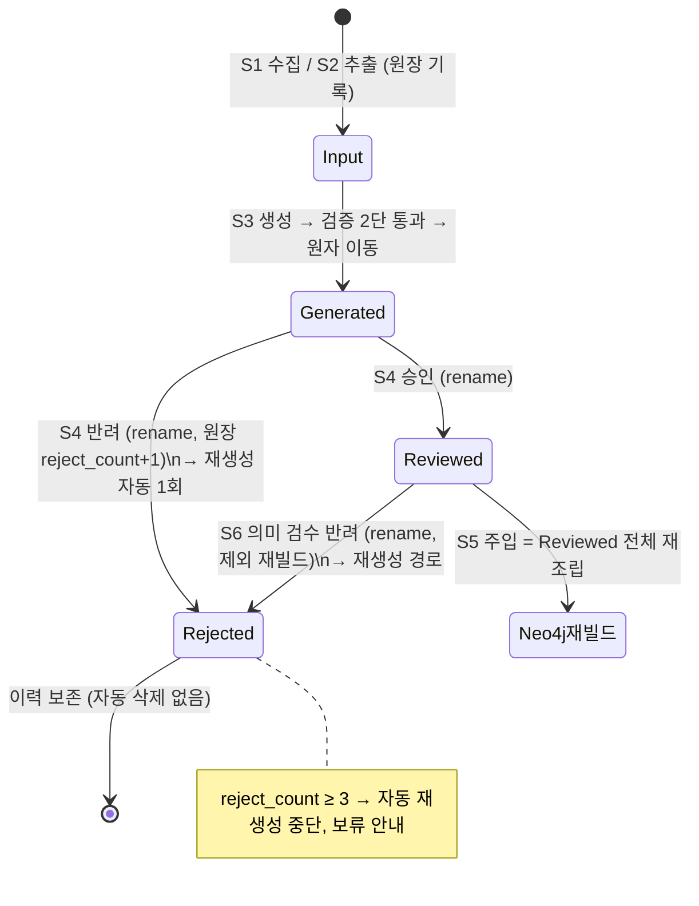
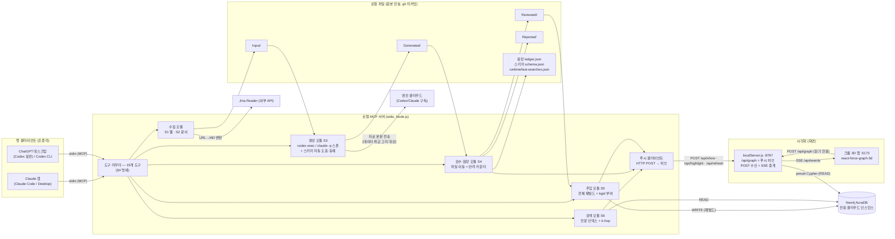
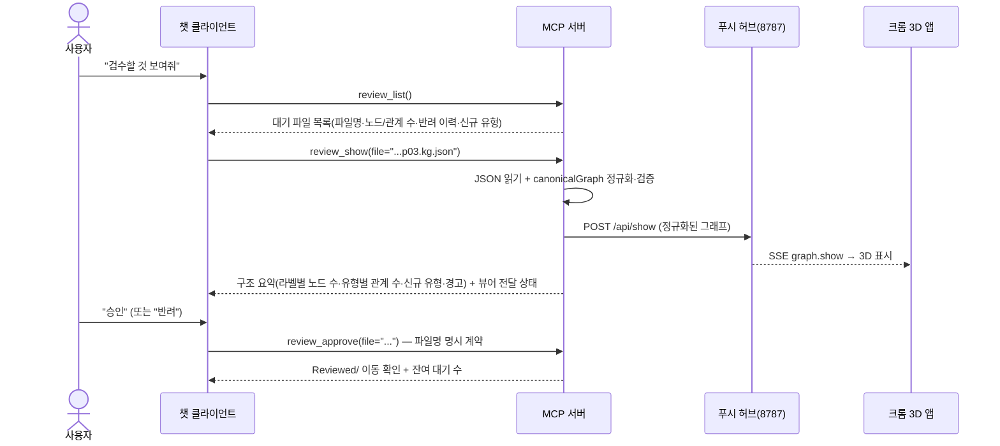
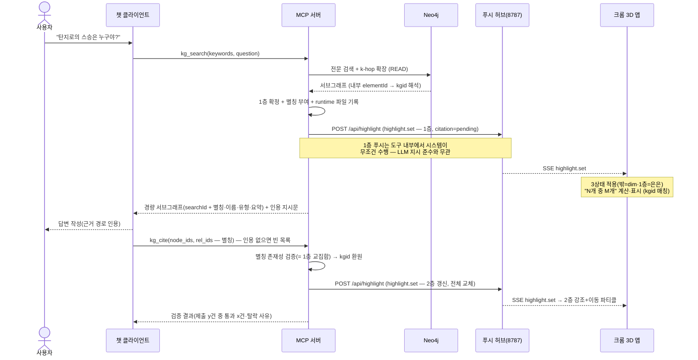

# 기술 설계 (TECH-SPEC) — 비블리오마인드(BiblioMind) (GraphRAG_1st 확장)

> 상태: **v2.2 — v2.1(AuraDB 전환·스캐폴딩 패널 반영) 후 총감사(패널 8인) 개정: 검증 계획 6(호출률·부정 대조) 신설, §5.5 404 비치명 처리, §6.4 Aura RTT 재산정, citation 문구 정직화, 과잉 인용 경고, 잠금 감지, README 목차 ⑮~⑰, 부록 A 3건 해소, 신형 콘솔 자격증명 정정 (상세는 부록 C·DECISIONS.md)**  · **v2.3(2026-08-22 유지보수 M2·M3): §6.2.3 질문 원문 앵커 복원 / §6.3 T2 점수 하한 / §6.4 상한 3행 / §4.3-13 인용 밀도 안내 정직화 / §1.14 가정 7행 신설** · **v2.4(2026-08-22): §7.9 하이라이트 상태 진단 스냅샷(`window.__bibliomind`) 신설 — 읽기 전용, 렌더링 무변경**| 최종 수정: 2026-08-22
> 입력: docs/PRD.md v3(승인본 — 2026-08-21 "도메인 스키마 AI 자동 도출" 요구 변경 반영본)이 유일한 요구사항 입력. 확정 결정은 docs/DECISIONS.md.
> 절 구성(1→7): **1. 플랫폼·스택·파이프라인·개발 환경** (언어·의존성·엔진 호출·S1/S2 수집·추출·폴더 구조·환경·스파이크/검증 계획) → **2. 데이터 모델** (전역 스키마 자동 도출·KG JSON·Neo4j 물리 모델·파일 시스템·무결성) → **3. 아키텍처** (구성·데이터 흐름·kgid 식별자·동시성) → **4. MCP 도구 명세·클라이언트 등록** (도구 15종 = 도구 표면의 정본) → **5. 푸시 프로토콜** (허브·SSE·메시지 4종 = 푸시의 정본) → **6. 검색·질의응답 설계** (내부 알고리즘의 정본) → **7. 시각화 확장** (화면 측 구현 — v2 신설)
> v2 개정 원칙: 검수 보고 4건(모호성·과잉 / 교차 정합성 / pain point / PRD 커버리지)의 지적을 반영하되, 지시된 변경 외의 기존 내용은 삭제·축약하지 않았다. 절 간 이중 정의는 아래 정본표 기준으로 단일화했다.

## 명명·경로·프로토콜 정본표 (v2 단일화 — 전 절이 이 표를 따른다)

병렬 설계에서 갈라진 표기를 아래 한 벌로 확정한다. 본문 어딘가에 폐기 표기가 남아 있다면 오기이며 이 표가 우선한다.

| 대상 | 정본 (확정) | 폐기된 표기 |
|---|---|---|
| Generated/·Reviewed/ 산출물 파일명 | `<stem>.kg.json` (1:1 고정 파생) | `<stem>.json` |
| Rejected/ 파일명 | `<stem>.kg.rejN.json` (N = 원장 reject_count 회차 — 반복 반려 이력 공존) | `<stem>.rejN.json`, `<stem>.kg.rejected-<시각>.json` |
| 스키마 파일 | 기본본 `shared/schema/schema.default.json` → 런타임 사본 `data/schema.json` | `data/schema/kg-schema.json`, `kg-schema.default.json` |
| KG 생성 프롬프트 템플릿 | `shared/prompts/kg-generation.md` | `shared/prompts/req_node_relation.txt` |
| 정규화 함수 | `shared/src/normalize.js`의 `normalize()` — **NFC**·trim·공백 축약·소문자화. 산출 = `name_key` | `normalizeName.js`, `entityKey.js`, `shared/normalize.js`, NFKC, `nameNorm` |
| MCP 서버 엔트리 | `mcp-server/src/index.js` | `mcp/server.js` |
| 검색·인용 도구명 | `kg_search` / `kg_cite` (도구 표면은 §4 소유) | `search_graph` / `cite_paths` |
| LLM 노출 식별자 | 별칭(`n1`/`r1`) — 서버가 별칭↔kgid 맵 보관. 푸시·화면 매칭은 **kgid** | elementId 노출, kgid 직접 노출 |
| 1층 집합·별칭 맵 저장 | `data/runtime/last-searches.json` 파일 (최근 5건 롤링) | 메모리 캐시 TTL 30분 |
| Neo4j 출처 속성 | `reviewed_files[]` / `input_files[]` | `src_json[]` / `src_input[]` |
| Neo4j 보조 라벨 | `RKEntity` (시스템 라벨 — 표시 라벨 1개 + 예외 1개) | "보조 라벨 금지" |
| full-text 인덱스명 | `kg_fulltext` (+ RANGE 인덱스 `kg_name_key`) | `rk_entity_fulltext`, `rk_entity_norm` |
| 재빌드 세대 표식 | `buildId` (원장 기록·푸시 동봉 — 참고 정보) | `graph_version`, `(:RKMeta)` 메타 노드 |
| 푸시 SSE 채널 | `GET /api/events` 단일 (메시지 4종 — §5 정본) | `GET /api/highlight/stream`, `GET /api/highlight/current` |
| 허브 주소 환경변수 | `VIZ_SERVER_URL=http://127.0.0.1:8787` | `HUB_URL` |
| 임시 폴더 | `data/tmp/`(엔진 입출력, ASCII 파일명)와 `data/.tmp/`(원자 쓰기 스테이징)는 **별개 폴더 — 둘 다 존재** | 한쪽 누락·혼동 |
| 검색 상한·크롤 간격 등 확정 상수 | **코드 상수** (환경변수로 빼지 않음 — §1.9 원칙) | 검색 상한의 .env 외부화 |
| 프론트매터 추출 품질 필드 | `extraction_quality: ok\|empty\|low` | `extraction: empty` |
| 프론트매터 extractor 예시 값 | `"unpdf"` | `"pdf-parse"` |

---

# 1. 플랫폼과 스택 · 파이프라인 · 개발 환경

## 1.1 구현 언어·런타임 확정 — Node.js 단일 통일

**결정: 전 컴포넌트를 Node.js(≥ 22.12, 권장 24 LTS) + JavaScript(ESM)로 통일한다. Python은 혼용하지 않는다.**

| 판단 기준 | A안. Node.js 단일 (채택) | B안. Node + Python 혼용 (배제) |
|---|---|---|
| 기존 자산 결합 | `canonicalGraph.js`(정규화 계층)·`neo4j-driver`·React 앱을 **그대로 import** — 파이프라인과 시각화가 같은 정규화 코드를 공유해 드리프트 원천 차단 | 정규화·검증 로직을 Python으로 이중 구현해야 함 — "생성기가 만든 JSON을 시각화가 못 읽는" 불일치의 온상 |
| MCP 서버 | 공식 `@modelcontextprotocol/sdk`(TypeScript/JS)가 stdio 서버의 1급 지원 | Python SDK도 존재하나, 그것 때문에 런타임 2개를 유지할 이유가 없음 |
| PDF·이미지 추출 | `unpdf`(MIT) + `tesseract.js`(Apache-2.0, WASM)로 MVP 요건(디지털 PDF + 이미지 베스트에포트) 충족. **네이티브 설치 없이 Windows에서 동작** | PyMuPDF는 **AGPL — MIT 저장소와 충돌**. pdfplumber 등 MIT 대안도 있으나 품질 이점이 MVP 요건을 초과 |
| 클론 재현성 (PRD 2차 사용자) | 시각화 앱이 이미 Node를 요구하므로 **추가 런타임 0개**. `git clone` → `npm install` 로 끝 | Windows에서 Python 설치 + venv + pip가 통째로 추가됨 — README 부담과 트러블슈팅 표면이 배로 늘어남 |
| KG 엔진 호출 | `codex exec`/`claude -p`는 어차피 **외부 CLI 서브프로세스** — 어느 언어에서 불러도 동일 | 동일 (혼용의 이점 없음) |

- 배제한 B안의 재검토 조건: 후순위 기능 "스캔본 고품질 OCR" 도입 시점에 한해 Python 사이드카(또는 네이티브 Tesseract) 재평가.
- **TypeScript 미도입**: 기존 앱이 순수 JS(JSX)이며, 1인 + AI 개발 규모에서 빌드 스텝 추가는 비용만 늘린다. 전 패키지 **ESM(`"type": "module"`) + JSDoc 타입 주석**으로 통일한다. MCP 도구의 입력 검증은 SDK가 요구하는 스키마 선언(zod)으로 충분히 커버된다.
- 런타임 하한 근거: 기존 앱의 Vite 7이 Node 22.12+를 요구한다. 루트 `package.json`에 `"engines": { "node": ">=22.12" }` 를 명시한다.

## 1.2 컴포넌트별 스택 총괄

| 컴포넌트 (PRD) | 위치 | 핵심 기술 |
|---|---|---|
| 웹 크롤러 S1 | `pipeline/src/crawl/` | Node 내장 `fetch` + Jina Reader API, `robots-parser`, `tldts`(등록 도메인 2단계 라벨), `gray-matter`(프론트매터) — 링크 발견·예절 상수는 §1.5 |
| 문서 추출기 S2 | `pipeline/src/extract/` | `unpdf`(디지털 PDF 텍스트), `tesseract.js`(이미지 OCR, kor+eng) — 전부 로컬 실행 (§1.5) |
| KG 생성기 S3 | `pipeline/src/generate/` | `codex exec` / `claude -p` 헤드리스 서브프로세스 어댑터 (§1.4) — 스키마 자동 도출 흐름은 §2.1 |
| Neo4j 주입기 S5 | `pipeline/src/inject/` | `neo4j-driver` 5.x (기존 앱과 동일 계열) |
| MCP 서버 S1~S6 | `mcp-server/` | `@modelcontextprotocol/sdk` stdio 서버 — pipeline 함수를 **in-process import**로 호출 |
| 시각화 확장 | `visualization-3d/` | 기존 스택 그대로(React 18 + react-force-graph-3d + Vite 7) + localServer에 수신 채널(POST /api/show·/api/highlight·/api/refresh + GET /api/events SSE) 신설 — 프로토콜은 §5, 화면 구현은 §7 |
| 공유 계층 | `shared/` | canonicalGraph(기존 이동), 파일명 sanitize, URL 정규화, `normalize()`(병합·kgid·검색 공용), .env 로더 |

## 1.3 신규 의존성과 라이선스 (MIT 호환 원칙)

의존성 최소주의: HTTP는 Node 내장 `fetch`, .env는 자체 로더(기존 localServer 패턴 승계), 테스트는 기존 Vitest를 그대로 쓴다. 신규 추가는 아래 6개가 전부다.

| 패키지 | 라이선스 | 용도 | 비고 |
|---|---|---|---|
| `@modelcontextprotocol/sdk` | MIT | MCP stdio 서버 | 공식 SDK |
| `unpdf` | MIT | PDF 텍스트 추출 | 내부 엔진은 Mozilla pdf.js(Apache-2.0). 순수 JS — 네이티브 빌드 없음 |
| `tesseract.js` | Apache-2.0 | 이미지 OCR (베스트에포트) | WASM — 네이티브 Tesseract 설치 불필요. 언어팩(kor+eng, 약 20MB)은 최초 1회 다운로드 후 로컬 캐시(`data/ocr-cache/`) — **문서 내용은 외부로 나가지 않음**(S2 로컬 전용 원칙과 무모순) |
| `robots-parser` | MIT | robots.txt 존중 (S1) | |
| `tldts` | MIT | 등록 도메인(eTLD+1) 판정 — 파일명 "메인이름" 규칙의 기술 기반 | 인터뷰의 tldextract(Python) 대응 JS 라이브러리 |
| `gray-matter` | MIT | YAML 프론트매터 읽기/쓰기 | |

Apache-2.0은 MIT 저장소에 포함 가능한 허용적 라이선스다(단방향 호환). AGPL 계열(PyMuPDF 등)은 전면 배제.

**PDF 추출 지정: `unpdf`.** 디지털 PDF의 텍스트 레이어 추출이 MVP 판정 기준(성공 기준 2)이며, unpdf는 pdf.js 엔진을 서버리스 빌드로 내장해 Windows/Node에서 의존성 없이 동작한다. 스캔 PDF(텍스트 레이어 없음)는 추출 결과가 비어도 정상 — 프론트매터에 `extraction_quality: empty` 표기(PRD 베스트에포트 정의). unpdf에 문제가 생기면 `pdfjs-dist`(Apache-2.0) legacy 빌드 직접 사용으로 대체 가능(동일 엔진이라 이행 비용 낮음).

## 1.4 KG 생성 엔진 2종 호출 방식 (codex exec / claude -p)

### 설계 원칙: 엔진 = "텍스트 입력 → JSON 텍스트 출력" 순수 함수

파일 읽기·쓰기·검증은 전부 **우리 파이프라인 코드**가 수행하고, 엔진에는 에이전트적 파일 조작을 시키지 않는다. 이유: 산출물 위치·개수(Input 1파일 = JSON 1개)의 결정성을 코드가 보장해야 체크포인트 재개와 검수 목록이 성립한다.

```
[generate 오케스트레이터 (pipeline)]
  1. Input MD 읽기 → 프롬프트 조립 (shared/prompts/kg-generation.md
     + data/schema.json의 전역 스키마 렌더 치환 — "①도메인 분석 → ②기존 유형
     우선 재사용·부족분만 신규 도출 → ③그 스키마로 추출" 3단계 지시 포함, §2.1)
  2. 엔진 어댑터 호출 (아래 계약)
  3. stdout/출력파일 → JSON.parse → canonicalGraph 정규화 → 스키마 검증
     (명명 규칙 위반만 실패 — 미등재 유형은 통과 + 등재 대상 수집, §2.2)
  4. 통과 시에만 Generated/<stem>.kg.json 원자적 쓰기(tmp에 쓰고 rename)
     → "Generated/에는 완전한 JSON만 놓인다"(PRD S3) 보장
  5. 실행 단위로 신규 유형을 모아 data/schema.json에 자동 등재
     (schema_version +1, 원자적 쓰기) + 결과 요약에 보고 (§2.1)
```

### 공통 어댑터 계약

```js
// pipeline/src/generate/engines/ — codex.js, claude.js가 동일 시그니처 구현
/**
 * @param {{ prompt: string, timeoutMs: number, model?: string, cwd: string }} req
 * @returns {Promise<{ ok: true, text: string }
 *                 | { ok: false, kind: 'timeout'|'rate_limit'|'crash'|'bad_output'|'not_installed',
 *                     summary: string }>}   // summary는 실패 보고 원칙에 따라 챗 응답용
 */
export async function run(req) { ... }
```

### 호출 명령 (Windows 네이티브 — 검증 사실 반영)

두 CLI 모두 npm 설치 시 **`.cmd` 심(shim)** 으로 깔린다. Node의 보안 패치(CVE-2024-27980) 이후 `spawn('codex', ...)`처럼 .cmd를 직접 spawn하면 Windows에서 `EINVAL`로 실패한다. 따라서 공용 헬퍼 `shared/src/winSpawn.js`가 **`cmd /c` 래퍼**로 감싼다. `{ shell: true }` 옵션은 인자 이스케이프가 셸 해석에 노출되므로 쓰지 않는다 — 인자는 배열로 유지하고 `cmd /c` 앞단만 붙인다.

```js
// shared/src/winSpawn.js — 요지
spawn('cmd', ['/c', bin, ...args], { cwd, stdio: ['pipe', 'pipe', 'pipe'] });
// 비-Windows(클론 사용자)에서는 spawn(bin, args) 그대로.
```

**본문 전달 규칙: 프롬프트(자료 본문 포함)는 절대 argv로 넘기지 않는다.** ① cmd 명령줄 8,191자 한계 ② 따옴표·한글 이스케이프 문제를 동시에 회피 — **stdin으로 파이프**하는 것을 1안, 실패 시 `data/tmp/`의 임시 파일(ASCII 파일명) 경로 전달을 2안으로 한다.

| 항목 | Codex 어댑터 | Claude 어댑터 |
|---|---|---|
| 명령 골격 | `cmd /c codex exec --skip-git-repo-check -s read-only -C <data/tmp> -o <출력파일> -` (프롬프트는 stdin) | `cmd /c claude -p --output-format json --max-turns 1` (프롬프트는 stdin, cwd=`data/tmp`) |
| 결과 수취 | `-o/--output-last-message` 파일에서 최종 메시지 읽기 (stdout 인코딩 이슈 회피). `--output-schema`(JSON Schema 강제) 사용 여부는 스파이크에서 확정 | stdout의 결과 JSON에서 `result` 필드 추출, `is_error` 필드로 실패 판별 |
| 도구/부작용 차단 | 샌드박스 `read-only` | 헤드리스는 승인 없는 도구 실행이 기본 차단됨 + 도구 차단 플래그(`--disallowedTools` 등)를 스파이크에서 확정 |
| 모델 지정 | `-m <model>` (KG_ENGINE_MODEL 설정 시) | `--model <model>` (동일) |

- **cwd를 `data/tmp/`로 고정하는 이유**: 저장소 루트에서 실행하면 리포의 CLAUDE.md/AGENTS.md 프로젝트 지침이 헤드리스 세션에 주입되어 KG 생성 프롬프트를 오염시킨다. 빈 작업 폴더에서 실행해 순수 생성으로 유지한다.
- 세부 플래그는 2026-08 기준 지식이며, **정확한 플래그 세트는 하이라이트 스파이크 직후의 "엔진 스모크 테스트"(각 엔진 1회 실행)에서 확정**하고 그 결과를 DECISIONS.md에 기록한다(PRD 성공 기준 3의 "두 엔진 각각 검증" 일부 선행).
- **실패 분류 (v2 보강)**: 프로세스 비정상 종료/타임아웃/출력의 한도 안내 문구 감지 → `rate_limit`/`timeout`/`crash`로 분류해 요약을 챗으로 반환(실패 보고 원칙). **단 `rate_limit`은 곧바로 실패로 끝내지 않고 한도 전환(failover) 규칙을 먼저 적용한다**(타 엔진으로 같은 파일부터 계속, 양쪽 소진 시에만 중단·보고). **`not_installed`**: CLI 미설치는 crash와 구분해 "다음 행동"을 재시도가 아니라 **CLI 설치 안내**로 반환한다. 판정 기준(v2.1 — 패널 실측): 비-Windows는 spawn ENOENT, Windows는 cmd /c 래퍼 경유라 ENOENT가 발생하지 않고 **종료 코드 9009**("not recognized")로 나타나므로 9009도 not_installed로 분류한다. 존재 사전 점검은 where.exe/which의 종료 코드만 쓴다(stderr는 코드페이지 문제로 미표시). **`bad_output`**(JSON 파싱·스키마 검증 실패): ① 1회에 한해 실패 사유+원 출력 요지를 붙인 **교정 재호출**을 수행한다(추가 비용 1회로 무한 반복 차단 — LLM 자기 교정 패턴) ② 교정도 실패하면 생성 실패로 보고하고 재실행 시 재시도한다 ③ **bad_output은 반려 카운트에 포함하지 않는다** — 반려는 사람의 검수 판단만 센다. 한도 중단 시(**두 엔진 모두 소진**) "같은 명령 재실행 = 미생성분만 재개"는 S3 오케스트레이터가 **Generated/ ∪ Reviewed/ 기준(§2.4.1 스킵 판정, Rejected 제외)**으로 판정한다(별도 상태 파일 불필요).

### 시작 엔진 선택 설정 — ".env 기본 + 명령 인자 우선" 구현

```js
// pipeline/src/generate/resolveEngine.js
const VALID = ['codex', 'claude'];
export function resolveEngine(toolArg, env = process.env) {
  const v = toolArg ?? env.KG_ENGINE ?? 'codex';   // 시작 엔진 우선순위: 도구 인자 > .env > 내장 기본 (한도 시 전환은 failover 규칙이 별도 처리)
  if (!VALID.includes(v)) return { ok: false, summary: `엔진 값 "${v}" 인식 불가 (codex|claude)` };
  return { ok: true, engine: v };
}
```

MCP의 생성 도구는 선택 인자 `engine`을 받아 이 함수에 그대로 전달한다 — 인자를 지정하면 **그 실행에 한해** 우선(PRD 확정 8항)하고, 설정 파일(.env)은 바꾸지 않는다. 이 값은 **시작 엔진**이다 — 실행 중 한도 소진 시의 전환은 failover 규칙을 따르며, 전환 역시 .env를 바꾸지 않는다.

### 구독 사용량 예산 — 엔진 상호 전환(failover) (v3 개정 — 역할 분리 폐기)

1인 + AI 개발에서는 ① 개발 자체(Claude Code 페어) ② S3 생성 엔진 ③ S6 질의응답 클라이언트가 같은 구독 지갑을 나눠 쓴다. 완화를 명문화한다:

- **상호 전환 원칙 (v2 '역할 분리' 폐기 — 2026-08-21 사용자 결정)**: 생성 엔진에 역할을 고정하지 않는다. `KG_ENGINE`(기본 codex)은 **시작 엔진**일 뿐이며, 실행 중 사용량 한도(rate_limit)를 만나면 **다른 엔진으로 자동 전환해 계속한다**(Codex→Claude·Claude→Codex 방향 무관). 목적 = 두 구독의 잔여 사용량 최대 활용 — 역할 고정 시 '남은 한도가 있어도 역할 때문에 못 쓰는' 문제를 제거. 규칙 상세는 아래 '한도 전환(failover) 규칙'. DECISIONS.md에 운영 방침 변경으로 기록한다.
- 대량 생성은 각 엔진의 한도 리셋 주기(Codex 5시간 롤링 등)에 맞춰 `limit` 소분할 실행(README 운영 팁).
- PRD 후순위 "API 크레딧 경로"의 발동 조건을 예약한다: **두 엔진이 같은 실행에서 모두 한도 소진(양쪽 rate_limit)되는 일이 주간 2회 발생하면** 크레딧 경로 도입을 의사결정 안건으로 올린다(전환 도입으로 단일 엔진 소진은 병목이 아니게 되어 기준을 '양쪽 동시 소진'으로 갱신).
- 이미 설계로 줄인 것: 가짜 엔진 계약 테스트(실구독 미소모, §1.12), 체크포인트 `limit` 소분할(§4.3-3), 검색 결과 경량화(§4.1), MCP Inspector 단독 테스트(§1.8).

#### 한도 전환(failover) 규칙 (v3 신설)

1. **트리거 = `rate_limit`만** — timeout/crash/bad_output/not_installed는 기존 경로 유지.
2. **같은 파일부터 전환**: rate_limit 호출은 산출물이 없으므로 그 파일을 타 엔진으로 즉시 재시도한다(다음 파일로 넘기지 않음 — 체크포인트 문법 불변).
3. **실행 내 고정(sticky)**: 전환 후 남은 파일은 전환된 엔진으로 처리. 전환 상태는 **영속하지 않는다** — .env 불변, 다음 실행은 다시 resolveEngine부터(한도는 시간 창으로 회복 — 숨은 상태 금지).
4. **양쪽 소진 = 중단·재개**: 전환된 엔진도 rate_limit이면 중단하고 '두 엔진 모두 사용량 한도 — 회복 후 같은 명령 재실행 시 이어서 처리'를 보고. 자동 대기·폴링 없음(MCP 타임아웃·챗 UX).
5. **bad_output 교정과의 결합**: 교정 재호출은 같은 엔진으로. 교정 재호출이 rate_limit이면 전환하되 타 엔진에는 처음부터의 생성 호출로 시작(원 출력 기반 교정은 타 엔진에 무의미).
6. **끄기**: `kg_generate`의 `failover?: bool`(기본 true) — false면 시작 엔진 고정(용도: 성공 기준 3 엔진별 검증·준수율 측정 §1.14).
7. **보고(실패 보고 원칙)**: 전환은 실패가 아니라 보고 의무가 있는 이벤트 — 요약에 전환 방향·시점 파일·파일별 엔진 집계 포함, 산출물 meta.engine에 실제 생성 엔진 기록.

## 1.5 웹 수집·문서 추출 파이프라인 (S1·S2 상세 — v2 신설)

> v1에서 "S1 절·수집 파이프라인 절"로 참조만 되고 존재하지 않던 설계를 보강한다. 파일명·프론트매터·원장 규약은 §2.4가 소유하고, 본 절은 수집 동작(링크 발견·예절·추출 판정)을 소유한다.

### S1 웹 크롤러 — 링크 발견과 BFS

- **링크 발견 = Jina 응답 마크다운 파싱(확정)**: 각 페이지를 Jina Reader로 변환한 마크다운에서 링크(`[텍스트](URL)` 구문)를 추출한다. 원본 HTML을 별도 fetch하지 않는다 — 페이지당 요청이 Jina 1회로 유지되어 무료 키 한도와 크롤링 예절 표면이 절반이 된다.
- **BFS 프런티어**: 추출 링크를 절대 URL화 → URL 정규화(§2.4.4 규칙) → 등록 도메인 필터(tldts, 시작 URL과 같은 eTLD+1만) → 방문 집합(배치 내 메모리 + 원장 기수집 키) 중복 제거 → BFS 큐 투입. 상한(`max_pages`, 기본 10)은 "시도한 페이지 수" 기준(시작 페이지 포함 — PRD 문언).
- **robots.txt**: 대상 사이트에서 **직접 1회 fetch**(`robots-parser`)해 배치 동안 캐시한다. 불허 경로는 시도 수에 세지 않고 건너뜀으로 보고한다.
- **요청 간격**: 코드 상수 `CRAWL_DELAY_MS = 1000`(1초) — Jina 호출 간 최소 간격. robots.txt의 Crawl-delay가 더 크면 그 값을 따른다.
- **JINA_API_KEY 부재 시**: Jina Reader의 무키 저율 호출로 동작을 허용하되, 결과 요약에 "무료 키 발급 권장(속도·한도 개선)" 1줄을 포함한다. 키가 있으면 헤더로 전달.
- **멱등 스킵 2단 (원장 키 순환 해소 — §2.4.4와 한 몸)**: ① 1차 — BFS가 발견한 URL의 정규화 키로 **요청을 보내기 전에** 스킵 판정(기수집 `collected`면 네트워크 요청 자체를 생략 — "재실행 시 건너뛴다"의 체감 보장) ② 2차 — 수집 응답의 최종 URL(리다이렉트 결과) 정규화 키(`final_hash`)가 기존 다른 엔트리와 겹치면 같은 문서의 다른 진입 URL로 판정해 파일을 만들지 않고 스킵 기록.
- 실패 페이지는 원장에 `failed` + 사유 기록, 재실행 시 자동 재시도(PRD S1).

### S2 문서 추출기 — 로컬 전용

- PDF: `unpdf`로 텍스트 레이어 추출. 이미지: `tesseract.js`(kor+eng) OCR. **외부 전송 없음**(전 과정 로컬).
- **품질 판정 → `extraction_quality`**: 추출 텍스트 0자 = `empty`, 임계 길이 미만(코드 상수, 구현 중 확정) = `low`, 그 외 = `ok`. 어느 경우든 파일은 생성한다(베스트에포트 — PRD S2). 판정 결과는 프론트매터와 결과 요약 양쪽에 보고.
- 파일명 규칙·sanitize·원제목 보존은 §2.4.2·§1.13이 소유. 원본 파일 내용 해시가 원장 키(§2.4.4 — 같은 PDF 재투입 = 멱등 스킵).
## 1.6 폴더 구조 (모노레포) — 기존 GraphRAG_1st에 추가

npm workspaces 모노레포로 확장한다. 클론 1회 + `npm install` 1회로 전 컴포넌트가 설치된다. **물리 배치(파일명·경로)는 본 절이 단일 소유자다** — 타 절은 파일 "내용"을 소유한다.

```
GraphRAG_1st/
├─ package.json                  # [신규] 루트: workspaces 선언 + 공통 스크립트 (§1.8)
├─ .mcp.json                     # [신규] Claude Code 프로젝트 스코프 MCP 등록 (상대경로 커밋, §4.4)
├─ .gitignore                    # [갱신] data/·.env 커밋 금지 (§1.7)
├─ .env.example                  # [신규] 전체 환경변수 문서 (커밋, §1.9)
├─ .env                          # 실제 값 — 커밋 금지
├─ LICENSE  /  README.md         # 기존 유지 (MIT)
│
├─ examples/                     # [신규] 커밋되는 유일한 데이터 — 명시 선정 예시
│  └─ KG_Demon Slayer_Draft_01.json   # 루트에서 이동 (README 링크 갱신)
│
├─ data/                         # [신규] ★ 전체 gitignore — 사용자 로컬 원본 진실
│  ├─ Input/                     # S1·S2 산출 MD
│  ├─ Generated/                 # S3 산출 KG JSON (완전한 것만, <stem>.kg.json)
│  ├─ Reviewed/                  # S4 승인분 — Neo4j 재빌드의 원본 진실
│  ├─ Rejected/                  # S4·S6 반려분 (<stem>.kg.rejN.json — 삭제 아님)
│  ├─ ledger.json                # 원장: 정규화 URL/파일 해시 키 → 수집 상태·실패 기록·차단·반려 횟수 (§2.4.4)
│  ├─ schema.json                # 전역 스키마 런타임 사본 — 초기값은 shared에서 복사, AI 자동 등재 대상 (§2.1)
│  ├─ runtime/                   # 검색 상태 등 런타임 파일
│  │  └─ last-searches.json      # 1층 집합·별칭↔kgid 맵 (최근 5건 롤링, §6.3)
│  ├─ tmp/                       # 엔진 임시 입출력 (ASCII 파일명) — 스테이징 청소 대상 아님
│  ├─ .tmp/                      # 원자적 쓰기 스테이징 (명령 시작 시 비움, §2.5)
│  └─ ocr-cache/                 # tesseract.js 언어팩 캐시
│
├─ shared/                       # [신규] @bibliomind/shared — 모두가 공유하는 단일 진실
│  ├─ package.json
│  ├─ src/
│  │  ├─ canonicalGraph.js       # visualization-3d/src/lib에서 이동 (아래 이동 방식)
│  │  ├─ naming.js               # 파일명 규칙 v2·Windows sanitize(금지문자·예약이름·길이 상한)
│  │  ├─ urlNormalize.js         # URL 정규화 (S1 스킵 판정 키 — 규칙 정의는 §2.4.4)
│  │  ├─ normalize.js            # ★ 정규화 단일 구현 — name_key 산출 (병합·kgid·검색 공용, §2.3.2)
│  │  ├─ kgSchemaValidate.js     # KG JSON 2단계 검증 (§2.2)
│  │  ├─ renderSchema.js         # 전역 스키마 → 프롬프트 텍스트 렌더러 (§2.1.5)
│  │  ├─ env.js                  # 루트 .env 로더 (§1.10)
│  │  ├─ paths.js                # KG_DATA_DIR 해석 + 하위 폴더 상수·자동 생성
│  │  └─ winSpawn.js             # cmd /c 래퍼 spawn (§1.4)
│  ├─ schema/schema.default.json # 초기 전역 스키마 시드 (커밋 — 내용은 §2.1)
│  └─ prompts/kg-generation.md   # KG 생성 지시문 템플릿 ({schema} 치환 자리, 3단계 절차 포함)
│
├─ pipeline/                     # [신규] @bibliomind/pipeline — S1·S2·S3·S5 실행 엔진
│  ├─ package.json
│  ├─ src/
│  │  ├─ crawl/                  # S1: BFS·도메인 경계·Jina 변환·멱등 스킵 (§1.5)
│  │  ├─ extract/                # S2: PDF·이미지 → MD (로컬 전용, §1.5)
│  │  ├─ generate/               # S3: 오케스트레이터 + engines/{codex,claude}.js + resolveEngine.js
│  │  ├─ inject/                 # S5: 전체 재빌드·병합·kgid·출처 속성 (§2.3)
│  │  └─ ledger.js               # 원장 읽기/쓰기 (원자적 갱신)
│  ├─ bin/                       # 수동 실행·디버그용 얇은 CLI (collect.js, generate.js, inject.js,
│  │                             #  inject-example.js — 스파이크용 최소 주입, §1.14)
│  └─ tests/
│
├─ mcp-server/                   # [신규] @bibliomind/mcp-server — 챗 조종석
│  ├─ package.json
│  ├─ src/
│  │  ├─ index.js                # stdio 엔트리 (Claude·Codex 클라이언트가 이것을 기동)
│  │  ├─ tools/                  # 도구 정의 — pipeline 함수를 in-process 호출, 결과 요약 반환
│  │  └─ vizClient.js            # 시각화 허브로 그래프 표시·하이라이트 POST (닫힘 감지 포함)
│  └─ tests/
│
├─ scripts/
│  └─ setup.js                   # [신규] 최초 1회 부트스트랩 (§1.11)
│
└─ visualization-3d/             # 기존 앱 — 내부 구조 불변 + 최소 확장
   ├─ server/localServer.js      # [확장] 푸시 허브 라우트 4종 + SSE (§5) + 127.0.0.1 바인딩
   └─ src/                       # [확장] SSE 구독·push 소스·3상태 레이어 (§7)
      └─ lib/canonicalGraph.js   # [축소] shared 재-export 심 1줄 (아래)
```

### 책임과 의존 방향

| 폴더 | 책임 (한 줄) | 하면 안 되는 것 |
|---|---|---|
| `shared/` | 파이프라인·MCP·시각화가 공유하는 정규화 규칙·명명 규칙·경로·환경 로더 | 네트워크·DB 접근 금지 (순수 함수만) |
| `pipeline/` | 자료를 이동시키는 모든 실행 로직 (수집→추출→생성→주입) | 챗 응답 포맷팅 금지 — 구조화된 결과 객체만 반환 |
| `mcp-server/` | 챗 명령 ↔ pipeline 함수 연결 + 결과 요약을 챗 문장으로 + 시각화 푸시 | 비즈니스 로직 보유 금지 (전부 pipeline·shared에) |
| `visualization-3d/` | 화면 — 그래프 렌더 + 수신 채널 | 파이프라인 데이터 폴더 직접 접근 금지 (신호 수신만) |
| `data/` | 사용자 로컬 데이터의 단일 루트 — 백업 안내 대상(README) | 커밋 금지 (전체) |
| `examples/` | 공개 데모용으로 명시 선정된 데이터만 | 사용자 생성 데이터 투입 금지 |

**의존 방향 (단방향 강제)**: `shared` ← `pipeline` ← `mcp-server`, `shared` ← `visualization-3d`. MCP 서버는 pipeline을 **같은 프로세스에서 import**한다(서브프로세스는 KG 엔진 CLI뿐) — 프로세스 경계가 하나 줄어 실패 보고가 예외 객체 그대로 전달된다.

**canonicalGraph 이동 방식**: 파일을 `shared/src/`로 이동하고, 기존 위치에는 `export * from '@bibliomind/shared/canonicalGraph';` 재-export 심을 남긴다. 기존 앱의 import 경로·테스트 14종(fixtures 제외)이 무수정으로 통과하고, 생성기·주입기·시각화가 같은 정규화 코드를 쓰게 된다(게이트 검증에서 확인된 "정규화 계층 재사용 가능" 이행).

**data/를 저장소 안에 두는 이유**: 클론 사용자와 본인 모두 경로 설정 없이 즉시 동작(제로 설정)하고, `.gitignore`가 커밋을 원천 차단한다. 다른 드라이브로 옮기고 싶으면 `KG_DATA_DIR` 하나만 바꾸면 된다(§1.9). 폴더들은 없으면 `shared/src/paths.js`가 자동 생성하므로 클론 직후에도 오류가 없다.

## 1.7 .gitignore 정책 (PRD 공개 저장소 위생 원칙의 구현)

루트 `.gitignore`에 추가한다(기존 항목 유지):

```gitignore
# 의존성·산출물
node_modules/
dist/
coverage/

# ★ 사용자 데이터 전체 — Input/Generated/Reviewed/Rejected/원장/스키마/런타임/임시 (PRD 위생 원칙)
data/

# 환경 변수 — 자격증명·키
.env
.env.*
!.env.example

*.log
```

- **커밋되는 데이터는 `examples/` 와 `shared/schema/schema.default.json`, `shared/prompts/` 뿐**이다. 사용자 스키마(`data/schema.json`)와 원장은 원본 진실이므로 로컬 백업 대상(README 고지 — PRD 리스크 절 이행).
- `visualization-3d/.gitignore`(기존)는 그대로 둔다. 이중 방어가 되어도 무해하다.

## 1.8 실행 명령 체계 (루트 package.json)

```json
{
  "name": "graphrag-1st",
  "private": true,
  "type": "module",
  "engines": { "node": ">=22.12" },
  "workspaces": ["shared", "pipeline", "mcp-server", "visualization-3d"],
  "scripts": {
    "setup":      "node scripts/setup.js",
    "dev:all":    "npm run dev:full -w visualization-3d",
    "dev:viz":    "npm run dev -w visualization-3d",
    "dev:api":    "npm run dev:api -w visualization-3d",
    "mcp:stdio":  "node mcp-server/src/index.js",
    "mcp:inspect":"npx -y @modelcontextprotocol/inspector node mcp-server/src/index.js",
    "mcp:smoke":  "npx -y @modelcontextprotocol/inspector --cli node mcp-server/src/index.js --method tools/list",
    "lint":       "eslint shared pipeline mcp-server scripts && npm run lint -w visualization-3d",
    "test":       "npm test --workspaces --if-present"
  }
}
```

| 명령 | 하는 일 | 언제 쓰나 |
|---|---|---|
| `npm run setup` | 최초 부트스트랩 (§1.11) | 클론 직후 1회 |
| `npm run dev:all` | 시각화 API 서버(8787) + Vite(5173) 동시 기동 — 기존 `dev:full` 재사용 | **평상시 이것 하나** — "크롬 3D 앱은 화면" 준비 완료 상태 |
| `npm run mcp:stdio` | MCP 서버 수동 기동 | 디버그 전용 — 평상시엔 Claude/Codex 클라이언트가 자동 기동 |
| `npm run mcp:inspect` | MCP Inspector **UI**로 도구를 챗 없이 단독 테스트(대화형 웹 UI — 사람용) | 도구 개발 중 수동 확인 |
| `npm run mcp:smoke` | Inspector **CLI 모드** — tools/list 1회 응답 후 종료(비대화형) | 등록 직후·스캐폴딩 자가검증(§1.14)의 자동 판정용 (v2.1 신설 — UI 모드는 행(hang)이라 게이트 판정 불가) |
| `npm run lint` | 루트 flat config(신규 패키지·scripts) + 시각화 자체 lint 순차 실행 | 슬라이스 완료 시마다 (v2.1 신설 — PROCESS 2.2 이행, 신규 의존성은 기존 eslint 9 재사용) |
| `npm test` | 전 워크스페이스 Vitest 실행 | 슬라이스 완료 시마다 |
| `pipeline/bin/*.js` | `node pipeline/bin/generate.js --engine claude` 식 수동 실행 | MCP 우회 디버그 (조작 원칙의 "수동 대체 수단") |

일상 운영 형태: 터미널에서 `npm run dev:all` 1개 + 크롬에서 `http://localhost:5173` — 나머지는 전부 챗(MCP)이 조종한다. MCP 서버는 사용자가 띄우는 프로세스가 아니라 **챗 클라이언트가 stdio로 기동·종료를 관리**하므로 dev:all에 포함하지 않는다.

## 1.9 .env.example (신규 환경변수 전체 목록)

루트 `.env` **단일 파일**로 통일한다(기존 `visualization-3d/.env.local`도 계속 인식 — 하위 호환).

```bash
# ══ Neo4j AuraDB 클라우드 — 주입기·MCP 검색·시각화 공용 (v2.1: 오너 지시로 Desktop→AuraDB 전환) ══
NEO4J_URI=neo4j+s://xxxxxxxx.databases.neo4j.io   # AuraDB Connection URI (+s = TLS 내장 — 드라이버 추가 암호화 설정 불요). 로컬 병용 시 bolt://localhost:7687
NEO4J_USERNAME=replace-me       # 자격증명 .txt의 NEO4J_USERNAME 값 그대로 (신형 콘솔은 8자 ID 발급 — 2026-08-21 실물 확인)
NEO4J_PASSWORD=replace-me       # 인스턴스 생성 시 1회만 표시 — 자격증명 파일 다운로드 필수
NEO4J_DATABASE=neo4j            # 자격증명 .txt의 NEO4J_DATABASE 값 그대로 (신형 Aura 콘솔은 인스턴스별 생성명 발급 — 2026-08-21 실물 확인. CREATE DATABASE는 여전히 미지원)
NEO4J_SOURCE_ENABLED=true       # [기존 변수] 시각화 Neo4j 모드 — true

# ══ 시각화 서버 ══
API_PORT=8787                   # [기존 변수] localServer 포트
VIZ_SERVER_URL=http://127.0.0.1:8787   # MCP→시각화 푸시 대상 (그래프 표시·하이라이트) — 바인딩과 일치

# ══ KG 생성 엔진 (S3) ══
KG_ENGINE=codex                 # codex | claude — 시작 엔진. 챗 명령 지정 시 그 실행에 한해 우선. 한도 소진 시 타 엔진 자동 전환(§1.4 failover — kg_generate failover=false로 고정 가능)
KG_ENGINE_MODEL=                # 비우면 각 CLI의 기본 모델
KG_ENGINE_TIMEOUT_MS=600000     # Input 파일 1건 생성 제한 시간 (10분)

# ══ 웹 수집 (S1) ══
JINA_API_KEY=                   # 무료 키 — 발급 절차는 README (없어도 저율 동작, §1.5)

# ══ 데이터 위치 ══
KG_DATA_DIR=./data              # Input/Generated/Reviewed/Rejected/원장/스키마/runtime의 루트 (저장소 기준 상대 또는 절대)
```

원칙: **PRD가 값을 확정한 것(페이지 상한 기본 10, 반려 3회 한도, BFS 등)은 환경변수로 빼지 않고 코드 상수**로 둔다 — 설정 표면을 늘리면 클론 재현성이 나빠진다. 크롤링 요청 간격(§1.5)·검색 상한(§6.4)도 같은 원칙의 코드 상수다(v2에서 검색 상한의 환경변수 외부화를 폐기).

## 1.10 환경 로딩 규칙 — shared/src/env.js

- dotenv 의존성 없이 자체 로더(기존 localServer의 `loadEnvLocal` 패턴을 일반화해 승계).
- **탐색 기준은 cwd가 아니라 모듈 파일 위치**: `env.js`에서 상위로 올라가 저장소 루트의 `.env`를 찾는다. 근거: MCP 서버는 Claude/Codex 클라이언트가 **임의의 cwd에서** 기동하므로 cwd 기반 로딩은 반드시 깨진다. `node --env-file`도 같은 이유(경로 고정·부재 시 에러)로 쓰지 않는다.
- 우선순위: 이미 설정된 `process.env` > 루트 `.env`. 값은 어떤 로그에도 출력하지 않는다(기존 앱 관례 유지).
- localServer.js에는 루트 `.env` 로딩을 추가하되 기존 `.env.local`이 우선하도록 한다(비파괴 확장).

## 1.11 부트스트랩 — scripts/setup.js (클론 재현성의 핵심)

`npm run setup` 1회가 수행하는 것: ① `data/` 하위 폴더 전체 생성(runtime/·tmp/·.tmp/ 포함) ② `shared/schema/schema.default.json` → `data/schema.json` 복사(없을 때만) ③ `.env.example` → `.env` 복사(없을 때만) ④ Node 버전·`codex`/`claude` CLI 존재 점검 + **가능한 범위의 로그인 상태 점검** 결과를 표로 출력 ⑤ §4.4의 MCP 등록 명령을 절대경로를 채워 출력 ⑥ `.env`에 Neo4j 값이 있으면 **AuraDB 접속 시도 점검**(성공/실패·안내 출력. 실패 시 무료 인스턴스의 일시정지 가능성과 콘솔 Resume 확인 안내를 포함하고, 미설정이면 "슬라이스 0.5에서 인스턴스 생성" 안내가 정상 — v2.1). 실패해도 각 단계는 독립적이며 재실행 안전(멱등).

## 1.12 테스트 러너 — Vitest 통일

- 기존 앱이 Vitest 3이므로 **전 워크스페이스 Vitest**로 통일. 루트 `npm test`가 `--workspaces --if-present`로 순회한다.
- 테스트 정책(1인 + AI 규모에 맞게 3종만):
  1. **순수 로직 단위 테스트** — naming·urlNormalize·normalize·resolveEngine·ledger·kgSchemaValidate: 입출력 표 기반. Windows 금지 문자·예약 이름(CON, NUL 등)·한글 파일명 케이스 필수 포함. **v2 추가 케이스**: 반려 후 자동 재생성이 실패한 자료가 다음 `kg_generate` 재실행에서 처리 대상에 포함되는지(스킵 판정 = Generated ∪ Reviewed 기준, §2.4.1) / 미등재 유형의 자동 등재·schema_version 증가.
  2. **엔진 어댑터 계약 테스트** — 실제 codex/claude 대신 **가짜 실행 스크립트**(고정 JSON을 뱉는 node 스크립트)를 spawn해 stdin 전달·타임아웃·실패 분류(not_installed 포함)·교정 재호출·**한도 전환(가짜 rate_limit → 타 엔진 전환·같은 파일 재시도, 양쪽 rate_limit → 중단 보고, failover=false 시 고정)**을 검증. 실 구독을 소모하지 않는다.
  3. **기존 시각화 테스트 무수정 통과** — canonicalGraph 이동(재-export 심) 후 기존 tests/ 14종(fixtures 제외)이 그대로 통과하는 것이 이동 완료 판정.
- 네트워크(Jina·Neo4j)를 실제로 때리는 테스트는 만들지 않는다 — 실연동 검증은 로드맵의 슬라이스별 수동 스모크(성공 기준 1~9)로 대체.

## 1.13 Windows 네이티브 주의점 (설계에 반영된 검증 사실)

| # | 사실 | 설계 반영 |
|---|---|---|
| 1 | npm 설치 CLI(`codex`, `claude`)는 `.cmd` 심 — Node 보안 패치 이후 직접 spawn 시 `EINVAL` | `shared/src/winSpawn.js`의 **`cmd /c` 래퍼** 일원화. `shell: true`는 인자 이스케이프 위험으로 금지 (§1.4) |
| 2 | cmd 명령줄 8,191자 한계 | 자료 본문·프롬프트는 argv 금지 — stdin 파이프(1안)/임시 파일(2안) (§1.4) |
| 3 | MCP stdio 프로토콜은 stdout을 점유 | mcp-server 전역에서 `console.log` 금지, 진단은 **stderr 전용** — stdout 오염 시 클라이언트 연결이 조용히 깨진다 |
| 4 | 파일명 금지 문자(`: / ? * " < > \|`) + 예약 이름(CON, PRN, AUX, NUL, COM1~9, LPT1~9) + 끝 공백/마침표 금지 | `shared/src/naming.js`가 일괄 sanitize. PRD 파일명 규칙의 구현 지점 |
| 5 | MAX_PATH 260자 | 메인이름을 80자에서 절단(원제목은 프론트매터에 전체 보존 — PRD와 무모순) |
| 6 | `fs.rename`은 드라이브 경계에서 `EXDEV` 실패 | `data/` 하위 이동(Generated→Reviewed 등)은 같은 볼륨이라 안전. `KG_DATA_DIR`를 다른 드라이브로 바꾼 경우 대비 copy+unlink 폴백 |
| 7 | 한글 인자·경로의 셸 해석 문제 | 엔진 임시 파일은 `data/tmp/`에 **ASCII 파일명**으로 생성, 경로 조립은 항상 `node:path` |
| 8 | 헤드리스 CLI가 cwd의 CLAUDE.md/AGENTS.md를 읽음 | 엔진 실행 cwd를 `data/tmp/`로 고정 — 리포 지침의 프롬프트 오염 차단 (§1.4) |

## 1.14 스파이크·검증 계획 (v2 신설 — 미검증 가정과 마일스톤)

### 미검증 가정 총괄과 검증 시점

| # | 가정 | 틀렸을 때의 파급 | 검증 계획 |
|---|---|---|---|
| 1 | 엔진 CLI 플래그 세트(§1.4) | 어댑터 호출부 국소 재작성 (계약 인터페이스 뒤 격리) | 스파이크 직후 "엔진 스모크 테스트" 각 1회 → DECISIONS 기록. codex `--output-schema` 동작을 우선 확인(스키마 강제가 되면 준수율 문제 자체가 축소) |
| 2 | ChatGPT 데스크탑 일반 챗 모드의 로컬 MCP 동작 | Codex 화면 지원으로 축소(경미) — 대응은 PRD §4 특칙 확정 | 하이라이트 스파이크에서 실검증 |
| 3 | Neo4j full-text `cjk` 분석기의 한국어 실측 품질 | 시드 부실 → 1층 품질 하락 (T1·T3 폴백은 존재) | **(v2.1 선행 추가) Aura 가용성 실측**: 인스턴스 생성 직후 `CALL db.index.fulltext.listAvailableAnalyzers()`로 cjk 존재 1회 확인(2026-08-21 웹 검증: Neo4j 코드베이스 내장 확인, Aura 명시 문서는 부재 — 실측으로 확정). 이어서 **검색 품질 미니 평가(신설)**: 예시 데이터 대상 한국어 질문 15~20개(직접형·부분 이름형·관계형 혼합)로 기대 시드 적중률 측정, 기준 **≥80%**. 미달 시 T2 쿼리 구성·키워드 지시문 조정 후 재측정 → DECISIONS 기록 |
| 4 | 헤드리스 엔진의 KG JSON 스키마 준수율 | 검증 실패→재생성 루프의 한도 소모 | **준수율 측정(신설)**: S3 구현 직후 실자료 5건 × 엔진 2종으로 측정(성공 기준 3의 수치화). 측정 실행은 `failover=false`로 엔진을 고정한다(전환이 표본을 오염시키지 않게). 파일별 판정 증거 = 산출물 `meta.engine`. 완화 장치는 bad_output 교정 재호출 1회(§1.4) |
| 5 | 챗 LLM의 도구 호출 순서 준수(특히 답변 직후 `kg_cite`) | 2층 미표시 (1층 보장선은 무관하게 동작) | **kg_cite 준수율 판정(신설)**: 스파이크에서 클라이언트별 질문 10회 중 kg_cite 호출 ≥8회 + 2층 표시 확인 ≥1회. 미달 시 사다리: 결과 동봉 지시문 강화 → 도구 설명문 조정 → "2층은 베스트에포트, 1층이 보장선" PRD 각주 경미 개정 |
| 6 | (v2.2 신설 — 총감사 반영) 챗 LLM의 **kg_search 호출 자체**(도구 선택) — 검증 5의 전제 | 1층 보장선 자체가 무력화(침묵 실패 — 자체 지식 답변 + 하이라이트 무변화) | **kg_search 호출률 판정**: 같은 스파이크 질문 10회 중 kg_search 호출 횟수 측정(질문 세트에 "LLM이 이미 아는 유명 IP 질문"을 의도 포함해 미호출 유도). 미달 사다리: 도구 설명문 조정 → 저장소 CLAUDE.md/AGENTS.md에 "지식 질문은 kg_search 우선" 규칙 추가 → README에 질문 관례("그래프에서 찾아 답해줘") 명문화. **부정 대조 실험 동시 수행**: 그래프에 없는 사실 질문 n회에서 "빈 인용 제출 + 그래프 밖 지식 고지" 준수율 측정(환각-검증표시 위장 감지) |
| 7 | (v2.3 신설 — 유지보수 M2 반영) 챗 LLM이 도구 인자로 넘기는 **한글 키워드의 표기 무결성** — 모델이 질문에 등장한 이름을 자모 수준에서 손상시키지 않고 그대로 전달한다는 가정 | **거짓 부재**: 그래프에 있는 자료를 "없습니다"라고 답한다. 시스템(정규화·저장·검색)은 무결한데 결과만 틀리므로 원인이 "정규화 결함"으로 오귀인되기 쉽다(2026-08-22 A3·B4에서 실제 발생) | **반증 완료(2026-08-22) — 가정은 거짓이다.** 실측 손상률 **2/37 토큰 = 5.4%**(Wilson 95% CI 1.5~17.7%), 발생 모델 Opus·Fable 양쪽. 사례: 일륜→일륨(U+B95C→U+B968, 종성 4→16) / 혈→혐(U+D608→U+D610, 종성 8→16) — 둘 다 초·중성 보존, 종성만 ㅁ으로 치환(n=2, "종성→ㅁ" 기전은 미확정). 결정적 반증 실행: 동일 서버에 "일륜도"(정상 표기) 검색 시 시드 1건(일륜도:T1) 적중, "일륨도"만 0건. **대책** = §6.2.3 질문 원문 앵커 복원(런타임) + `scripts/check-keywords.js`(오프라인 계측기 — 판정 기록의 keywords↔질문을 자모 편집거리로 대조해 기 발생 2건을 재현 검출, 정상 토큰은 무경보). **재측정**: 슬라이스 2 규모에서 손상 표본 n≥10을 모아 손상률·손상 유형 분포를 갱신하고 앵커 복원의 거리 상한·글자 수 하한을 재검토한다. **한계 명시**: 앵커 복원은 손상어와 정상 표기가 **같은 호출의 question 안에** 있을 때만 성립한다. E1처럼 정상 표기가 모델 자신의 답변에만 등장한 경우는 런타임 복원 불가이며 계측기로만 검출한다(그래프에 대상 자체가 없으므로 결과에는 무영향) |

보조 가정: MCP 도구 타임아웃 키 이름(Claude `MCP_TOOL_TIMEOUT`·Codex config 키)은 구현 시점 문서 확인으로 유보(§4.4.3). Vite 프록시의 SSE 통과는 스파이크에서 자연 검증.

### 스파이크 준비 슬라이스 (로드맵 "슬라이스 0.5" — 착수 조건 명문화)

"예시 JSON 수동 주입 상태"(PRD §4 특칙)는 kgid·name_key·출처 속성·인덱스가 있어야 성립하므로, 사실상 **최소 주입 스크립트의 선행 구현**을 뜻한다. 이를 산출물로 정의한다:

1. **`pipeline/bin/inject-example.js`**: examples JSON 1개를 읽어 `RKEntity` 라벨 + `kgid`·`name_key`·출처 속성(더미 파일명) 부여 + 인덱스 2종(`kg_name_key`·`kg_fulltext`, cjk) 생성만 수행(병합·원장·체크포인트 불요). §4.3-8 kg_rebuild의 부분 선행 구현이므로 **버려지는 코드가 아니라 주입기의 씨앗 코드**다. cjk 인덱스를 포함해야 검증 계획 3(T2)이 실검증된다.
2. **사용자 액션 체크리스트 (순서 고정, v2.1 AuraDB 반영)**: ① **Neo4j AuraDB 무료 인스턴스 생성** — console.neo4j.io 가입(카드 불요) → Free 인스턴스 생성(계정당 1개) → **자격증명 파일 다운로드**(비밀번호는 이때 1회만 표시) → Connection URI 확인 → `.env` 입력(README 최우선 배치, setup.js 접속 점검이 진단 — 로컬 설치가 사라져 v2 대비 난관 완화) ② MCP 등록(`claude mcp add` + config.toml) → **직후 `npm run mcp:smoke` 자가검증**(tools 목록 응답 후 종료 — v2.1) ③ 구독 로그인 확인 ④ `npm run dev:all` + 크롬 5173.
3. **스파이크 도구 부분집합**: `kg_search`·`kg_cite`·`highlight_clear`·`kg_status` 4종만 우선 구현(나머지 11종은 파이프라인 슬라이스에서).

## 1.15 클론 직후 스모크 순서 + README 목차 확정 (성공 기준 9의 검증 기준)

```
git clone → npm install → npm run setup → (.env에 Neo4j 값 입력)
→ npm run dev:all → 크롬 http://localhost:5173 확인
→ §4.4 MCP 등록 → 챗에서 "그래프 보여줘" (예시 데이터) → 하이라이트 데모
```

**README 목차 체크리스트 (v2 확정 — 이 목록 충족 = 성공 기준 9의 판정 기준)**: ① 1회성 설치 예외 전체 목록(AuraDB 인스턴스 생성·MCP 등록·구독 로그인·Jina 키 — OCR 설치는 WASM 채택으로 소멸) ② AuraDB 무료 인스턴스 생성·자격증명 저장(스크린샷 포함, 최우선 배치) + **Aura 정책 고지(v2.1)**: 3일 무(無)쓰기 → 자동 일시정지(읽기 쿼리는 활동으로 인정 안 됨), 일시정지 30일 경과 → 인스턴스 영구 삭제 — 원본 진실은 로컬 Reviewed/이므로 인스턴스 재생성 + kg_rebuild로 완전 복구 가능함을 함께 안내 ③ 데이터 취급 고지(S3 시 본문이 엔진 클라우드로 전송 + **주입된 그래프 데이터는 Neo4j Aura 클라우드에 저장** — v2.1) ④ Codex 정책 검증 날짜 명기 ⑤ 로컬 백업 대상 목록(Input/·Reviewed/·data/schema.json·ledger.json) ⑥ 베스트에포트 한계(스캔본·이미지) ⑦ 예시 데모 재현 절차(위 스모크 순서) ⑧ 도구 승인 UX 권장 분류(§4.4.3) ⑨ 이중 등록 동시성 안내("다른 챗에서 재빌드 진행 중"이 정상 동작) ⑩ ChatGPT 웹·모바일 로컬 MCP 불가 ⑪ MCP 타임아웃 상향 방법 ⑫ 검수 가이드(반려 판단 기준 — "검색이 못 찾는 것은 반려 사유 아님", §4.3-7) ⑬ 대량 생성 소분할 운영 팁(§1.4) ⑭ 엔진 상호 전환(failover) 안내 — 한도 소진 시 자동 전환, 양쪽 소진 시 같은 명령 재실행으로 재개, 파일별 생성 엔진은 결과 요약·meta.engine에서 확인 ⑮ (v2.2) 아웃바운드 TCP 7687 필요(회사망·방화벽 주의) ⑯ (v2.2) Aura 인스턴스 삭제 시 완전 복구 절차 — 인스턴스 재생성 → **새 자격증명 .txt 다운로드 → .env 4개 값 갱신** → `npm run setup` 접속 확인 → `kg_rebuild` (자격증명 재발급 단계 누락 금지) ⑰ (v2.2) OCR 언어팩(kor+eng)은 최초 1회 온라인 다운로드 후 로컬 캐시 — 문서 본문의 외부 전송은 없음.

---
# 2. 데이터 모델

> 담당 범위: 전역 KG 스키마(노드·관계 유형 — AI 자동 도출), KG JSON 파일 스키마, Neo4j 물리 모델, 파일 시스템 데이터 모델(폴더 수명주기·원장·프론트매터), 산출물 무결성 보장.
> 근거 코드: `GraphRAG_1st/visualization-3d/src/lib/canonicalGraph.js`(검증 계층), `server/core/mapper.js`(Neo4j→화면 매핑, labels[0]만 사용), `server/core/config.js`(NEO4J_DATABASE), 예시 데이터 `GraphRAG_1st/KG_Demon Slayer_Draft_01.json`(라벨 14종·관계 48종 실사용 확인).

## 2.0 설계 원칙 요약

| 원칙 | 내용 |
|---|---|
| **폴더가 곧 상태** | 파이프라인 상태(생성 대기/검수 대기/승인/반려)는 파일이 어느 폴더에 있는지로 표현한다. 별도 상태 DB 없음. 원장(ledger)은 "수집 멱등·차단·반려 횟수"만 담당한다. |
| **stem이 곧 자료 ID** | Input 파일명에서 확장자를 뺀 것(예: `20260821143012_bibliomind_p01`)이 전 파이프라인의 자료 식별자다. **산출물 파일명 = `<stem>.kg.json`**(1:1 고정 파생). Generated/Reviewed/Rejected의 파일명, Neo4j 출처 속성, 원장이 모두 이 stem으로 연결된다. |
| **과소병합 > 과병합** | 엔티티 병합은 보수적 정확 일치만 한다. 잘못 안 합쳐진 것은 눈에 보이지만(검수 가능), 잘못 합쳐진 것은 그래프를 조용히 오염시킨다. |
| **기존 검증기 재사용** | KG JSON의 구조 검증은 기존 `canonicalGraph.js` 규칙을 그대로 계승하고, 파이프라인은 그 위에 스키마 검증만 얹는다(모노레포 `shared/`로 이동 재사용). |
| **스키마는 AI가 키운다 (v2)** | 도메인 스키마(노드·관계 유형)는 사용자가 미리 정의·편집하지 않는다. 생성 시 AI가 자료에서 도출하되 전역 스키마의 기존 유형을 우선 재사용하고, 신규 유형은 자동 등재된다(PRD 2026-08-21 요구 변경). |

## 2.1 전역 KG 스키마 — AI 자동 도출·확장 (v2 전면 개정)

### 2.1.1 단일 정책: "기존 유형 우선 재사용 + 부족분만 신규 도출 + 자동 등재"

v1의 "노드 유형 폐쇄 목록(목록 외 검증 실패)"을 폐기하고, 관계 유형에 적용하던 2단계 정책(핵심 목록 + 규칙 준수 자유 확장)과 통합한 **단일 정책**을 노드·관계 양쪽에 적용한다(PRD S3 요구 변경·DECISIONS 2026-08-21 "도메인 스키마의 AI 자동 도출" 이행):

KG 생성 흐름에 다음 3단계를 명시한다(프롬프트 템플릿 `shared/prompts/kg-generation.md`에 절차로 포함 — §2.1.5):

1. **① 도메인 분석**: 자료의 핵심 내용·도메인(분야·소재)을 먼저 분석한다.
2. **② 스키마 확정**: 전역 스키마(`data/schema.json`)의 **기존 유형을 우선 재사용**하고, 자료 표현에 부족한 유형만 명명 규칙에 맞게 **최소한으로 신규 도출**한다.
3. **③ 추출**: 그렇게 확정한 유형 체계로 노드·관계를 추출한다.

**호출 구조 확정: 단일 엔진 호출 안에 3단계를 절차 지시로 넣는다 (2회 호출 배제).** 트레이드오프 판단 근거:

| 기준 | 단일 호출 내 단계 지시 (채택) | 2회 호출 (1차 스키마 도출 → 2차 추출, 배제) |
|---|---|---|
| 구독 한도 (PRD 리스크 1) | 파일당 엔진 호출 1회 유지 — 자료 본문 전송도 1회 | 호출 수·본문 전송이 2배 — 한도 리스크 직접 악화 |
| 체크포인트 문법 | "Input 1파일 = 호출 1회 = 산출물 1개" 유지 — 재개 판정·실패 분류 불변 | 중간 산출물(도출 스키마)의 상태 관리가 추가로 필요 |
| 도출 품질 | 스키마 도출에 필요한 입력(자료 본문 + 전역 스키마)이 추출과 동일 — 분리 호출의 정보 이득 없음 | 단계별 검증 가능하나 이득 대비 비용 과다 |

재검토 조건: 준수율 측정(§1.14 검증 계획 4)에서 단일 호출의 **유형 남발·기존 유형 재사용 실패**가 확인되면 2회 호출(1차: 유형 도출 전용 경량 호출, 2차: 추출)로 전환하고 DECISIONS에 기록한다.

**신규 유형의 처리 (검증기 정책 개정)**: 명명 규칙을 통과한 미등재 유형은 **검증 통과 + 전역 스키마 자동 등재(schema_version 증가) + `kg_generate` 결과 요약에 보고**("신규 노드 유형 n종·관계 유형 m종 등재")한다. 명명 규칙 위반만 검증 실패다. 등재는 `kg_generate` 실행 단위로 신규 유형을 모아 1회 수행한다(파일마다 버전이 튀는 것 방지, 원자적 쓰기 §2.5 적용). 등재된 유형은 다음 생성부터 "기존 유형"으로 재사용 대상이 된다 — 이 재사용 루프가 교차 자료 연결(성공 기준 6)을 보호한다.

### 2.1.2 스키마 파일

| 항목 | 확정 내용 |
|---|---|
| 파일 | `shared/schema/schema.default.json` — **저장소에 커밋되는 초기 시드** (클론 재현용) |
| 런타임 사본 | `data/schema.json` — 최초 실행 시(setup.js) 시드를 복사. 챗 명령의 조회·조정과 **AI 자동 등재**는 이 사본을 대상으로 하며, **커밋 금지**(.gitignore — PRD "스키마 파일은 로컬 데이터" 준수) |
| 형식 | JSON 단일 파일 (챗 명령·파이프라인이 기계 수정·검증하기 쉬운 형식) |
| 버전 | `schema_version` 정수. 챗 조정 명령 성공 시 +1, **AI 자동 등재 발생 실행마다 +1**, `updated_at` 갱신. 생성된 모든 KG JSON은 자기가 사용한 `schema_version`을 meta에 기록한다 → PRD "변경은 새 생성분부터(소급 없음)"의 추적 근거 |

```json
{
  "schema_version": 1,
  "updated_at": "2026-08-21T00:00:00+09:00",
  "policy": "reuse_first_auto_extend",
  "node_labels": [ { "label": "Person", "ko": "인물", "desc": "실존·가상 인물", "origin": "seed" } ],
  "node_label_name_rule": "^[A-Z][A-Za-z0-9]{1,39}$",
  "core_relationships": [ { "type": "MEMBER_OF", "ko": "소속", "origin": "seed" } ],
  "extended_relationships": [ { "type": "ATTEMPTED_TO_TAKE_FOR_TREATMENT", "origin": "auto", "first_seen": "20260821143012_bibliomind_p01" } ],
  "relationship_name_rule": "^[A-Z][A-Z0-9_]{1,39}$",
  "instructions_ko": [ "…(2.1.5의 언어·명명 지시)" ]
}
```

- `origin: "seed" | "auto" | "manual"` — 시드/AI 자동 등재/챗 수동 조정의 출처 추적. `first_seen`은 자동 등재 유형의 최초 발생 stem(검수 시 역추적용).
- **명명 규칙**: 노드 라벨 = 영문 PascalCase `^[A-Z][A-Za-z0-9]{1,39}$`(2~40자), 관계 유형 = 영문 대문자 스네이크 `^[A-Z][A-Z0-9_]{1,39}$`(2~40자). 이 두 정규식이 검증기의 유일한 하드 게이트다.

### 2.1.3 초기 노드 라벨 시드 — 16종

예시 데이터(KG_Demon Slayer_Draft_01.json)에 실제 사용된 14종 전부 + 범용 지식 자료용 2종(Concept, Work). 예시 라벨을 전부 포함해야 데모 데이터와 신규 생성분의 라벨 체계가 일치하고, 기존 시각화 색상·필터가 그대로 작동한다. **v2: 이 16종은 폐쇄 목록이 아니라 전역 스키마의 시드다** — 재사용 우선 대상이며, 부족분은 §2.1.1 정책에 따라 AI가 확장한다.

| 라벨 | 한국어 | 용도 | 출처 |
|---|---|---|---|
| Person | 인물 | 실존·가상 인물 | 예시 |
| Organization | 조직 | 단체·기관·기업·부대 | 예시 |
| Family | 가문/가족 | 혈연·가문 집단 | 예시 |
| Place | 장소 | 지리적 장소·지역·건물 | 예시 |
| Event | 사건 | 일어난 일·행사·시험·사고 | 예시 |
| TimePeriod | 시대/기간 | 시대·연대·기간 | 예시 |
| Species | 종족 | 생물종·종족 | 예시 |
| Object | 사물 | 물건·도구·물질 | 예시 |
| Weapon | 무기 | 무기류 | 예시 |
| Technique | 기술 | 기술·기법·능력·호흡법 | 예시 |
| Mission | 임무 | 임무·과업 | 예시 |
| Training | 수련/훈련 | 수련·교육 과정 | 예시 |
| MediaRange | 매체 범위 | 화수·권수 등 매체 구간 | 예시 |
| StorySegment | 이야기 구간 | 서사 구간 단위 | 예시 |
| **Concept** | 개념 | 추상 개념·이론·용어·제도·프로세스 | 신규(범용 지식) |
| **Work** | 작품/문헌 | 책·작품·문서·매체 산출물 | 신규(범용 지식) |

새 도메인 자료 투입 시 필요한 라벨(예: 재무 자료의 `Account`, `Process`)은 생성 시 AI가 도출·등재하므로 수동 스키마 작업이 없다(PRD "어떤 도메인의 자료를 넣어도 수동 스키마 작업 없이").

### 2.1.4 초기 관계 유형 시드 — 핵심 15종

예시 데이터가 이미 48종의 자유 서술형 관계(`ATTEMPTED_TO_TAKE_FOR_TREATMENT` 등)를 사용하고 있어, 관계를 폐쇄 목록으로 강제하면 반려·재생성이 빈발해 구독 한도를 소모한다. 핵심 15종은 "우선 이 중에서 선택"을 지시하는 통제 어휘(검색·질의 시 안정적으로 기댈 수 있는 축)이고, 그 밖은 §2.1.1 단일 정책(명명 규칙 + 자동 등재)을 따른다. (v1의 "오너 확인 항목 — 관계 정책"은 PRD 요구 변경으로 단일 정책 확정되어 소멸.)

| 핵심 관계 | 의미 | 핵심 관계 | 의미 |
|---|---|---|---|
| IS_A | 분류(~의 일종) | HAS_AGENT | 사건의 행위 주체 |
| MEMBER_OF | 소속 | HAS_TARGET | 사건의 대상 |
| PART_OF | 부분-전체 | HAS_INSTRUMENT | 사건의 수단·도구 |
| LOCATED_IN | 위치 | CAUSED | 원인 |
| OCCURRED_DURING | 발생 시기 | RESULTED_IN | 결과 |
| PARTICIPATED_IN | 참여 | PRECEDES | 시간 선행 |
| USES | 사용 | KNOWS | 인지·친분 |
| RELATED_TO | 기타 연관(최후 수단) | | |

### 2.1.5 `{schema}` 주입 — kg-generation.md 연결

- 프롬프트 템플릿: `shared/prompts/kg-generation.md` (저장소 커밋). 템플릿 안의 `{schema}` 플레이스홀더를 생성 파이프라인이 **스키마 렌더러**의 출력으로 치환한다.
- 렌더러(`shared/src/renderSchema.js` — 유일한 변환 지점): `data/schema.json` → 아래 형태의 마크다운 텍스트(자동 등재분 포함 전체 유형을 렌더).

```
[작업 절차 — 반드시 이 순서로]
1) 자료의 핵심 내용과 도메인(분야·소재)을 먼저 분석하라.
2) 아래 전역 스키마의 기존 유형을 우선 재사용하고, 자료 표현에 부족한 유형만
   명명 규칙에 맞게 최소한으로 새로 도출하라.
3) 그렇게 확정한 유형 체계로 노드·관계를 추출하라.

[노드 유형 — 기존 유형 우선 재사용. 부족할 때만 영문 PascalCase(예: Account)로 신규]
- Person(인물): 실존·가상 인물
- …(시드 16종 + 자동 등재분)

[관계 유형 — 아래 목록에서 우선 선택. 없을 때만 대문자 스네이크(영문)로 새로 명명]
- MEMBER_OF(소속), IS_A(분류), …(핵심 15종 + 자동 등재분)

[명명·언어 규칙]
- 노드 name은 원문 언어의 표기를 유지한다(한국어 자료는 한국어).
- 고유명사는 자료에 등장하는 가장 완전한 정식 명칭으로 통일한다(별명·약칭 금지). 같은 대상은 반드시 같은 name으로 쓴다.
- 모든 노드는 properties.name(비어있지 않은 문자열)을 반드시 갖는다.
```

"정식 명칭 통일" 지시는 2.3.2 병합 규칙(정확 일치)의 성립 조건이므로 스키마 파일의 `instructions_ko`에 포함해 렌더링한다. LLM 비결정성에 의한 파일 간 명칭 비일관은 지시문만으로 완전히 강제할 수 없으므로, 하류 방어로 재빌드 시 **유사 이름 쌍 리포트**(§2.3.2·§4.3-8)를 두고, 반복 검출 시 별칭 사전(후순위)을 앞당기는 트리거로 삼는다. 선택 옵션(후순위 검토): 생성 프롬프트에 기존 그래프의 동일 라벨 노드명 상위 N개를 주입해 명칭 수렴을 유도(토큰 비용과 교환).

## 2.2 KG JSON 파일 스키마 (Generated/·Reviewed/·Rejected/ 산출물)

기존 `canonicalGraph.js` 검증 계층과 **완전 호환**을 확인했다: 검증기는 최상위에서 `nodes`·`relationships`만 읽고 여분 키를 무시하므로, 최상위 `meta` 추가는 기존 3D 앱(드래그앤드롭 포함)에서 그대로 통과한다.

```json
{
  "meta": {
    "input_file": "20260821143012_bibliomind_p01.md",
    "schema_version": 3,
    "engine": "codex",
    "generated_at": "2026-08-21T14:35:00+09:00",
    "new_types": { "node_labels": ["Account"], "relationships": ["POSTED_TO"] }
  },
  "nodes": [
    { "id": "0", "label": "Person", "properties": { "name": "카마도 탄지로", "role": "주인공" } }
  ],
  "relationships": [
    { "type": "MEMBER_OF", "start_node_id": "0", "end_node_id": "1", "properties": {} }
  ]
}
```

규약:
- **노드 id**: 파일 내 로컬 고유 문자열("0","1",…). 파일 간 충돌은 무관 — Neo4j 주입 시 (라벨, name_key)로 병합되므로 전역 id가 아니다.
- **meta.schema_version** = 생성에 사용한 시점의 전역 스키마 버전(도출 신규 유형 등재 전 기준). **meta.new_types**(선택) = 이 파일에서 처음 도출되어 등재된 유형 — 검수 시 신규 유형을 눈으로 확인하는 근거.
- **meta.engine** = 이 파일을 **실제로 생성한** 엔진(한도 전환 발생 시 전환 후 엔진) — 성공 기준 3의 엔진별 검증과 혼합 배치 추적의 근거.
- **reviewed 파일명은 meta에 넣지 않는다**: 승인/반려는 파일 이동(rename)이므로, Reviewed 파일명은 주입 시점에 파일 시스템에서 읽어 출처 속성으로 기록한다(이동 시 파일 내용 수정 불필요).
- **검증 2단**(생성 직후, Generated/ 진입 조건 — v2 개정):

| 단계 | 규칙 | 위반 시 |
|---|---|---|
| 1. 구조 (canonicalGraph 계승) | 최상위 객체, nodes/relationships 배열, 노드 id 고유·비어있지 않음, 관계의 참조 무결성, 노드 ≥1 | 실패 (Generated/ 진입 불가) |
| 2. 스키마·주입 호환 (신규, `shared/src/kgSchemaValidate.js`) | ① label이 노드 명명 규칙(`^[A-Z][A-Za-z0-9]{1,39}$`) 통과 — **미등재 라벨은 실패가 아니라 등재 대상으로 수집**(§2.1.1) ② 관계 type이 관계 명명 규칙 통과 — 미등재 유형 동일 ③ 모든 노드 properties.name 존재·비어있지 않은 문자열 ④ meta 필수 필드 존재 ⑤ 속성 값은 스칼라(string/number/boolean) 또는 동종 스칼라 배열만 — 중첩 객체 금지(Neo4j 속성 제약) ⑥ 예약 속성명(`kgid`, `name_key`, `reviewed_files`, `input_files`) 사용 시 제거 + 경고 | ①~⑤ 규칙 위반 실패, ⑥ 자동 교정. 미등재 유형은 **통과 + 자동 등재 + 결과 요약 보고** |

검증기는 `canonicalGraph.js`를 `shared/src/`로 이동해 시각화 앱과 파이프라인이 공유하고, 2단계 검증은 `shared/src/kgSchemaValidate.js`로 신규 작성한다.

## 2.3 Neo4j 물리 모델

### 2.3.1 라벨·속성 규약 (v2 개정 — RKEntity 채택)

- **라벨 원칙 (v2 개정): 표시 라벨 1개 + 시스템 라벨 `RKEntity` 1개 (예외는 이것뿐)**. v1의 "보조 라벨도 쓰지 않는다"를 개정한다. 근거: 보조 라벨 하나로 ① 전 라벨 단일 인덱스(스키마 자동 확장 시 인덱스 자동 추종 — AI 자동 도출 정책과 정합) ② 삭제 범위 식별 ③ 검색 T1 단일 쿼리가 동시에 해결된다. 기존 `mapper.js`가 `labels[0]`만 화면에 사용하고 Neo4j는 라벨 순서를 보장하지 않으므로, **표시 라벨 = "RKEntity 제외 후 첫 라벨"** 필터 1줄 수정을 시각화 작업 목록(§7.8)에 등재한다.
- **시스템 속성** (주입기가 기록, LLM 산출 속성과 별도 예약 — §2.2 검증 ⑥이 오염 차단):

| 속성 | 타입 | 대상 | 의미 |
|---|---|---|---|
| `name` | string | 노드 | 표시 이름. 원 표기(NFC), 첫 등장(선착) 표기 유지 |
| `name_key` | string | 노드 | 병합 키(2.3.2 정규화 결과). 검색 T1 완전일치의 대상이기도 함 |
| `kgid` | string | 노드·관계 | 콘텐츠 안정 식별자(§3.5) — 하이라이트 매칭 키 |
| `reviewed_files` | string[] | 노드·관계 | 이 요소가 나온 Reviewed JSON 파일명 목록(정렬·중복 제거). **재빌드 제외의 키** |
| `input_files` | string[] | 노드·관계 | 원 Input 파일명 목록 |

출처 속성이 배열인 이유: 병합된 노드는 여러 자료에서 나오므로 단일 값으로는 PRD의 "각 노드·관계에 출처 기록"을 만족할 수 없다. PRD의 `reviewed_file`/`input_file` 요구를 복수형 배열로 구현한 것이다. (v1 아키텍처 절의 `src_json[]`/`src_input[]` 표기는 이 이름으로 단일화 — 정본표 참조.)

### 2.3.2 엔티티 병합 키와 정규화 규칙

- **병합 키 = (표시 라벨, name_key)** — PRD "정규화된 (이름, 노드 유형)"의 구현.
- **name_key 정규화 함수** (결정적, 전 시스템 유일 구현 `shared/src/normalize.js` — 병합·kgid·검색 T1이 전부 이 한 파일을 import):

```js
nameKey = name
  .normalize('NFC')        // 유니코드 NFC (한글 자모 결합 통일)
  .trim()                  // 양끝 공백 제거
  .replace(/\s+/g, ' ')    // 내부 연속 공백·탭·개행 → 스페이스 1개
  .toLowerCase();          // 영문 대소문자 통합 (한글 무영향)
```

- **NFC 확정 (v2 — NFKC 배제)**: 병합 키는 "과소병합 > 과병합" 원칙상 보수적이어야 하고, 전각/반각 변형의 검색 리콜은 검색 계층(T2 bigram·T3 CONTAINS — §6.2)이 흡수한다. NFC/NFKC가 갈라지면 병합 키·kgid·검색 키가 동시에 갈라지므로 단일 파일·단일 형식을 하드 규칙으로 한다("병합은 됐는데 검색이 안 되는 노드"의 원천 차단).
- 그 이상(전각/반각, 별칭, 부분 일치)은 하지 않는다 — 과병합 방지. "탄지로" vs "카마도 탄지로"는 병합되지 않으며, 이는 스키마 지시문의 "정식 명칭 통일"(2.1.5)로 상류에서 해결한다. 별칭 사전은 후순위.
- **유사 이름 쌍 리포트 (v2 신설 — 병합 누락의 가시화)**: 재빌드 마지막에 같은 표시 라벨 안에서 한쪽 name_key가 다른 쪽을 포함하는 쌍(예: "탄지로" ⊂ "카마도 탄지로")을 집계해 결과 요약에 상위 10쌍을 보고한다(§4.3-8). 구현 저렴·의미 검수(S6)에서 병합 누락을 눈으로 잡는 장치. 반복 검출되는 쌍은 별칭 사전(후순위) 도입의 트리거.
- **관계 중복 제거 키 = (시작 노드 병합 키, type, 끝 노드 병합 키)**. 동일 키 관계는 하나로 합치고 속성은 아래 규칙으로 병합.
- **속성 병합 규칙(속성 보존·보강)**: 재빌드는 Reviewed/ 파일을 **파일명 오름차순(= 배치 타임스탬프 순)**으로 처리한다. 없는 속성 키는 추가, 이미 있는 키에 다른 값이 오면 **선착 값 유지**(먼저 처리된 파일 우선). 결과: 같은 입력 집합이면 몇 번 재빌드해도 같은 결과(멱등·결정적 — PRD S5 준수).

### 2.3.3 제약·인덱스

- **유니크 제약**: 전역 스키마의 각 표시 라벨 L에 대해 주입기가 재빌드 시 자동 생성 —
  `CREATE CONSTRAINT kg_uniq_<L> IF NOT EXISTS FOR (n:<L>) REQUIRE n.name_key IS UNIQUE`
  (스키마 파일에서 라벨 목록을 읽어 생성하므로 **AI 자동 등재 라벨도 다음 재빌드에서 자동 추종**.)
- **검색용 인덱스 2종** (RKEntity 대상 — 스키마 라벨 변경과 무관하게 단일 유지):
  `CREATE RANGE INDEX kg_name_key IF NOT EXISTS FOR (n:RKEntity) ON (n.name_key)` — T1 완전일치.
  full-text 인덱스 **`kg_fulltext`** — 대상 속성·분석기(cjk) 등 상세 정의는 **§6(검색 설계)이 소유**하며, 데이터 모델은 "주입기가 재빌드 마지막 단계에서 생성을 보장한다"는 계약만 진다. 기존 인덱스의 분석기가 다르면(SHOW INDEXES로 확인) DROP 후 재생성.

### 2.3.4 도구 전용 DB 식별과 삭제 안전장치

- **1차 방벽 — 전용 인스턴스 전제 (v2.1 AuraDB 반영)**: `.env`의 `NEO4J_DATABASE`(기존 config.js 그대로 재사용 — **값은 자격증명 .txt의 NEO4J_DATABASE 그대로**. 신형 콘솔은 인스턴스별 생성명(예: 8자 ID)을 발급하며 사용자명과 동일 — 2026-08-21 실물 확인). README는 본 도구 **전용 AuraDB 인스턴스** 사용을 안내한다. ※ Aura는 사용자에 의한 CREATE DATABASE를 지원하지 않으므로 "전용 DB" = 전용 인스턴스이며, Free는 계정당 1개라 그 1개를 본 도구 전용으로 쓰는 구성이 기본이다.
- **2차 방벽 — 라벨 + 속성 이중 조건 삭제 (v2 개정)**: 재빌드의 삭제는 항상
  `MATCH (n:RKEntity) WHERE n.reviewed_files IS NOT NULL DETACH DELETE n`
  — 시스템 라벨과 출처 속성을 **둘 다** 가진 것만 지운다(이중 방벽). `MATCH (n) DETACH DELETE n` 같은 전체 삭제는 금지.
- **보호 확인**: 재빌드 시작 시 RKEntity·출처 속성이 없는 노드 수를 세어 0이 아니면 결과 요약에 "도구 외 데이터 n개 존재 — 건드리지 않음"을 보고한다(실패 보고 원칙과 정합).

### 2.3.5 재빌드 간 식별자 동기화의 데이터 기반 (검색·하이라이트에 제공하는 계약)

Neo4j `elementId`는 재빌드마다 바뀐다(PRD 리스크 항목). 데이터 모델은 **(표시 라벨, name_key)가 재빌드 불변의 논리 식별자**임을 보장하고 모든 노드에 `name_key`를, 모든 노드·관계에 이로부터 유도된 **`kgid`**(§3.5)를 저장한다. 검색·하이라이트·시각화의 매칭은 전부 kgid로 하며(elementId는 서버 내부 질의 전용), 동기화 프로토콜 상세는 §3.5·§5.6이 소유한다. (v1 검색 절의 `(:RKMeta {graph_version})` 메타 노드·버전 대조 방식은 buildId로 통합·폐기 — 정본표 참조.)

## 2.4 파일 시스템 데이터 모델

### 2.4.1 폴더와 수명주기 상태도

데이터 루트 = `<repo>/data/` (전체 .gitignore, 커밋 금지 — PRD 저장소 위생 준수. 물리 배치는 §1.6 소유):

```
data/
  Input/       # 수집·추출된 MD (원본 진실 1)
  Generated/   # 검증 통과한 KG JSON — 검수 대기 (<stem>.kg.json)
  Reviewed/    # 승인분 (원본 진실 2 — Neo4j는 이것의 파생물)
  Rejected/    # 반려분 (<stem>.kg.rejN.json — 이력 보존, 삭제 아님)
  schema.json  # 전역 스키마 런타임 사본 (AI 자동 등재 대상)
  ledger.json  # 수집 원장
  runtime/     # 검색 상태 파일 (last-searches.json)
  tmp/         # 엔진 임시 입출력 (청소 대상 아님 — .tmp와 별개)
  .tmp/        # 원자적 쓰기 스테이징 (조회 대상에서 항상 제외)
```



- **자료 제거 명령 (v2 개정 — Rejected/ 포함)**: 해당 stem의 Input/·Generated/·Reviewed/·**Rejected/** 파일과 원장 엔트리를 삭제("재수집 허용") 또는 원장을 `blocked`로 표시("영구 차단") 후 재빌드. "반려 = 삭제 아님"의 이력 보존 원칙은 **검수 반려의 일반 경로**에만 적용되고, "자료 자체의 제거"는 상위 명령이다 — 민감 자료 제거 시 Rejected/에 파생 사본이 남으면 사용자 기대 위반이므로 전체 제거로 통일(PRD 부속 명령 문언에 Rejected 추가의 경미 개정 필요 — 문서 갱신 선행 원칙에 따라 오너 확인 후 PRD 반영).
- **파이프라인의 상태 판정은 전부 폴더 스캔으로 (v2 개정 — 스킵 판정 단일화)**: "S3 미생성분" = Input에 있으나 **Generated/ ∪ Reviewed/** 에 `<stem>.kg.json`이 없는 것. **Rejected/는 판정에서 제외한다** — 반려분(stem이 Rejected에 잔존)이 재생성 경로에서 영구 누락되는 것을 방지(반려 후 자동 재생성이 실패해도 다음 `kg_generate` 재실행에서 자연 편입). "검수 대기" = Generated/의 `*.kg.json`. 보류(reject_count≥3) 파일은 `files` 인자에 명시했을 때만 처리(§4.3-3).

### 2.4.2 파일명 규약 (stem 연쇄)

| 폴더 | 파일명 | 예 |
|---|---|---|
| Input/ | `<stem>.md` (stem = `yyyymmddhhmmss_메인이름_pNN`, PRD 규칙) | `20260821143012_bibliomind_p01.md` |
| Generated/, Reviewed/ | `<stem>.kg.json` (1:1 고정 파생 — 자기서술적 확장자로 다른 JSON과 구분) | `20260821143012_bibliomind_p01.kg.json` |
| Rejected/ | `<stem>.kg.rejN.json` (N = 누적 반려 회차 = 원장 reject_count와 1:1 — 같은 stem 3회 반려 시 파일 3개 공존, 반려 시각은 원장 `last_attempt_at`이 보존) | `20260821143012_bibliomind_p01.kg.rej2.json` |

### 2.4.3 MD 프론트매터 (Input/*.md 첫머리, `---` 구분 YAML)

공통 필수: `source_type`, `title`, `collected_at`(ISO 8601 +09:00), `batch`(파일명의 배치 타임스탬프), `source_hash`(원장 키와 동일). 프론트매터는 메타데이터로 취급하며 KG 생성 시 본문과 구분해 전달한다.

```yaml
# 웹 (S1)
---
source_type: web
url: "https://blog.bibliomind.com/post/42?utm_source=x"   # 요청 원본 URL
url_normalized: "https://blog.bibliomind.com/post/42"      # 정규화 결과
source_hash: "a1b2c3d4e5f60718"
domain: bibliomind          # 등록 도메인 대표 이름 (파일명 메인이름과 동일)
title: "페이지 제목"
collected_at: 2026-08-21T14:30:12+09:00
batch: "20260821143012"
---
# 문서 (S2)
---
source_type: pdf          # 또는 image
original_file: "C:\\Users\\...\\원제목 전체: 부제.pdf"   # sanitize 전 원제목 보존 (PRD 요구)
source_hash: "9f8e7d6c5b4a3921"
title: "원제목 전체: 부제"
collected_at: 2026-08-21T14:30:12+09:00
batch: "20260821143012"
extraction_quality: ok    # ok | empty | low — 베스트에포트 표시 (PRD S2 요구)
extractor: "unpdf"
---
```

### 2.4.4 원장(ledger) — `data/ledger.json`

단일 JSON 파일(자료 수백 건 규모에 충분, 사람이 열어 볼 수 있음, 원자적 쓰기 적용). 역할은 3가지뿐: **수집 멱등 스킵, 실패 재시도, 차단** + 반려 횟수 카운트.

```json
{
  "version": 1,
  "sources": {
    "a1b2c3d4e5f60718": {
      "kind": "web",
      "source": "https://blog.bibliomind.com/post/42",
      "final_url": "https://blog.bibliomind.com/post/42",
      "final_hash": "a1b2c3d4e5f60718",
      "status": "collected",
      "file": "20260821143012_bibliomind_p01.md",
      "title": "페이지 제목",
      "batch": "20260821143012",
      "attempts": 1,
      "last_error": null,
      "collected_at": "2026-08-21T14:30:12+09:00",
      "last_attempt_at": "2026-08-21T14:30:12+09:00",
      "reject_count": 0
    }
  }
}
```

- **키 (v2 개정 — 순환 정의 해소)**: SHA-256 16진수 앞 16자. 웹: **BFS가 발견한 URL의 정규화 결과** 해시(요청 전 스킵 판정이 가능한 1차 키). 수집 후 리다이렉트 최종 URL의 정규화 키를 `final_url`/`final_hash`로 병기해 **2차 dedupe**에 쓴다(다른 진입 URL → 같은 문서 감지, §1.5). 문서: **원본 파일 내용**의 해시(같은 PDF 재투입 = 멱등 스킵).
- **status**: `collected`(MD 저장 성공 — PRD의 "이미 수집된 페이지" 판정 기준) / `failed`(재실행 시 자동 재시도, `attempts`·`last_error` 갱신) / `blocked`(영구 차단 — 수집 시도 자체를 건너뜀).
- **URL 정규화 규칙** (구현은 `shared/src/urlNormalize.js`, 발견 URL·최종 URL 양쪽에 동일 적용): scheme·host 소문자 → 기본 포트 제거 → fragment(#…) 제거 → 추적 파라미터(utm_* 등) 제거 후 잔여 쿼리 키 정렬 → 경로 끝 `/` 제거(루트 제외) → 퍼센트 인코딩 대문자 통일.
- **`--force` 처리**: `collected`여도 재수집하되 **기존 파일명에 내용을 덮어쓴다**(새 파일명 발급 없음 — stem 연쇄가 끊기지 않음). 프론트매터 `collected_at`과 원장 갱신 후, 같은 stem의 Generated/Reviewed 산출물이 있으면 "내용이 갱신됨 — 재생성 필요" 를 결과 요약에 보고한다. **`blocked`는 `--force`보다 우선한다** — 차단 해제는 명시적 챗 명령으로만.
- **같은 stem의 Generated/·Reviewed/ 공존 (v2 확정)**: `--force` 재수집 → 재생성으로 새 `<stem>.kg.json`이 Generated/에 생기면, 기존 승인분(Reviewed/)과 일시 공존한다. 이 상태에서 `review_approve`는 **Reviewed/ 기존 파일을 덮어쓴다**(구버전 자동 대체) + 요약에 "기존 승인분이 교체되었습니다 — 재주입(kg_rebuild) 필요"를 명시 보고(§4.3-6). 공존 중의 재빌드는 Reviewed/의 구버전을 계속 주입한다(교체·재빌드 전까지 — 요약 보고로 가시화).
- **`reject_count`**: S4·S6 반려 시 +1. `>= 3`이면 자동 재생성을 중단하고 보류 안내(PRD S4). 별도 "보류" 상태값은 두지 않는다(카운트로 판정 — 도구 반환의 `held`는 `reject_count>=3`의 파생 값이지 저장 상태가 아니다). **리셋 규칙 (v2 확정): `review_approve` 성공 시 해당 stem의 reject_count를 0으로 리셋한다** — 카운터의 목적은 "같은 자료의 연속 실패 감지"이고 승인은 그 실패 사슬의 종결이므로, 이후 의미 검수 반려는 새 문제로 새로 센다. 승인 시 원장 갱신은 이 리셋뿐(별도 승인 필드 없음 — "폴더가 곧 상태").

## 2.5 무결성 보장 — "완전한 JSON만 Generated/에" (체크포인트)

1. **스테이징 + 원자 이동**: 모든 산출물 쓰기(KG JSON, MD, ledger.json, 스키마 저장, runtime/last-searches.json)는 `data/.tmp/<파일명>`에 완전히 쓴 뒤 `fs.rename`으로 목적 폴더에 이동한다. 같은 볼륨 내 rename은 Windows(NTFS)에서 원자적이므로, 목적 폴더에는 "완전히 써진 파일"만 나타난다.
2. **검증 후 이동**: KG JSON은 스테이징 파일에 대해 2.2의 검증 2단을 **모두 통과한 뒤에만** Generated/로 이동한다. 파싱 실패·검증 실패·중간 중단 산출물은 Generated/에 절대 진입하지 않는다 → 검수 목록과 재개 판정(§2.4.1의 스킵 판정 = Generated/ ∪ Reviewed/ 기준)이 그 자체로 신뢰 가능(PRD S3 "완전한 JSON만" 충족).
3. **저장 주체 = 파이프라인**: 생성 엔진(codex/claude CLI)에게 파일 쓰기를 맡기지 않는다. 엔진 출력(JSON)을 파이프라인이 받아 검증 → 스테이징 → 이동한다.
4. **잔여물 청소**: 각 명령 시작 시 `data/.tmp/`를 비운다(이전 중단의 찌꺼기 제거). `.tmp/`는 모든 폴더 스캔에서 제외된다. **`data/tmp/`(엔진 임시 입출력)는 별개 폴더로 이 청소 대상이 아니다** — 실행 중인 엔진의 임시 파일을 지우는 사고 방지(엔진 임시 파일은 해당 생성 작업 종료 시 개별 정리).
5. **승인·반려·제거의 이동도 rename**: 같은 볼륨 내 원자적 이동이므로 중간 상태(두 폴더에 반쪽씩)가 생기지 않는다.
6. **ledger.json 충돌 방지 + 최소 잠금 (v2 개정 — 데이터모델·아키텍처 충돌 해소)**: 원장 쓰기는 명령 실행 단위로 직렬화(한 MCP 명령이 원장을 읽고→수정하고→원자적으로 교체). 범용 파일 잠금 라이브러리는 도입하지 않되, **DB 재빌드 경로(kg_rebuild·review_reject의 내장 재빌드·source_remove의 재빌드)에 한해 최소 잠금 파일 1개**(`data/.lock` — PID+시각 기록)로 상호 배제한다. 근거: Claude·Codex 이중 등록이 권장 구성인 이상 재빌드 중복 실행만은 실제 위험(삭제→주입 교차 시 DB 오염). stale lock은 기록된 PID의 프로세스 생존 확인으로 자동 해제한다(크래시 후 영구 차단 함정 방지 — 세부는 구현 중 확정). 그 외 쓰기 도구의 동시 실행은 지원 범위 밖(README 안내 — 마지막 쓰기가 남음).

---
# 3. 아키텍처

> 본 절(§3)과 §4(MCP 도구 명세·클라이언트 등록)·§5(푸시 프로토콜)는 한 묶음이다. **도구 표면(이름·인자·요약 형식)은 §4가, 푸시 프로토콜은 §5가, 검색 내부 알고리즘은 §6이 정본**이다(v2 소유권 분할 확정).

## 3.1 설계 개요

- **구성 원칙**: "챗이 조종석, 크롬 3D 앱은 화면"(PRD 운영 원칙)을 그대로 구조화한다. 챗 클라이언트(Claude 앱/Codex)는 **로컬 MCP 서버** 하나에만 연결되고, MCP 서버가 파이프라인 전 과정(수집→생성→검수→주입→검색)을 도구로 노출한다. 시각화 앱은 **푸시 허브(기존 localServer.js 확장)** 를 통해 결과만 수신한다.
- **프로세스는 2개뿐이다**: ① MCP 서버(챗 클라이언트가 stdio로 스폰 — 사용자가 따로 띄울 필요 없음) ② 시각화 서버 `npm run dev:all`(루트 명령 — 내부적으로 워크스페이스 dev:full 위임, = localServer.js 8787 + Vite 5173). 1인 개발 규모에 맞춰 별도 데몬·큐·DB 브로커는 두지 않는다.
- **원본 진실은 파일**: `Input/`·`Generated/`·`Reviewed/`·`Rejected/`·원장(ledger)·스키마 파일이 상태의 원본이고, Neo4j는 `Reviewed/`의 파생물이다(DECISIONS "주입 되돌리기 = 승인 JSON 재빌드"). MCP 서버는 상태를 메모리에 두지 않으므로 재시작에 안전하다(검색 1층 집합도 runtime 파일 — §6.3).

## 3.2 전체 아키텍처 다이어그램



읽는 법: 왼쪽 챗에서 내린 명령이 MCP 서버의 모듈을 거쳐 파일→Neo4j로 흐르고, 화면에 보여줄 것(검수용 그래프·하이라이트·갱신 신호)만 오른쪽 푸시 허브를 통해 크롬 3D 앱으로 전달된다. 3D 앱이 Neo4j를 읽는 경로(`/api/graph`)는 기존 코드 그대로이며 읽기 전용이다.

## 3.3 컴포넌트 책임표

| 컴포넌트 | 위치(신규/기존) | 책임 | 하지 않는 것 |
|---|---|---|---|
| MCP 서버 | **신규** `mcp-server/src/index.js` (`@modelcontextprotocol/sdk`, stdio) | 도구 15종 노출, 결과 요약 생성(실패 보고 원칙), 원장·잠금 관리 | 화면 렌더링, 상시 데몬(클라이언트가 스폰) |
| 수집 모듈 | 신규 `pipeline/src/crawl/`·`extract/` (MCP가 in-process import) | S1 BFS 크롤+Jina 변환(§1.5), S2 로컬 추출, 파일명 규칙·원장 기록 | 외부 전송(S2), 도메인 밖 크롤 |
| 생성 모듈 | 신규 `pipeline/src/generate/` | Input 1개→KG JSON 1개, `codex exec`/`claude -p` 서브프로세스 호출, 스키마 자동 도출 지시 주입(§2.1), 산출물 검증·신규 유형 등재(임시파일→완성 시 rename) | 불완전 JSON을 Generated/에 노출 |
| 검수·원장 모듈 | 신규 | 파일 이동(승인/반려), 반려 카운터(자료당 누적 3회 보류·승인 시 리셋), 재생성 트리거 | 그래프 편집(Non-Goal) |
| 주입 모듈 | 신규 `pipeline/src/inject/` | 항상 전체 재빌드(멱등), (라벨,name_key) 정규화 병합, kgid·출처 속성·RKEntity 부여, 도구 주입분만 삭제, 유사 이름 리포트 | 증분 주입(후순위), DB 전체 삭제 |
| 검색 모듈 | 신규 | 전문 인덱스+k-hop 검색(상세는 §6), 1층 확정, 경량 결과 생성 | 임베딩(후순위) |
| 푸시 허브 | **기존 확장** `visualization-3d/server/localServer.js` | POST 수신(`/api/show`·`/api/highlight`·`/api/refresh`), SSE 중계(`/api/events`), 최신 상태 보관·재생 (§5) | 비즈니스 로직, 상태 영속화(메모리만) |
| 3D 앱 | 기존 확장 `visualization-3d/src` | SSE 구독, 푸시 소스 로드, 쿼리 하이라이트 레이어(3상태), "N개 중 M개" 계산·표시 (§7) | 파이프라인 조작 UI(챗이 조종석) |
| 공유 라이브러리 | 기존 재사용 + 신규 | `canonicalGraph.js`(정규화·검증 — MCP 서버도 import), `normalize.js`(병합·kgid·검색 공용 — §2.3.2 정의) | — |

## 3.4 핵심 데이터 흐름

### S4 구조 검수 (챗 → 화면 → 챗)



### S6 질의응답 + 3상태 하이라이트 (★핵심)



### 나머지 흐름 (요약)

- **S1/S2 수집**: `collect_web`/`collect_docs` → 수집 모듈 → `Input/` + 원장. 화면 관여 없음.
- **S3 생성**: `kg_generate` → Input별로 엔진 CLI 스폰 → 검증 통과 시 `Generated/`에 rename + 신규 유형 자동 등재(§2.1). 화면 관여 없음.
- **S5 주입**: `kg_rebuild` → 잠금 → 순차 트랜잭션(도구 주입분 삭제 → 제약·인덱스 보장 → Reviewed/ 전체 병합 주입) → 완료 시 `graph.refresh` 푸시 → 열린 3D 앱은 Neo4j 소스를 자동 재로드.

## 3.5 식별자 체계 — kgid (재주입 세대 불일치의 근본 해결, v2 단일 정본)

**문제**: 현 앱의 Neo4j 모드는 노드·관계를 Neo4j `elementId`로 식별한다(`server/core/mapper.js`). 재빌드는 삭제 후 재생성이므로 elementId가 매번 바뀌고, 화면에 남은 옛 그래프와 검색 결과의 id가 어긋나 하이라이트가 깨진다(PRD 리스크 "재주입 시 식별자 변동").

**결정: 콘텐츠 기반 안정 키 `kgid`를 주입 시 속성으로 부여하고, 하이라이트 매칭은 elementId가 아닌 kgid로 한다. elementId는 서버 내부 질의 전용으로만 남는다.** (v1 검색 절의 elementId+graph_version 대조 방식은 이 정본으로 폐기 — 정본표 참조.)

- 노드: `kgid = "n_" + sha256( label + US + name_key ).hex.slice(0,16)`
- 관계: `kgid = "r_" + sha256( startKgid + US + type + US + endKgid ).hex.slice(0,16)`
- `US` = U+001F(구분자, 이름에 등장 불가), `name_key`는 병합 규칙과 **동일한 공유 함수**(`shared/src/normalize.js` — §2.3.2가 정의를 소유하고, 단일 구현을 주입·검색·kgid가 import하는 것이 본 절의 계약이다).

성립 근거: 주입 병합 키가 (표시 라벨, name_key)이므로(PRD S5·§2.3.2) kgid는 **DB 안에서 유일**하고, 같은 내용이면 **몇 번을 재빌드해도 같은 값**이다. 중복 관계는 병합에서 제거되므로 관계 kgid도 유일하다. 16 hex(64bit)는 수천 노드 규모에서 충돌 확률이 사실상 0이다.

동작 방식:

1. 주입 모듈이 모든 노드·관계에 `kgid` + 출처 속성(`reviewed_files[]`, `input_files[]`)을 기록한다(속성명은 §2.3.1 정본).
2. `/api/graph`는 properties를 이미 전부 반환하므로 **기존 API 무변경**으로 kgid가 화면에 도달한다. 3D 앱은 그래프 로드 시 `kgid → 렌더 객체` 색인을 만든다(§7.4).
3. `kg_search`가 푸시하는 id는 전부 kgid, 챗 LLM에 노출하는 id는 별칭(별칭↔kgid 맵은 서버가 runtime 파일에 보관 — §6.3). 화면 그래프가 재빌드 이전 세대여도 내용이 같으면 그대로 매칭된다.
4. 내용이 실제로 달라진 경우(반려 제외 재빌드 등)는 매칭 실패분이 생기며, 이는 "N개 중 M개" 안내(§5.4)와 재빌드 직후의 `graph.refresh` 자동 푸시(§5.3)로 흡수한다.
5. 재빌드마다 `buildId`(타임스탬프)를 발급해 원장에 기록하고 모든 푸시 메시지에 실어 보낸다 — 화면·로그에서 세대를 식별하는 **참고 정보**이며, 매칭 로직은 kgid만 쓴다. (v1 검색 절의 `graph_version`·`RKMeta` 메타 노드는 buildId로 통합·폐기. 버전 불일치에 의한 강제 재로드 동작도 삭제 — graph.refresh 푸시 + N/M 안내가 §5.6의 2·3차 방어로 이미 존재.)

## 3.6 프로세스·포트·동시성·보안

| 항목 | 결정 |
|---|---|
| 포트 | 시각화 Vite 5173 / API·푸시 허브 8787 (기존 유지). MCP 서버는 stdio라 포트 없음 |
| 허브 바인딩 | `127.0.0.1` 로 변경(현재 전체 인터페이스 바인딩) — 로컬 단일 사용자 도구이므로 외부 노출 차단 |
| 프록시 | Vite `/api` → 8787 프록시 기존 그대로 — SSE(`/api/events`)도 같은 프록시로 통과 |
| 동시 실행 (v2 개정 — §2.5-6과 단일화) | Claude·Codex 양쪽에 등록하면 MCP 서버 프로세스가 각각 스폰될 수 있음 → 상태는 파일·DB에 있어 조회는 안전. **잠금은 DB 재빌드 경로(kg_rebuild·review_reject 내장 재빌드·source_remove 재빌드)에 한해 최소 잠금 파일(`data/.lock`, PID+시각, stale은 PID 생존 확인 자동 해제)**. 잠금 충돌 시 도구가 "다른 챗에서 재빌드 진행 중" 요약을 반환. 그 외 쓰기 도구의 동시 실행은 지원 범위 밖(README 안내) |
| 임의 Cypher 금지 | 기존 handler.js의 preset 방식 유지. MCP 검색 도구도 서버 고정 쿼리+파라미터만 사용 — 챗에서 임의 Cypher를 받지 않는다 |
| 설정 | MCP 서버는 저장소 루트 `.env`(NEO4J_URI/USERNAME/PASSWORD/DATABASE, `VIZ_SERVER_URL=http://127.0.0.1:8787`, 기본 엔진, 폴더 경로) — 시각화의 `.env.local`과 키 이름 통일(클론 재현성, §1.9가 목록 소유) |

---

# 4. MCP 도구 명세 · 클라이언트 등록

> **본 절이 도구 표면(이름·인자·반환 요약 형식)의 정본이다.** 검색 내부 알고리즘(워터폴·k-hop·최단경로·별칭 직렬화·인용 지시문 원문)은 §6이 소유한다(v2 소유권 분할).

## 4.1 공통 규약

- **표면**: MCP tools만 사용(resources·prompts 미사용 — MVP 단순화). 도구 이름은 `snake_case` ASCII, 설명은 한국어로 작성한다(챗 모델이 이 설명으로 도구를 고르므로 설명 문구가 곧 UX다).
- **결과 요약 형식(실패 보고 원칙)**: 모든 도구는 첫 콘텐츠로 아래 형식의 **사람이 읽을 요약 텍스트**를 반환하고, 데이터가 필요한 도구만 JSON 블록을 뒤에 붙인다. 요약 말미에 "위 요약을 사용자에게 그대로 전달하세요"를 포함해 챗 모델의 누락을 방지한다.

  ```
  [bibliomind] <도구명> 결과 — 상태: 성공 | 부분 성공 | 실패
  성공 n건 · 실패 m건 · 건너뜀 k건
  실패 사유(최대 5건 표시, 나머지 x건):
  - <대상 파일/URL>: <사유>
  다음 행동: <재시도·후속 명령 한 줄>
  ```

- **파일명 명시 인자 계약**: 승인·반려·표시·제거 도구의 `file`/`target` 인자는 `review_list`/`kg_status`가 반환한 **파일명을 경로 없이 그대로** 넣는다(챗 AI가 목록에서 복사해 채움 — PRD S4). 서버가 파일 위치(Generated/Reviewed)를 스스로 판정하고, 경로 문자(`/`, `\`, `..`)가 섞이면 즉시 거부한다(디렉터리 탈출 방지).
- **Generated 파일명 파생 규칙**: Input `20260821143001_bibliomind_p03.md` → `20260821143001_bibliomind_p03.kg.json` (1:1 고정 파생 — 생성 스킵 판정 = **Generated/ ∪ Reviewed/에 이 이름 존재, Rejected/는 판정 제외** §2.4.1). 반려로 `Rejected/` 이동 시 회차 접미사(`<stem>.kg.rejN.json`, N=원장 reject_count)로 반복 반려 이력이 보존된다(§2.4.2 정본).
- **반려 규칙**: 반려 카운터는 원장에 **원 Input 파일 단위**로 누적된다. 반려 시 자동 재생성 1회, 누적 3회 도달 시 자동 재생성 중단·보류 상태 기록(PRD S4). 보류 해제는 스키마·지시문 조정 후 `kg_generate`에 해당 파일을 명시해 재시도. **승인 시 카운터는 리셋**된다(§2.4.4).
- **출력 경량화(PRD §6)**: 검색·목록 도구는 노드 `별칭·이름·유형(label)` + 대표 텍스트 요약(속성 중 본문성 값 1개, 최대 160자), 관계 `별칭·type·양끝 별칭`만 반환한다. 전체 properties는 반환하지 않는다 — 2층 인용에 필요한 최소 정보(id·이름·관계 유형)는 항상 보존된다. 별칭↔kgid 맵은 서버가 runtime 파일에 보관하고 푸시·화면 매칭은 kgid로 한다(§6.3). (v1 검색 절의 "속성 2개·120자" 안은 이 계약으로 단일화 — 더 엄격한 쪽이 구독 한도에 안전.)
- **어노테이션**: 각 도구에 MCP tool annotations(`readOnlyHint`/`destructiveHint`/`idempotentHint`)를 정직하게 선언한다 — 클라이언트 승인 UX(§4.4.3)의 기반.

## 4.2 도구 목록 (15종)

| # | 도구 | 시나리오 | 성격 | 한 줄 역할 |
|---|---|---|---|---|
| 1 | `collect_web` | S1 | 쓰기 | URL → BFS 크롤 → Jina 변환 → Input/ 저장 |
| 2 | `collect_docs` | S2 | 쓰기 | PDF/이미지 → 로컬 추출 → Input/ 저장 |
| 3 | `kg_generate` | S3 | 쓰기(엔진 호출) | Input → KG JSON 생성(체크포인트 재개, 스키마 자동 도출·등재) |
| 4 | `review_list` | S4 | 읽기 | 검수 대기 목록 + 반려 이력 조회 |
| 5 | `review_show` | S4 | 읽기+푸시 | 지정 JSON을 3D 앱에 표시 |
| 6 | `review_approve` | S4 | 쓰기 | Generated/ → Reviewed/ 승인 이동 |
| 7 | `review_reject` | S4·S6 | 쓰기 | Rejected/ 이동 (+필요 시 재빌드) + 자동 재생성 1회/3회 보류 |
| 8 | `kg_rebuild` | S5 | 쓰기(멱등) | Reviewed/ 전체 기준 Neo4j 재조립 |
| 9 | `source_remove` | 부속 | **파괴적** | 자료 일괄 제거(재수집 허용/영구 차단) |
| 10 | `schema_get` | S3 | 읽기 | 전역 스키마(유형·지시문·자동 등재분) 조회 |
| 11 | `schema_update` | S3 | 쓰기 | 스키마 수동 조정(새 생성분부터 적용) — 자동 등재의 보조 수단 |
| 12 | `kg_search` | S6 | 읽기+푸시 | 그래프 검색 + **1층 하이라이트 무조건 푸시** |
| 13 | `kg_cite` | S6 | 읽기+푸시 | 인용 검증(∩1층) + 2층 하이라이트 푸시 |
| 14 | `highlight_clear` | S6 | 푸시 | 하이라이트 해제 |
| 15 | `kg_status` | 전체 | 읽기 | 파이프라인·DB·연결 상태 한눈 조회 |

## 4.3 도구별 상세

표기: `?` = 선택 인자. 모든 도구의 반환에는 §4.1 요약 텍스트가 선행된다(아래는 데이터 부분만 기술).

### 1) `collect_web` — 웹 자료 수집
| 인자 | 타입/기본값 | 설명 |
|---|---|---|
| `url` | string (필수) | 시작 URL |
| `max_pages?` | int, 기본 10 | 시도한 페이지 수 상한(시작 페이지 포함) |
| `force?` | bool, 기본 false | 기수집분 강제 재수집 |

동작: 배치 시작 시각으로 타임스탬프 1회 고정, 등록 도메인 경계·BFS·robots.txt·요청 간격 준수(§1.5), 정규화 URL 기준 원장 스킵(1차 발견 키 + 2차 final_hash — §2.4.4), 실패분 자동 재시도(재실행 시). 반환 데이터: 신규 저장 파일명 목록(최대 10 표시 + 총수), 건너뜀 수, 실패 목록(URL·사유). 원장에 차단(`blocked`)된 URL은 건너뜀으로 보고.

### 2) `collect_docs` — 문서 자료 수집
| 인자 | 타입/기본값 | 설명 |
|---|---|---|
| `path` | string (필수) | PDF/이미지 파일 또는 폴더의 절대경로 |
| `force?` | bool, 기본 false | 재추출 |

동작: 로컬 추출만(외부 전송 없음, §1.5). 저품질·빈 추출도 파일 생성 + 프론트매터에 품질 플래그(베스트에포트 정의). 반환: 성공/저품질/실패 목록.

### 3) `kg_generate` — KG 생성
| 인자 | 타입/기본값 | 설명 |
|---|---|---|
| `files?` | string[] | Input 파일명 목록. 생략 시 미생성분 전체가 대상. **명시 시 `limit`은 무시된다**(사용자 의도 우선 — v2 확정) |
| `engine?` | `"codex"`\|`"claude"` | **시작 엔진**. 생략 시 설정 파일 기본값. 지정 시 이번 실행만 우선(한도 시 전환 여부는 failover 인자가 지배) |
| `failover?` | bool, 기본 true | 한도(rate_limit) 시 타 엔진 자동 전환(§1.4 규칙). false = 시작 엔진 고정 — 엔진별 검증·준수율 측정용 |
| `limit?` | int, **기본 1** | 이번 호출에서 처리할 최대 파일 수 |
| `force?` | bool, 기본 false | 기생성분 재생성 |

동작: 파일당 엔진 CLI 1회 호출(스키마 자동 도출 3단계 지시 포함 — §2.1) → 검증 통과 시에만 `Generated/`에 rename(불완전 산출물 미노출) → 실행 단위로 신규 유형 자동 등재(schema_version +1). **`limit` 기본 1의 이유 (v2 하향 — v1은 3)**: 파일당 최장 10분(KG_ENGINE_TIMEOUT_MS)이므로 기본 3이면 단일 도구 호출이 최악 30분 — MCP 클라이언트 타임아웃 기본값과 챗 UX(무응답 대기)에 정면 충돌한다. 기본 1(최악 10분) + "같은 명령 재실행 = 이어서 처리"(PRD 체크포인트 문법)를 기본 사용 패턴으로 삼고, 타임아웃 상향(§4.4.3)을 한 사용자는 limit을 올려 호출하면 된다 — 설정 표면을 늘리지 않는 해법. 보류(3회 반려) 파일은 `files`에 명시했을 때만 처리(보류 해제 겸함). **한도 전환**: 처리 중 rate_limit이면 같은 파일부터 타 엔진으로 전환해 계속(실행 내 고정, 양쪽 소진 시 중단 — §1.4). 반환: 생성 n·실패 m(파일·사유·분류 — not_installed는 설치 안내)·**엔진 전환 보고(발생 시: 방향·시점 파일 + 파일별 엔진 집계 "codex n건·claude m건"; 양쪽 소진 시 "두 엔진 모두 한도 — 회복 후 재실행하면 이어서 처리")**·**신규 유형 보고("신규 노드 유형 n종·관계 유형 m종 등재, schema_version v→v′")**·**남은 대기 r건("다시 실행하면 이어서 처리")**.

### 4) `review_list` — 검수 대기 조회 (인자 없음)
반환 데이터(JSON): Generated/ 대기 목록 — `{ file, sourceInput, engine(meta.engine — 실제 생성 엔진), nodeCount, relCount, newTypes(meta.new_types 요약), rejectCount, held }[]`(혼합 엔진 배치에서 검수 시 파일별 생성 엔진 확인) + Reviewed/·Rejected/·보류 총수. `held`는 `reject_count>=3`의 **파생 값**(저장 상태 아님 — §2.4.4). 요약에 "표시: review_show, 승인: review_approve, 반려: review_reject — file 인자에 위 파일명을 그대로" 안내 포함.

### 5) `review_show` — 검수용 그래프 표시
| 인자 | 설명 |
|---|---|
| `file` (필수) | Generated/ 또는 Reviewed/의 KG JSON 파일명 그대로 |

동작: JSON 읽기 → **기존 `canonicalGraph.js`로 정규화·검증**(MCP 서버가 동일 모듈 import — 단일 검증 소스) → 실패 시 오류 요약을 챗으로 반환(화면 미표시) → 성공 시 허브에 `graph.show` 푸시. 반환: 뷰어 전달 상태(§5.5), 구조 요약(라벨별 노드 수·유형별 관계 수·신규 유형 목록·경고 목록), 다음 행동 안내.

### 6) `review_approve` — 승인
| 인자 | 설명 |
|---|---|
| `file` (필수) | Generated/ 파일명 그대로 |

동작: `Reviewed/` 이동 + 원장 reject_count 리셋(§2.4.4). **같은 stem의 기존 Reviewed/ 파일이 있으면 덮어쓴다**(--force 재수집·재생성 경로의 구버전 자동 대체 — v2 확정) + 요약에 "기존 승인분이 교체되었습니다 — 재주입(kg_rebuild) 필요" 명시. 반환: 이동 확인 + 잔여 대기 수 + "주입하려면 kg_rebuild". ※ 수백 건 규모 도달 시의 "일괄 승인(구조 경고 0건 한정)"은 후순위 제안으로 예약(PRD 개정 논의 경로 — 현 MVP는 파일 단위 유지).

### 7) `review_reject` — 반려 (구조 검수·의미 검수 공용)
| 인자 | 설명 |
|---|---|
| `file` (필수) | Generated/(구조 검수) 또는 Reviewed/(의미 검수) 파일명 그대로 |
| `reason?` | 반려 사유(원장 기록 — 재생성 지시문 개선의 재료) |
| `regenerate?` | bool, 기본 true — 자동 재생성 1회의 실행 여부 (v2 신설: 실수 반려 시 구독 소모를 한 템포 제어) |

동작(순서 고정): ① `Rejected/`로 이동(`.kg.rejN.json` 회차 접미사) ② **Reviewed/에 있던 파일이면 자동 `kg_rebuild` 실행**(해당 JSON 제외 상태로 DB 복원 — PRD S6). Neo4j 다운 등으로 재빌드가 실패하면 "파일은 이미 Rejected/로 이동됨 — Neo4j 기동 후 kg_rebuild를 실행하세요"를 요약에 명시 ③ 원장 반려 카운터 +1 ④ `regenerate=true`이고 누적 <3이면 같은 Input 자료 재생성 1회 자동 실행(**시작 엔진 결정·한도 전환 규칙은 kg_generate와 동일 — §1.4 failover**), 누적 =3이면 보류 기록 + "스키마·지시문 조정 후 kg_generate에 파일명을 명시해 재시도" 안내. 잘못 반려한 경우의 복원 도구는 두지 않는다(v2 확정 — 재생성분을 다시 검수하는 것으로 충분, `regenerate=false`로 즉시 소모 방지 가능). 반환: 각 단계 결과(이동/재빌드/재생성 성공 여부 또는 보류 안내). **도구 설명에 반려 판단 가이드를 명시한다(PRD S6)**: "검색이 경로를 못 찾는 것은 반려 사유가 아님(검색 품질 이슈) — 하이라이트된 경로의 내용이 원문과 다를 때만 반려".

### 8) `kg_rebuild` — 주입(전체 재빌드, 인자 없음)
동작: 잠금 획득(`data/.lock` — §2.5-6) → RKEntity+출처 속성 이중 조건 삭제(§2.3.4) → 제약·인덱스 보장 생성(§2.3.3) → `Reviewed/` 전체를 (라벨, name_key) 기준 병합 주입(속성 보존·보강, 중복 관계 제거, `kgid`·`RKEntity`·출처 속성 부여) → `buildId` 발급·원장 기록 → 유사 이름 쌍 리포트 집계(§2.3.2) → `graph.refresh` 푸시. **실행 방식·예산 (v2 확정)**: 삭제→제약·인덱스→노드→관계 순의 **순차 트랜잭션 + UNWIND 배치 주입**(노드·관계 각 500행 단위 파라미터 배열 — CREATE INDEX는 스키마 연산이라 데이터 tx와 분리되는 Neo4j 제약 준수). **AuraDB 반영(v2.1)**: Aura는 트랜잭션 메모리 상한이 강제(해제 불가)되므로 삭제도 단일 tx가 아니라 `MATCH (n:RKEntity) WHERE … CALL { WITH n DETACH DELETE n } IN TRANSACTIONS`(2,000행급 — Aura 권장 범위) 배치로 수행한다. 주입 배치 500행은 유지(필요 시 2,000까지 상향 여지). 중간 실패 시 DB는 불완전 상태가 될 수 있으나 **"재실행이 곧 복구"**(전체 재빌드 멱등)이며, 실패 요약에 "DB가 불완전 상태입니다 — kg_rebuild를 다시 실행하세요"를 고정 문구로 반환한다. 성능 목표: 수천 노드·관계 2만 기준 **2분 이내**(PRD "수 분 이내"의 판정 기준). 멱등: 같은 Reviewed/ 상태면 몇 번을 실행해도 같은 결과. 반환: 주입 노드 n·관계 m, 병합 발생 s건, **유사 이름 쌍 상위 10(병합 누락 후보 — "같은 대상이면 반려 후 명칭 통일 재생성 권장")**, 소요 시간, buildId, 뷰어 갱신 여부, "의미 검수: 이제 질문을 던져 경로를 확인하세요".

### 9) `source_remove` — 자료 제거 (파괴적)
| 인자 | 설명 |
|---|---|
| `target` (필수) | Input 파일명 **또는** 원본 URL |
| `mode` (필수) | `"recollect_ok"`(원장에서 삭제 — 재수집 허용) \| `"block"`(원장에 차단 표시) |

동작: 대상 자료의 Input/·Generated/·Reviewed/·**Rejected/** 파일 제거(v2 확정 — **완전 제거**임을 도구 설명에 적시, §2.4.1) + 원장 처리 + Reviewed/에 있었다면 자동 재빌드(잠금 적용). `mode`는 필수로 두어 챗 AI가 사용자에게 반드시 물어보게 강제한다. 반환: **제거된 파일 전체 목록**(사후 확인 가능하게 전수 표시)·원장 처리·재빌드 여부.

### 10) `schema_get` (인자 없음)
반환: 전역 스키마 파일 내용 — 노드 유형 목록·관계 유형 목록(각각 origin: seed/auto/manual 구분, 자동 등재분의 first_seen 포함), 명명 규칙, 이름 언어 규칙 등 지시문, schema_version(수정 시각).

### 11) `schema_update`
| 인자 | 설명 |
|---|---|
| `add_node_types?` / `remove_node_types?` | string[] |
| `add_rel_types?` / `remove_rel_types?` | string[] |
| `set_instructions?` | 지시문 본문 교체(언어 규칙 등) |

동작: 연산 기반 수정(전체 교체 아님 — 챗 AI의 실수로 스키마가 통째로 증발하는 것 방지). **v2 위상 변경**: 자동 등재(§2.1)가 스키마 확장의 기본 경로이므로 이 도구는 **수동 조정의 보조 수단**이다(오도출 유형 제거·설명 개선·지시문 조정 등 — PRD "조회·조정은 챗 명령으로 가능"). 반환: 변경 diff 요약 + "새 생성분부터 적용, 기존 그래프 소급 없음"(PRD S3).

### 12) `kg_search` — 그래프 검색 + 1층 푸시 (★)
| 인자 | 타입/기본값 | 설명 |
|---|---|---|
| `keywords` | string[] (**필수**, 1~8개) | 질문 속 엔티티 이름을 **조사·어미를 뗀 기본형**으로(챗 모델이 추출 — v2: "생략 시 서버 추출" 폐기. 서버측 NLP는 만들지 않는다 §6.3). 누락 호출은 오류가 아니라 "기본형 키워드를 추출해 재호출하라"는 요약 반환으로 처리 |
| `question?` | string | 원문 질문 — 3D 앱 상태 표시·로그용 |
| `hops?` | 1\|2, 기본 1 | 검색 적중 노드에서의 확장 깊이 |
| `limit_nodes?` | int, 기본 80, 최대 150 | 1층 노드 상한 (관계 상한 160/300은 코드 상수 — v2 수치 단일화, 근거는 §6.4) |

동작: 검색 수행(3계층 워터폴 + k-hop + 시드 간 최단경로 — 내부 알고리즘은 §6이 정본) → 결과 서브그래프 = **1층 확정** → 별칭 부여 + 1층 kgid 집합·별칭 맵을 `data/runtime/last-searches.json`에 기록(최근 5건 롤링 — MCP 프로세스 재시작·Claude/Codex 이중 클라이언트에서도 인용 검증 가능) → **도구 내부에서 허브로 `highlight.set`(1층, citation=pending) 무조건 푸시**(모델의 지시 준수와 무관한 보장선 — PRD S6, 메시지 형식은 §5.2) → 경량 결과 반환.

반환 데이터(JSON, 경량화 계약 — LLM 노출 id는 별칭):
```json
{
  "searchId": "s-20260821-154530-01",
  "buildId": "20260821T154201",
  "seeds": [ { "keyword": "탄지로", "matched": ["n1"], "tier": "T1" } ],
  "unmatched": ["혈귀술"],
  "nodes": [ { "a": "n1", "name": "카마도 탄지로", "label": "Person", "hop": 0, "summary": "대표 텍스트 속성 앞 160자..." } ],
  "relationships": [ { "a": "r1", "type": "MEMBER_OF", "from": "n1", "to": "n2" } ],
  "counts": { "nodes": 12, "relationships": 15, "truncated": false },
  "viewer": { "hubUp": true, "connected": 1, "delivered": true },
  "instructions": "…(§6.5 인용 지시문 원문 동봉)…"
}
```
**재빌드 감지(v2.2 총감사 반영)**: 도구 시작 시 `data/.lock` 존재를 확인해, 감지되면 요약과 반환에 "재빌드 진행 중 — 결과가 불완전할 수 있음" 플래그 1줄을 동봉한다(검색은 막지 않음). **검색 실패 시 고지 유도(v2.2)**: Neo4j 접속 불가 등 실패 요약의 고정 문구에 "이 상태에서 일반 지식으로 답할 경우 답변에 그래프 근거가 없음을 명시하라"를 포함한다. 미매칭 키워드는 `unmatched`로 반환해 챗이 "○○는 그래프에 없습니다"라고 안내한다(실패 보고 원칙). 시드 0건이면 빈 1층을 **그래도 푸시**하고(이전 하이라이트 잔상 방지 — 앱은 "검색 결과 없음" 표시), 요약에 재시도 힌트("키워드를 더 일반적인 핵심어로 줄여 1회만 재호출") + **"검색이 못 찾는 것은 그래프 오류가 아니라 검색 품질 이슈 — 반려 대상 아님"**(PRD S6 반려 가이드) 1줄을 포함한다. 뷰어 0명이면 3D 앱 열기 안내(§5.5)를 요약에 포함.

### 13) `kg_cite` — 인용 검증 + 2층 푸시
| 인자 | 타입/기본값 | 설명 |
|---|---|---|
| `node_ids?` | string[], 기본 [] | 답변이 인용한 노드 **별칭**(예: `["n1"]`) |
| `rel_ids?` | string[], 기본 [] | 답변이 인용한 관계 **별칭**(예: `["r1","r4"]`) — 경로는 관계 중심으로 인용 |
| `search_id?` | string | 생략 시 가장 최근 검색(챗 모델 실수 관용) |

동작: 제출 별칭을 runtime 파일의 해당 검색 별칭 맵과 대조 — **별칭 존재성 검사가 곧 1층 교집합 검증**(별칭은 그 검색의 1층에만 존재, §6.3 단계 4) → 통과분을 kgid로 환원해 허브로 `highlight.set` 갱신 푸시(2층+파티클, 같은 searchId 전체 재푸시 — §5.2 교체 방식) → 빈 목록 제출 시 `citation.status="none"` 확정 푸시. 통과한 관계의 양 끝 노드는 2층에 자동 포함(1층 구성상 dangling 없음). 반환: 제출 y건 중 통과 x건, 탈락 목록(사유: "검색 결과에 없는 별칭"), 뷰어 전달 상태. **인용 밀도 안내(v2.3 — 유지보수 M3에서 문구 정직화, 2026-08-22)**: 제출 별칭 수가 해당 검색 1층의 50%를 초과하면 요약에 **"1층의 n건 중 m건을 인용했습니다 — 2층이 1층과 거의 같아 강조 대비가 낮습니다"** 1줄을 동봉한다. **비난형("과잉 인용 의심")이 아니라 서술형**으로 쓴다: 스파이크 21문에서 이 경고는 **4회 전부 오탐**이었다(A4 1층 3건 중 2건 / A2 9건 중 5건 / B3 13건 중 7건 — 질문이 "그가 한 일 전부"였으므로 1층 대부분이 실제 근거였다 / E3). 즉 이 신호는 "인용이 잘못됐다"가 아니라 "이 검색은 1층이 작아 2층 대비가 안 난다"는 **화면 가독성 정보**다. 모델이 정당한 인용을 철회하도록 유도해서는 안 된다. 1층 최소 규모 문턱(예: 10건 미만이면 억제)은 실측 오탐 3건 중 B3(13건)을 못 잡으므로 **도입하지 않는다** — 문구 수정만으로 처리한다(존재성 검증의 한계 보완 — §6.5.1). 상세 검증 규칙 표는 §6.5.

### 14) `highlight_clear` (인자 없음)
동작: `highlight.clear` 푸시. 반환: 전달 상태.

### 15) `kg_status` (인자 없음)
반환: 파이프라인(Input n / Generated 대기 n / Reviewed n / Rejected n / 보류 목록), DB(노드·관계 수, 마지막 buildId·재빌드 시각), 스키마(schema_version·최근 자동 등재 유형), 연결 상태(Neo4j 접속 가능?, 허브 가동?, 3D 뷰어 접속 수), 설정(기본 엔진). 문제 발견 시 "다음 행동"에 복구 명령 안내(예: "Neo4j 접속 불가 — AuraDB 무료 인스턴스가 일시정지됐을 수 있습니다. console.neo4j.io에서 Resume을 확인하세요" — v2.1). ※ Neo4j 다운 시 각 도구의 동작: `kg_search` = 검색 실패 요약 + 하이라이트 미푸시, `kg_rebuild` = 잠금 해제 후 실패 요약, `review_reject` = ②단계 실패를 요약에 명시(§4.3-7).

## 4.4 MCP 클라이언트 등록 (1회성 설치 액션)

### 4.4.1 Claude 앱

**Claude Code (권장 — 프로젝트 스코프)**: 저장소 루트 `.mcp.json` 을 커밋한다(상대경로 — 클론 재현성 최우수). 클론 사용자는 폴더를 열면 등록 안내가 자동으로 뜬다.

```json
{
  "mcpServers": {
    "bibliomind": {
      "command": "node",
      "args": ["mcp-server/src/index.js"]
    }
  }
}
```
> README에 "저장소 루트에서 Claude Code를 열 것"을 명시한다. 환경 변수(Neo4j 접속 등)는 `.env`에서 서버가 스스로 읽으므로 `env` 블록에 자격증명을 넣지 않는다(자격증명을 설정 파일에 중복 보관하지 않는 원칙).

**Claude Desktop**: `%APPDATA%\Claude\claude_desktop_config.json` 의 `mcpServers`에 동일 블록(이쪽은 **절대 경로 필수** — `npm run setup`이 사용자 환경의 절대경로를 채운 복붙 블록을 출력, §1.11). 저장 후 앱 재시작.

```
# setup.js가 출력하는 수동 등록 명령 예 (절대경로 자동 치환)
claude mcp add bibliomind -- node "C:\...\GraphRAG_1st\mcp-server\src\index.js"
```

### 4.4.2 Codex (ChatGPT 데스크탑 앱 · Codex CLI 공용)

`C:\Users\DUME\.codex\config.toml` 에 추가한다. **TOML은 작은따옴표 리터럴 문자열로 Windows 역슬래시 이스케이프 문제를 회피**한다.

```toml
[mcp_servers.bibliomind]
command = "node"
args = ['C:\Users\DUME\Desktop\Claude Code Workspace\GraphRAG_1st\mcp-server\src\index.js']
# 긴 도구(kg_generate·kg_rebuild) 대비 도구 타임아웃 상향 — 키 이름은 설치된 Codex 버전 문서로 확인
```
저장 후 ChatGPT 데스크탑 앱(Codex 표면)/Codex CLI 재시작. 등록 직후 `npm run mcp:inspect`로 자가검증(§1.14). **ChatGPT 웹·모바일은 로컬 MCP 불가**(원격 HTTPS 전용) — README에 명시(스파이크 검증 대상, PRD §4 특칙).

### 4.4.3 승인 프롬프트 UX 주의점

1. **첫 사용 승인 폭탄 방지**: 두 클라이언트 모두 도구 첫 호출마다 승인을 묻는다. 15개 도구 × 매번 확인은 "챗이 조종석" 경험을 망가뜨리므로, 읽기성 도구는 "항상 허용"으로 두고 파괴적 도구만 확인을 유지하는 것을 권장 기본으로 README에 안내한다(권장 분류: 항상 허용 = list/status/get/search/cite/show/clear, 확인 유지 = `source_remove`; 중간 그룹 approve/reject/rebuild/generate/collect는 오너 취향 — 오너 확인 항목 ②). 도구의 `readOnlyHint`/`destructiveHint` 어노테이션을 정직하게 달아 클라이언트의 승인 UI가 위험도를 옳게 표시하게 한다.
2. **타임아웃**: `kg_generate`(엔진 호출)·`kg_rebuild`는 수십 초~수 분이 걸릴 수 있다. 1차 방어는 도구 설계(호출당 처리 상한 `limit` 기본 1 + 재실행 재개 — v2 하향, §4.3-3), 2차 방어는 클라이언트 타임아웃 상향(Claude Code `MCP_TOOL_TIMEOUT` 환경 변수, Codex config의 도구 타임아웃 키 — 정확한 키 이름은 구현 시점의 클라이언트 버전 문서로 확인해 README에 고정 기재).
3. **이중 등록 동시성**: Claude·Codex에 모두 등록하면 MCP 서버 프로세스가 2개 뜰 수 있다. 상태가 파일·DB에 있어 조회는 안전하고, 재빌드 경로는 최소 잠금(§3.6)으로 상호 배제된다 — "다른 챗에서 재빌드 진행 중" 요약이 나오는 것이 정상 동작임을 README에 한 줄 안내.
4. **도구 설명이 곧 조작 매뉴얼**: 챗 모델은 도구 description만 보고 인자를 채운다. `review_approve`/`review_reject`/`review_show` 설명에 "file 인자는 review_list가 보여준 파일명을 그대로 복사"를 명시하고, `review_reject` 설명에 반려 판단 가이드(§4.3-7)를, `source_remove` 설명에 "mode는 사용자에게 재수집 허용/영구 차단을 물어 확정한 뒤 호출 + Rejected/까지 완전 제거"를 명시한다.
5. **Neo4j 자격증명은 챗을 지나지 않는다**: 서버가 `.env`에서 직접 읽고, 어떤 도구도 자격증명을 인자로 받거나 반환하지 않는다(기존 localServer.js의 "자격증명 미로깅" 원칙 유지).

---
# 5. 푸시 프로토콜 (MCP 서버 → 시각화 앱) — **푸시의 정본**

> v2 확정: 푸시 채널·메시지 스키마는 본 절이 유일한 정본이다. v1 검색 절의 분리 엔드포인트(`/api/highlight/stream`·`/api/highlight/current`)·`kind: layer1/layer2` 분리 페이로드·`{ok, subscribers}` 응답·snake_case 필드(search_id/graph_version)는 전부 본 절 형식으로 대체되었다(정본표 참조). 필드 표기는 `searchId`·`buildId`로 통일한다.

## 5.1 전송 채널 — 기존 localServer.js 확장

기존 `visualization-3d/server/localServer.js`(8787, 현재 `/api/graph` 단일 라우트)에 라우트를 추가해 **푸시 허브**를 겸하게 한다. 별도 프로세스를 만들지 않는 이유: 이미 `npm run dev:all`로 상시 기동되는 로컬 서버이고, Vite가 `/api`를 8787로 프록시하므로 3D 앱은 같은 출처로 SSE를 구독할 수 있다(CORS 불필요).

| 라우트 | 메서드 | 호출자 | 역할 | 본문 상한 |
|---|---|---|---|---|
| `/api/graph` | GET/POST | 3D 앱 | 기존 그대로 (Neo4j 읽기) | 100KB (기존) |
| `/api/show` | POST | MCP 서버 | 검수용 그래프 표시 요청 수신 | **10MB** (KG JSON 본문 포함) |
| `/api/highlight` | POST | MCP 서버 | 하이라이트 상태 수신(설정·갱신·해제 공용) | 1MB |
| `/api/refresh` | POST | MCP 서버 | 재빌드 완료 → Neo4j 재로드 신호 | 4KB |
| `/api/events` | GET (SSE) | 3D 앱 | 이벤트 중계 구독 (단일 채널) | — |

기존 `MAX_BODY_BYTES` 100KB 단일 상수는 **라우트별 상한**으로 확장한다(위 표 — v2 명시).

허브 동작 규칙:

- POST 수신 → 유효성 검사(type·크기) → 접속 중인 모든 SSE 구독자에게 즉시 중계 → 응답 `{ "ok": true, "hubUp": true, "connected": <구독자 수>, "delivered": <구독자 수 && true> }`. MCP 서버는 이 응답으로 §5.5의 안내를 만든다.
- **최신 상태 보관·재생**: 허브는 마지막 `graph.show` 1건과 마지막 `highlight.set` 1건을 메모리에 보관하고, 새 SSE 구독자 접속 시 재생한다(`highlight.clear`·`graph.refresh`는 보관 상태를 각각 무효화). **재생 순서 규칙 (v2 확정)**: 보관 메시지의 `ts`를 비교해 **최신 1건의 '의도'만 재생**한다 — `graph.show`가 최신이면 highlight 재생을 생략(검수 직후 새 탭에서 옛 하이라이트가 검수 화면을 Neo4j로 전환해버리는 시나리오 차단), `highlight.set`이 최신이면 highlight만 재생. 영속화하지 않는다 — 허브 재시작 시 화면도 새로 시작이므로 충분.
- SSE 형식: `event: <type>` + `data: <JSON 한 줄>`, 25초 간격 keep-alive 코멘트(`: ping`). 바인딩은 `127.0.0.1`.

## 5.2 메시지 스키마 (JSON)

### `graph.show` — 검수용 그래프 표시 (S4)
```json
{
  "type": "graph.show",
  "ts": "2026-08-21T15:30:12+09:00",
  "purpose": "review",
  "file": "20260821143001_bibliomind_p03.kg.json",
  "sourceInput": "20260821143001_bibliomind_p03.md",
  "graph": { "nodes": ["..."], "relationships": ["..."] }
}
```
`graph`는 MCP 서버가 `canonicalGraph.js`로 **정규화를 마친** Canonical Graph. 3D 앱은 이를 신규 소스 `push`로 로더에 태워 기존 로드 파이프라인(검증→원자적 교체)을 그대로 통과시킨다(§7.3).

### `graph.refresh` — 재빌드 완료 신호 (S5)
```json
{ "type": "graph.refresh", "ts": "...", "buildId": "20260821T154201",
  "reason": "rebuild", "counts": { "nodes": 1234, "relationships": 2456 } }
```
3D 앱 동작: 현재 소스가 `neo4j`면 자동 재조회, 아니면 "그래프가 재빌드되었습니다(노드 1,234) — Neo4j 그래프 열기" 안내 배너(§7.7).

### `highlight.set` — 3상태 하이라이트 (S6, 통합 페이로드 전체 교체)
```json
{
  "type": "highlight.set",
  "ts": "2026-08-21T15:45:31+09:00",
  "searchId": "s-20260821-154530-01",
  "buildId": "20260821T154201",
  "question": "탄지로의 스승은 누구야?",
  "truncated": false,
  "layer1": { "nodeIds": ["n_a1b2..."], "relIds": ["r_0918..."] },
  "layer2": { "nodeIds": ["n_a1b2..."], "relIds": [] },
  "citation": { "status": "pending", "submitted": 0, "accepted": 0 }
}
```
- 모든 id는 **kgid**(§3.5). `buildId`는 참고 정보(매칭은 kgid만). `truncated`는 1층 상한 절단 발생 표시(v1 검색 절 필드를 본 정본에 흡수 — `seed_ids`는 미채택: 3상태 시각 문법에 시드 구분이 없음, 필요 시 후순위).
- `kg_search` 시점: `layer2` 빈 배열 + `citation.status="pending"` 으로 1층만 푸시.
- `kg_cite` 시점: 같은 `searchId`로 전체 재푸시(교체 방식 — 부분 패치보다 단순·안전). `citation.status` = `"verified"`(전건 통과) | `"partial"`(일부 탈락) | `"none"`(빈 인용 확정).
- 3D 앱 시각 계약(렌더링 상세는 §7): 집합 밖 dim / `layer1` 은은한 강조 / `layer2` 강조 + 방향 이동 파티클. `status`가 `pending`/`none`이면 화면에 "1층만 표시 중(인용 검증 없음/대기)"를 문구로 안내 — "인용이 없거나 탈락하면 그 사실이 안내된다"(PRD S6)의 화면 측 구현.

### `highlight.clear`
```json
{ "type": "highlight.clear", "ts": "..." }
```

## 5.3 화면 측 수신 규칙 (프로토콜 계약)

- 3D 앱은 시작 시 `/api/events`를 구독하고 재생 메시지를 일반 메시지와 동일하게 처리한다(연결 끊김 시 지수 백오프 재접속 — EventSource 기본 + 보강).
- `highlight.set` 수신 시 현재 소스가 `neo4j`가 아니면(검수용 파일 그래프 등) **Neo4j 소스로 자동 전환 후 적용**한다("챗이 조종석" — 질문을 던진 사용자 의도는 하이라이트를 보는 것). 전환 사실을 화면에 1줄 안내. **전환 후 복귀는 없다 (v2 확정 — 마지막 신호 승자)**: 검수 화면으로 돌아가려면 `review_show`를 다시 호출하면 된다(`highlight_clear`는 하이라이트만 해제하고 소스는 유지).
- 같은 `searchId`의 후속 `highlight.set`은 상태 교체, 다른 `searchId`는 새 하이라이트로 교체(동시 다중 하이라이트 없음 — 단일 사용자 도구).

## 5.4 "N개 중 M개" 계산 위치 — **시각화 앱 프런트엔드로 확정**

- N = 수신한 `layer1`의 노드+관계 총수. M = 그중 **현재 렌더 집합**(로드 그래프 ∩ 활성 필터)에서 kgid로 매칭된 수.
- 허브·MCP 서버는 화면에 무엇이 그려져 있는지(노드 상한 잘림, 사용자가 켠 속성 필터) 알 수 없으므로 계산은 화면만 할 수 있다 — PRD의 표시 위치("3D 앱 화면에")와도 일치.
- M < N이면 3D 앱이 "검색 결과 N개 중 M개 표시 중" + 원인별 힌트(필터 활성 시 "필터 해제", 그 외 "그래프 새로고침")를 표시한다. MCP 도구 요약은 전달 성공까지만 보고한다(화면 표시 수는 화면 소관).

## 5.5 3D 앱이 닫혀 있을 때 동작 — 확정 (PRD 열린 질문 해소)

**결정: "무시"도 "실패"도 아닌 — ① 챗으로 즉시 안내 + ② 허브가 최신 상태를 보관했다가 앱이 열리면 자동 재생.**

- 허브 자체가 꺼진 경우(connection refused): 도구 요약에 "시각화 서버가 꺼져 있습니다. `npm run dev:all` 실행 후 크롬에서 http://localhost:5173 을 여세요. (검색·답변은 정상 동작)" — 검색 결과 반환은 막지 않는다(하이라이트만 유실, 답변 우선).
- **허브 가동 + 수신 라우트 부재(HTTP 404 — 슬라이스 2 이전의 과도기, 2026-08-21 총감사 반영)**: 같은 원칙으로 비치명 처리한다 — 도구는 죽지 않고 `delivered:false` + "허브에 하이라이트 수신 라우트가 아직 없습니다(슬라이스 2 예정) — 검색·답변은 정상 동작" 요약 1줄. 푸시 클라이언트(vizClient)는 **어떤 실패(연결 거부·타임아웃·비 2xx)에도 throw하지 않는 계약**으로 구현한다.
- 허브는 켜졌지만 구독자 0명(크롬 탭 닫힘): 응답의 `connected: 0`을 근거로 "3D 앱이 열려 있지 않아 하이라이트가 화면에 표시되지 않았습니다. 크롬에서 http://localhost:5173 을 열면 **마지막 하이라이트가 자동 표시됩니다**" 안내. §5.1의 보관·재생이 이를 보장한다.
- 자동으로 브라우저를 여는 동작은 MVP에 넣지 않는다(놀람 최소화·구현 단순). 후순위 옵션(`AUTO_OPEN_BROWSER`)으로 남긴다. → 오너 확인 항목 ①.

## 5.6 식별자 세대 불일치 대응 — 확정 요약

§3.5의 kgid가 1차 방어(내용 같으면 세대 무관 매칭), `graph.refresh` 자동 푸시가 2차 방어(재빌드 직후 화면 최신화), "N개 중 M개" + 새로고침 힌트가 최후 방어(잔여 불일치의 가시화)다. elementId는 시각화 내부 렌더 키로만 남고 프로토콜 표면에서 제거된다. (v1 검색 절의 graph_version 대조·강제 재로드 방식은 폐기 — buildId는 참고 동봉만.)

---

# 6. 검색·질의응답 설계 (S6: 질의응답 + 경로 하이라이트) — **내부 알고리즘의 정본**

> 담당 범위: 1차 검색 방식, 검색 파이프라인(질문→2층 확정)의 내부 알고리즘, 성능 예산, 2층 구조화 인용의 검증 규칙·지시문 원문. **도구 표면(이름 `kg_search`/`kg_cite`·인자·반환 요약)은 §4가, 푸시 프로토콜은 §5가 정본**이며 본 절은 그 내부를 채운다(v2 소유권 분할 — v1의 `search_graph`/`cite_paths` 표기·독자 프로토콜은 전부 대체됨).
> 전제: PRD §3 S6, DECISIONS.md "3상태 하이라이트 확정", §2.3 물리 모델(RKEntity·name_key·kg_fulltext), §3.5 kgid.

## 6.1 설계 개요 — 한 문장 요약

챗 LLM(Claude/Codex)이 질문에서 키워드를 뽑아 MCP 도구 `kg_search`를 호출하면, MCP 서버가 Neo4j에서 **3계층 시드 매칭 → k-hop 확장(기본 1홉) → 시드 간 최단경로 보강**으로 1층 서브그래프를 만들어 ① 3D 앱에 **무조건 푸시**(1층 하이라이트, §5.2 `highlight.set`)하고 ② 챗 LLM에 **별칭(alias) 직렬화본 + 인용 지시문**을 반환한다. 챗 LLM은 답변 후 `kg_cite` 도구로 인용을 제출하고, 서버는 **1층과의 교집합 검증**(= 별칭 존재성 검사)을 통과한 것만 2층으로 확정해 푸시한다.

비유(ERP식): 1층은 "전표 조회 결과 리스트"(시스템이 기계적으로 보장), 2층은 "그중 결재에 실제 첨부된 증빙"(AI의 인용을 시스템이 대사(照合)한 것)이다.

## 6.2 1차 검색 방식 확정

### 6.2.1 제약과 문제 설정

- PRD 확정 제약: **임베딩 없이 동작** (벡터 검색은 후순위).
- 한국어 특성: 검색은 두 면에서 깨진다. **질문측** — "탄지로가 왜 싸웠어?"의 어절 "탄지로가"는 조사 포함형이라 노드명 "탄지로"와 어절 단위로 불일치. **색인측** — Lucene `standard` 분석기는 공백(UAX#29) 토큰화라 "카마도 탄지로"라는 노드명에서 "탄지로"만으로는 매칭 보장이 없다.
- 본 설계의 구조적 이점: **질문측 형태소 분석이 필요 없다.** MCP 구조상 키워드 추출은 챗 LLM이 수행하며(§6.3 단계 1), LLM은 조사·어미를 뗀 기본형을 도구 인자로 넘기는 데 탁월하다. 따라서 서버가 풀어야 할 문제는 색인측 — "깨끗한 키워드 ↔ 짧은 노드명"의 부분·변형 일치뿐이다. (이 전제 때문에 `keywords`는 필수 인자다 — "생략 시 서버 추출"은 형태소 분석을 뒷문으로 되돌리므로 v2에서 폐기, §4.3-12.)

### 6.2.2 대안 비교

| 기준 | A. Neo4j full-text 인덱스 (Lucene) | B. 속성 CONTAINS / 정규식 | C. Cypher 패턴 매칭 |
|---|---|---|---|
| 한국어 실효성 | 기본 `standard` 분석기는 어절 토큰이라 조사 문제에 취약. 단 **내장 `cjk` 분석기**(Lucene CJKAnalyzer)는 한글을 2음절 bigram으로 색인 — "카마도 탄지로"는 [카마,마도,도탄,탄지,지로]로 색인되어 키워드 "탄지로"(탄지+지로)와 **어절 경계 무관하게 부분 일치·점수화** 가능 | 부분 문자열이라 조사 무관. 단 방향성 함정: 키워드가 노드명보다 길면("카마도 탄지로" ⊄ "탄지로") 미스 | 이름 검색 능력이 없음 — **시드를 발견하지 못하므로 단독 불성립**. 시드 확보 후 확장 단계 전용 |
| 랭킹 | Lucene score 제공 → 다수 매칭 시 상위 선별 가능 | 없음 (휴리스틱 자작 필요) | 해당 없음 |
| 규모 내성 | 인덱스 기반 — 수십만 노드도 유지 | 전체 스캔 O(n). 수천 노드에선 수십 ms로 충분, 수십만이면 한계 | — |
| 운영 부담 | 인덱스 생성을 재빌드가 보장해야 함 + Lucene 특수문자 이스케이프 | 없음 | 없음 |
| 한국어 형태소(Nori) | **Neo4j 미내장** — 커스텀 AnalyzerProvider jar를 plugins 폴더에 설치해야 함 → 클론 사용자 재현성(1회성 설치 예외 목록 증가)을 해쳐 **배제** | — | — |

근거(2026-08-21 웹 검증): 분석기 목록·설정은 [Neo4j full-text 인덱스 매뉴얼](https://neo4j.com/docs/cypher-manual/current/indexes/semantic-indexes/full-text-indexes/), 커스텀 분석기가 플러그인 jar를 요구한다는 사실은 [Neo4j Java Reference — analyzer providers](https://neo4j.com/docs/java-reference/current/extending-neo4j/full-text-analyzer-provider/)와 [GraphAware — custom fulltext analyzer](https://graphaware.com/blog/custom-fulltext-analyzer/), CJK bigram 동작은 [Lucene CJK analysis 패키지 문서](https://lucene.apache.org/core/7_2_0/analyzers-common/org/apache/lucene/analysis/cjk/package-summary.html), 내장 분석기 활용 사례는 [Bratanic — Neo4j full-text search 탐구](https://medium.com/data-science/exploring-the-full-text-search-index-in-neo4j-on-a-movies-dataset-3cddca69db7a) 참조. cjk의 한국어 **실측** 품질은 스파이크의 "검색 품질 미니 평가"(§1.14 검증 계획 3)로 측정한다.

### 6.2.3 확정: 3계층 시드 매칭 워터폴 (A+B 하이브리드)

키워드 1개당 아래 순서로 시도하고, **상위 계층에서 1건 이상 매칭되면 하위 계층은 생략**한다.

| 계층 | 방식 | 커버하는 상황 | 쿼리 |
|---|---|---|---|
| T1 | 정규화 완전일치 (`name_key` — RANGE 인덱스 `kg_name_key`) | 키워드 = 노드명 그대로 (대부분의 경우, 최고 정밀) | `MATCH (n:RKEntity) WHERE n.name_key = $kwNorm` |
| T2 | full-text `cjk` 인덱스 (점수순) | 부분·다단어 변형 ("탄지로" ↔ "카마도 탄지로"), 다수 후보 랭킹 | `CALL db.index.fulltext.queryNodes('kg_fulltext', $escapedKw)` |
| T3 | CONTAINS 양방향 폴백 (전체 스캔) | 1글자 키워드 등 bigram 사각지대, 인덱스 부재 시의 안전망 | `WHERE n.name_key CONTAINS $kwNorm OR ($kwNorm 길이 ≥ 4 AND $kwNorm CONTAINS n.name_key)` |

- **정규화 함수는 병합·kgid와 동일 코드를 공유한다**(`shared/src/normalize.js` — NFC·trim·공백 축약·소문자화, 정의는 §2.3.2 소유). 병합 기준과 검색 기준이 어긋나면 "병합은 됐는데 검색이 안 되는" 노드가 생기므로 단일 소스 강제.
- T2의 키워드는 Lucene 특수문자(`+ - && || ! ( ) { } [ ] ^ " ~ * ? : \ /`)를 이스케이프한 **순수 텀**으로만 전달한다(연산자 구문 미사용) — 임의 쿼리 주입 차단(기존 `handler.js`의 "파라미터 외 입력 불허" 원칙 계승).
- T3의 역방향 CONTAINS(노드명이 키워드에 포함)는 키워드 4자 이상일 때만 — 짧은 노드명("물" 등) 과다 매칭 방지.
- **graceful degradation**: MCP 서버 기동 시 `db.index.fulltext.listAvailableAnalyzers()`로 `cjk` 존재와 인덱스 상태를 확인하고, 없으면 T2를 건너뛰고 T1+T3만으로 동작한다(챗 결과에 경고 1줄). Neo4j 버전 차이로 클론 사용자가 막히지 않게 하는 안전판.

**질문 원문 앵커 복원 (v2.3 — 유지보수 M2, 2026-08-22 신설)**

워터폴 세 계층이 **모두 미적중한 키워드에 한해**, 도구가 받은 `question` 문자열을 앵커로 삼아 1회만 복원을 시도한다. 챗 LLM이 한글 키워드를 자모 수준에서 손상시키는 현상(2026-08-22 실측 2/37 토큰 = 5.4%, Wilson 95% CI 1.5~17.7%. 일륜→일륨 U+B95C→U+B968 / 혈→혐 U+D608→U+D610, 둘 다 초·중성 보존·종성만 치환)이 **거짓 부재**(그래프에 있는 자료를 "없습니다"라고 답함)를 만들기 때문이다.

**절차** (`searchEngine.js`의 순수 함수 `pickAnchorCandidate(keyword, question)`)

1. `question`이 문자열이 아니거나 빈 문자열이면 복원하지 않는다(현행 동작 폴백).
2. 키워드를 `nameKey()`로 정규화한다. 한글 음절+공백 이외의 문자가 있으면 복원하지 않는다.
3. 키워드가 `ANCHOR_MIN_KEYWORD_CHARS`(=3) 글자 미만이면 복원하지 않는다.
4. 정규화한 `question`에 키워드가 **축자 존재하면 복원하지 않는다** — 손상이 아니라 사용자 본인의 표기이므로 "그래프에 없습니다"가 정답이다(오너 확정 '공백 가시화' 원칙).
5. `question`을 구두점으로 런 분할한 뒤, **키워드와 같은 글자 수**의 슬라이딩 창을 뽑는다. 창은 **어절 시작에 정렬**되어야 한다(창 앞 문자가 공백이거나 런의 시작). 한국어는 교착어라 우측에는 조사가 붙으므로 우측 경계는 요구하지 않는다.
6. 각 창과 키워드의 **자모 편집거리**(`shared/src/hangul.js` — 음절을 초·중·종성 토큰으로 편 배열 위의 Levenshtein)가 1 이상 `ANCHOR_MAX_JAMO_DISTANCE`(=1) 이하인 창을 후보로 모은다.
7. 후보가 **정확히 1종일 때만** 복원한다. 0건이거나 2종 이상(모호)이면 복원하지 않는다.
8. 복원어는 **T1 → T2(점수 하한 적용)까지만** 재조회한다. **T3 CONTAINS는 타지 않는다** — 복원은 이미 신뢰도가 한 단계 낮은 경로이므로 가장 느슨한 부분일치 계층을 더하지 않는다.
9. 재조회가 0건이면 아무 흔적도 남기지 않는다 — `unmatched`에는 **원 키워드**가 그대로 남고, 교정 안내도 출력하지 않는다.

**안전성 근거 4중**

- **후보 봉쇄**: 후보는 오직 `question`의 부분 문자열이다. 시스템이 문자열을 만들어내는 경로가 없다(종성 전수 치환 후 DB 조회 같은 '그래프 쪽 추측'은 명시적으로 기각).
- **동일 워터폴 재사용**: 복원어도 T1/T2라는 기존 매칭 규칙을 통과해야만 시드가 된다. 유사도 조회 같은 신규 매칭 규칙은 없다.
- **거리 1 + 3글자 하한**: 2음절은 자모 거리 1 이웃이 일상 한국어와 겹쳐 '손상이 아닌 별개 단어'를 바꿔치기한다(실측 5종: 마음→마을, 이간→인간, 제갈→재갈 등). 3글자 이상에서 오복원 0종.
- **순수 가산 배치**: 복원 호출은 `records.length === 0` 분기 안에만 존재하므로 적중 경로에 무개입이다.

**신뢰 경계**: `question`은 챗 LLM이 채우는 자유 문자열이며 사용자 원문이라는 보장이 없다(실기록에 '검증: 일륜도' 같은 비-사용자 문자열 확인). 따라서 ① 도구 스키마 설명문이 "사용자가 입력한 문장 그대로 — 요약·재작성·번역·접두어 부착 금지"를 요구하고 ② 사용자 노출 문구는 "질문 원문"이 아니라 "이 호출의 question"이라고 말하며 ③ 직전 어시스턴트 텍스트로 앵커를 확장하는 것은 **오프라인 계측기 전용**이고 런타임에 반입하지 않는다.

**재측정 조건**: 손상 표본 n=2로 세운 "종성→ㅁ" 가설은 확정이 아니다. 슬라이스 2 규모에서 손상 표본 n≥10 확보 시 거리 상한·글자 수 하한을 재검토한다.

### 6.2.4 주입기(§2.3)에 요구하는 인덱스·속성 계약 (인터페이스 — v2 갱신)

재빌드 마지막 단계에서 주입기가 보장할 것:

1. 모든 주입 노드에 시스템 라벨 **`RKEntity`** + 속성 `name`(표시명), `name_key`(정규화 이름), `kgid` (§2.3.1 정본). 시스템 라벨 1개로 인덱스 대상·삭제 범위("도구 주입분만")·스키마 자동 확장 내성이 동시에 해결된다.
2. 인덱스 2종 생성(멱등):
   ```cypher
   CREATE RANGE INDEX kg_name_key IF NOT EXISTS FOR (n:RKEntity) ON (n.name_key);
   CREATE FULLTEXT INDEX kg_fulltext IF NOT EXISTS
   FOR (n:RKEntity) ON EACH [n.name]
   OPTIONS { indexConfig: { `fulltext.analyzer`: 'cjk' } };
   ```
   기존 인덱스의 분석기가 다르면(SHOW INDEXES로 확인) DROP 후 재생성. 스키마에 별칭(aliases) 속성이 도입되면 `ON EACH [n.name, n.aliases]`로 확장(확장 포인트, MVP 밖).
3. 재빌드마다 `buildId`를 원장에 기록(§3.5-5 — 메타 노드 없음, v1의 `(:RKMeta {graph_version})` 요구는 폐기).
4. **시각화(§7.8) 참고**: `mapper.js`는 `labels[0]`을 표시 라벨로 쓰므로, 시스템 라벨 `RKEntity`가 표시 라벨로 잡히지 않게 "RKEntity 제외 후 첫 라벨" 1줄 수정 필요.

## 6.3 검색 파이프라인 — 단계별 입출력

MCP 도구는 2개다: **`kg_search`**(검색+1층 푸시)와 **`kg_cite`**(인용 제출+2층 확정) — 도구 표면은 §4.3-12·13이 정본. 검색은 읽기 전용 세션(`defaultAccessMode: READ`)만 사용한다. **elementId는 단계 2~3의 서버 내부 질의에서만 쓰고, 캐시·푸시·반환은 전부 kgid/별칭이다**(§3.5).

| # | 단계 | 수행 주체 | 입력 | 출력 |
|---|---|---|---|---|
| 0 | 질문 | 사용자 → 챗 LLM | 자연어 질문 | — |
| 1 | 엔티티 후보 추출 | **챗 LLM** (도구 스키마가 유도) | 질문 | `kg_search` 호출 인자 |
| 2 | 시드 매칭 | MCP 서버 → Neo4j | keywords[] | 시드 목록 (내부 elementId·kgid, 점수, 계층) + 미매칭 키워드 |
| 3 | k-hop 확장 + 최단경로 보강 | MCP 서버 → Neo4j | 시드 (내부 elementId), hops | raw 노드·관계 (kgid 포함) |
| 4 | 1층 서브그래프 구성 | MCP 서버 | raw 결과, 상한 | 1층 kgid 집합 + 별칭 맵 → **runtime 파일 기록** |
| 5a | **1층 결정 푸시** (LLM 준수 무관, 무조건) | MCP 서버 → 허브 | 1층 kgid 집합 | `highlight.set`(layer1, pending) — §5.2 |
| 5b | 직렬화 반환 | MCP 서버 → 챗 LLM | 1층 + 별칭 | 도구 결과 JSON(§4.3-12) + 인용 지시문 |
| 6 | 답변 + 구조화 인용 | 챗 LLM | 도구 결과 | 챗 답변 + `kg_cite` 호출 |
| 7 | 교집합 검증 | MCP 서버 | search_id, 별칭 목록 | 검증 통과/탈락 집계 (runtime 파일 대조) |
| 8 | 2층 확정 푸시 + 요약 | MCP 서버 → 허브·챗 LLM | 통과분 kgid | `highlight.set` 전체 재푸시(2층), 챗 요약 |

### 단계 1 — 엔티티 후보 추출 (챗 LLM = 키워드 추출기)

서버측 NLP는 만들지 않는다. 추출 품질은 도구 스키마의 설명문이 결정하므로 설명문을 계약으로 명시한다. 인자 스키마는 §4.3-12가 정본(keywords 필수 1~8·기본형, question 선택, hops 1~2, limit_nodes 80/150).

도구 설명문(요지): *"지식그래프에서 질문 관련 서브그래프를 검색한다. keywords에는 질문 속 엔티티 이름을 조사/어미를 뗀 기본형으로 1~8개 넣어라(예: '탄지로가 왜 싸웠어?' → ["탄지로"]). 결과에 포함된 지시에 따라 답변 직후 kg_cite를 반드시 호출하라."*

### 단계 2 — 시드 매칭

- 키워드별로 §6.2.3 워터폴 실행. **키워드당 상위 5개, 전체 시드 15개** 상한(점수순 절단).
- **T2 점수 하한(v2.3 — 유지보수 M2, 2026-08-22 신설)**: T2는 추가로 **그 키워드의 T2 1위 점수 대비 비율 하한**(`SEEDS_MIN_SCORE_RATIO = 0.5`, 판정식 `raw >= top × ratio`, 경계 포함)을 통과한 것만 시드로 승격한다. **하한은 tier 확정보다 먼저 적용하며, 통과 항목이 0건이면 tier를 굳히지 않고 T3로 강등된다** — 빈 records로 `tier='T2'`를 확정하면 T3 폴백을 건너뛰는 조용한 미적중이 생긴다. 기준점이 **키워드별 1위**인 이유: Lucene 원점수는 쿼리 간 비교가 불가능하다(idf·길이 정규화가 쿼리마다 다르다). 전역 1위 기준은 실측에서 12조합 중 6조합의 결과를 바꾸고 3조합에서 한 키워드의 T2를 전멸시켜 기각했다. T1(리터럴 1.0)·T3(리터럴 0.5)는 모든 행의 비율이 1.0이므로 하한 대상이 아니다.
- 하한에 잘린 후보는 `seedFloorCuts`(키워드·이름·kgid·점수·1위점수·비율)로 반환해 관측한다. 임계값 재조정의 유일한 근거 데이터이므로 **stderr NDJSON 1줄**로도 남긴다(stdout은 JSON-RPC 전용). 잘린 항목이 0건이면 아무것도 출력하지 않는다.
- **임계 0.5의 근거와 재측정 조건**: 근거는 2026-08-22 골든 픽스처의 **워터폴 실효 경로 3키워드·비교점 6개**(0.8302×3, 0.6197×2, 0.3919)에 나타난 자연 간극(39.2% ↔ 62.0%)의 중앙이다 — "20종 전수"가 아니다(T2에 실제로 도달하는 키워드는 5종뿐). `seedFloorCuts` 관측으로 **비교점 n ≥ 30**이 쌓이면 재측정한다.
- **알려진 부작용(오너 승인 2026-08-22)**: 시드가 빠지면 그 시드를 경유해서만 도달하던 1홉 이웃도 1층에서 함께 사라진다(실측: '네즈코' 질의에서 하가네즈카 호타루 탈락 → 일륜도 동반 소실, 13노드·21관계 → 11노드·18관계). 회귀가 아니라 설계된 결과이며, 골든 픽스처의 예상 델타에 kgid 단위로 선언한다.
- 출력: `[{keyword, tier, nodes: [{kgid, name, label, score}]}]` + `unmatched: [키워드...]`. 미매칭 키워드는 도구 결과에 그대로 실려 챗이 "○○는 그래프에 없습니다"라고 안내한다(실패 보고 원칙).
- 시드 0건이면: 빈 1층을 **그래도 푸시**하고(이전 질문의 하이라이트가 남아 새 질문의 결과처럼 보이는 것 방지 — 앱은 "검색 결과 없음" 표시), 도구 결과에 재시도 힌트("키워드를 더 일반적인 핵심어로 줄여 1회만 재호출하라") + 반려 가이드 1줄(§4.3-12)을 포함한다.

### 단계 3 — k-hop 확장 + 시드 간 최단경로 보강

- **k-hop**: 시드 집합에서 1홉씩 프런티어 확장(서버측 dedupe). 기본 k=1, 최대 k=2(인자 clamp).
  ```cypher
  MATCH (s:RKEntity)-[r]-(m:RKEntity)
  WHERE elementId(s) IN $frontierIds
  RETURN r.kgid AS relKgid, type(r) AS relType,
         startNode(r).kgid AS fromKgid, endNode(r).kgid AS toKgid,
         m.kgid AS nbKgid, elementId(m) AS nbInternalId,
         m.name AS nbName, labels(m) AS nbLabels
  LIMIT $relScanLimit
  ```
  (elementId는 프런티어 반복의 내부 커서로만 사용 — 반환·저장은 kgid.)
- **최단경로 보강**: 서로 다른 키워드의 1위 시드끼리 쌍을 만들어(최대 10쌍) `shortestPath((a)-[*..4]-(b))`를 실행, 경로 구성요소를 1층에 병합한다. 근거: 이 제품의 정체성은 "답의 근거 **경로**"이고 대표 질문형이 "A와 B의 관계는?"인데, 1홉 확장만으로는 2홉 이상 떨어진 두 시드 사이 경로가 잡히지 않는다. 성공 기준 6(교차 자료 연결)의 직접 지원 장치이며, APOC 등 추가 플러그인 없이 표준 Cypher로 동작한다.
- 출력: raw 노드·관계 집합 (kgid·이름·라벨·유형·방향 포함).

### 단계 4 — 1층 서브그래프 구성 (kgid 확정 + 별칭 부여)

- kgid 기준 중복 제거, 양 끝 노드가 집합에 없는 관계 제거(기존 `mapper.js`의 dangling 배제 원칙과 동일).
- **상한 적용**: 노드 80(최대 150), 관계 160(최대 300). 초과 시 절단 우선순위 = ① 시드 ② 최단경로 구성요소 ③ 1홉(시드 점수 높은 순) ④ 2홉. 관계는 잔존 노드 사이의 것만. 절단 발생 시 `truncated: true`(반환·푸시 양쪽 동봉).
- **별칭 부여**: 노드 `n1, n2, …`, 관계 `r1, r2, …`. 서버가 `searchId → {별칭 ↔ kgid}` 맵과 1층 kgid 집합을 **`data/runtime/last-searches.json`에 기록(최근 5건 롤링, 원자적 쓰기 §2.5)** — MCP 프로세스 재시작·Claude/Codex 이중 클라이언트(프로세스 2개)에서도 인용 검증이 성립한다(v1의 메모리 캐시 TTL 30분은 폐기 — 5건 롤링이 자연 만료를 겸함). kgid는 챗 LLM에 노출하지 않고 서버·푸시 경로에만 흐른다. 별칭의 효과 3가지: 토큰 절감, LLM의 id 오기재 방지, 그리고 **교집합 검증의 내장화** — 별칭은 해당 검색의 1층에만 존재하므로 "별칭이 맵에 있는가"가 곧 1층 교집합 검사다.

### 단계 5a — 1층 결정 푸시 (하이라이트 보장선)

검색 도구 실행의 일부로서 서버가 푸시 허브에 무조건 POST한다 — 챗 LLM의 지시 준수와 무관(DECISIONS.md 확정 이행). **엔드포인트·메시지 형식·허브 보관/재생·닫힘 동작(보관+안내+지연 표시)은 §5.1·§5.2·§5.5가 정본이다** — `POST /api/highlight`에 `highlight.set`(layer1 채움, layer2 빈 배열, citation=pending, truncated 동봉)을 보낸다. (v1의 분리 엔드포인트·`kind: layer1` 페이로드·`{ok, subscribers}` 응답 서술은 §5로 대체.)

### 단계 5b — 직렬화 반환 (챗 LLM에 주는 것)

반환 JSON 형식은 §4.3-12가 정본이다(별칭 `a` 필드, `summary` 1개·160자 — §4.1 경량화 계약, `seeds`/`unmatched`/`counts`/`viewer`/`instructions`). 예시의 라벨·관계는 실제 스키마 값(`Person`, `MEMBER_OF` 등 — 시드 16종·명명 규칙 준수)을 쓴다.

- 인용 지시문을 도구 설명이 아닌 **결과에 동봉**하는 이유: 매 대화 턴 고정 비용이 없고, 직전 컨텍스트일수록 LLM 준수율이 높다(Claude·Codex 공통).

단계 6~8은 §6.5(인용 형식·검증)에서 정의한다.

## 6.4 성능 예산 — "질문→하이라이트 10초" 충족 논거

전제 규모: 노드 수천 개(~1만), 관계 ~2만, **Neo4j AuraDB(싱가포르 리전 — 2026-08-21 전환 반영)**, 로컬 stdio MCP.

> **AuraDB 개정(2026-08-21 총감사 반영)**: 아래 표의 쿼리 시간에 **왕복 지연(RTT ≈ 70~100ms)이 쿼리 횟수만큼 가산**된다. 최악 경로 = 시드 매칭(키워드 8 × 워터폴 최대 3계층) + k-hop 1회 + 최단경로 10쌍 ≈ 수십 회 왕복 → RTT 가산 2~4초. 서버 처리 합계는 "< 1s"가 아니라 **"< 1s(연산) + RTT 가산(수 초) = 통상 3~5초"**로 재산정하며, 10초 예산 내 충족 판정은 유지하되 **스파이크(슬라이스 1)에서 질문→1층 표시 소요를 실측 기록**한다. 최단경로 쌍의 병렬 실행은 지연 초과 시의 1차 최적화 여지로 예약.

| 구간 | 보수적 추정 | 근거 |
|---|---|---|
| 시드 매칭 (키워드 최대 8) | < 0.5s | T1 인덱스 조회 ~1ms, T2 full-text ~10ms, T3 전체 스캔도 수천 노드에선 < 100ms |
| k-hop 확장 (k≤2) | < 0.3s | 홉당 1쿼리, 인접 관계 수천 건 스캔 수준 |
| 최단경로 ≤ 10쌍 (길이 ≤ 4) | < 0.3s | 쌍당 수십 ms — 양끝 고정 + 깊이 제한 |
| 1층 조립·별칭·runtime 기록·직렬화 | < 0.1s | 인메모리 작업 + 로컬 파일 1개, 상한 80/160 |
| 1층 푸시 (로컬 HTTP+SSE) | < 0.1s | localhost 왕복 |
| **서버 처리 합계** | **< 1s** | |

- **1층 기준 10초**: 질문 → 챗 LLM의 키워드 추출·도구 호출(통상 2~5초, 우리 통제 밖) + 서버 처리 < 1s ⇒ 1층 하이라이트는 여유 있게 10초 이내. **PRD의 "질문→하이라이트 10초"는 1층 표시 기준으로 판정한다** — 2층은 정의상(3상태 확정) 답변 완성 후에야 존재하므로 답변 길이에 종속되며, 이는 지연이 아니라 사양이다.
- 상한 기본값 요약표 (**전부 코드 상수** — v2에서 환경변수 외부화 폐기, §1.9 원칙 준수. 호출 단위 조절은 `hops`·`limit_nodes` 도구 인자로 충분):

| 항목 | 기본값 | 상한 | 선정 근거 |
|---|---|---|---|
| 키워드 수 | 1~8 | 8 | 질문 1개의 엔티티 수 상식선 |
| 시드/키워드 · 전체 | 5 · 15 | — | 확장 폭발 방지 + 랭킹 신뢰 구간 |
| k-hop | 1 | 2 | 1홉+최단경로면 근거 경로 커버, 2홉은 명시 요청 시 |
| 최단경로 | 10쌍, 길이≤4 | — | 키워드 쌍 조합 상한 |
| 1층 노드·관계 | 80 · 160 | 150 · 300 | 직렬화 ≈ 4~6k 토큰 — 구독 한도와 3D 가독성의 절충 |
| 1층 집합 보관 | 최근 5건 (runtime 파일 롤링) | — | 한 대화의 연속 질문 커버. TTL 없음 — 5건 밀림이 자연 만료 |
| T2 점수 하한 비율 | 0.5 | — | 그 키워드의 T2 1위 대비. 실효 비교점 6개의 자연 간극(39.2%↔62.0%) 중앙. 슬라이스 2에서 n≥30 확보 시 재측정 |
| 앵커 복원 자모 편집거리 | 1 | — | 실측 손상 2건 모두 거리 1(종성 단일 치환). 거리 2는 부정 대조를 깨므로 기각 |
| 앵커 복원 최소 키워드 글자 수 | 3 | — | 2음절은 거리 1 이웃이 일상 한국어와 겹쳐 오복원(마음→마을 등 5종). 3글자 이상에서 오복원 0종 |

## 6.5 2층 구조화 인용 — 형식·지시문·검증

### 6.5.1 왜 별도 도구 호출인가

MCP 서버는 챗 화면의 답변 텍스트를 볼 수 없다. 따라서 "답변 속 마커 파싱"류는 성립하지 않으며, **인용은 챗 LLM이 두 번째 도구 `kg_cite`를 호출해 제출하는 것이 유일한 경로**다. LLM이 호출을 누락하면 1층만 표시된다 — PRD가 이 상태를 명시적으로 허용한다("인용이 없으면 1층만 표시되고 그 사실이 안내된다"). 준수율은 스파이크에서 수치로 판정한다(§1.14 검증 계획 5).

### 6.5.2 `kg_cite` 인자 스키마

인자 표면은 §4.3-13이 정본: `node_ids`(노드 별칭 배열, 기본 []) / `rel_ids`(관계 별칭 배열, 기본 [] — 경로는 관계 중심으로 인용) / `search_id`(생략 시 최근 검색).

### 6.5.3 인용 지시문 원문 (kg_search 결과의 `instructions` 필드에 동봉할 텍스트)

```
[인용 지침 — 반드시 따를 것]
1. 위 nodes/relationships만 그래프 근거로 사용하라. 여기 없는 내용으로 답할 때는
   "그래프 밖 일반 지식"임을 답변에 밝혀라.
2. 답변을 작성한 직후, 반드시 kg_cite 도구를 호출하라.
   - search_id: 위 searchId 값 그대로 (생략하면 최근 검색으로 처리된다)
   - rel_ids: 답변 근거로 실제 사용한 관계의 a값(별칭) 배열 (예: ["r1","r4"])
     — 근거 경로는 관계 중심으로 인용한다
   - node_ids: 관계 없이 단독으로 근거가 된 노드의 a값(별칭) 배열
3. 이 결과에 없는 a값을 만들어내지 마라. 답변 본문에는 a값이 아니라 이름을 써라.
4. 그래프 근거를 쓰지 않았다면 빈 배열로 호출하라 — "인용 없음"이 3D 앱과
   사용자에게 안내된다.
5. 시드가 0건이면 키워드를 더 일반적인 핵심어로 줄여 kg_search를 1회만 재호출하라.
6. 최종 메시지는 반드시 ① 질문에 대한 답변 본문(근거 관계를 자연어 문장으로 풀어서)
   ② kg_cite 검증 요약 순으로 구성하라. 검증 요약만 단독 전달하는 것은 미완성
   답변이다 — 요약은 답변을 대체하지 않는다.
7. 그래프 근거로 답했다면(인용이 1건 이상 검증 통과) 최종 메시지 맨 앞에
   `[비블리오마인드 답변]`을 표기하라. 그래프 근거 없이 일반 지식으로만 답하면
   표기하지 말고 "그래프 밖 일반 지식"임을 밝혀라(항목 1).
8. 질문이 요구하는 정보가 위 결과에 없으면(항목 5의 재호출 후에도 시드 미적중,
   또는 해당 속성·관계 부재), 답변 본문 첫머리에 그 부재를 명시하라 —
   "그래프에 없습니다"가 정답이다. 이때 무엇이 없는지 특정하라(노드 자체 부재 /
   노드는 있으나 해당 속성 부재 / 관계 부재). 부재를 밝힌 뒤에만 사전 지식을
   덧붙일 수 있고, 이때 항목 1에 따라 "그래프 밖 일반 지식"임을 표기하라.
```

> 항목 6은 2026-08-21 스파이크 실측 반영: 판정 중 챗 모델이 검증 요약만 전달하고 답변 본문을 생략하는 사례 발견(§4.1의 "그대로 전달" 문언이 답변 대체로 오독됨) — kg_cite 요약에도 대칭 문언("답변 본문 뒤에 덧붙여라")을 동봉한다.
> 항목 7은 2026-08-21 오너 지시: 그래프 근거 답변과 AI 일반 지식 답변을 사용자가 한눈에 구분하도록 `[비블리오마인드 답변]` 표기를 도입 — 표기 유무 자체가 침묵 실패(그래프 미사용)의 가시화 장치가 된다. kg_cite 요약이 검증 결과에 따라 표기/비표기를 조건부로 안내한다.

### 6.5.4 검증 규칙 (교집합 검증·탈락 처리)

| 상황 | 처리 |
|---|---|
| `search_id`가 runtime 파일에 없음(5건 초과 밀림·오기재) | 전체 거부 — 2층 미표시, 사유 반환("해당 검색 결과를 찾을 수 없음 — 재검색 후 다시 인용") |
| 별칭이 해당 검색의 맵에 없음 / 형식 오류 | **해당 항목만 탈락**, `dropped`로 집계 (별칭 존재성 검사가 곧 1층 교집합 검증 — §6.3 단계 4) |
| 관계 별칭 검증 통과 | 그 관계의 **양 끝 노드를 2층에 자동 포함** (1층 구성상 dangling 없음이 보장됨) |
| 검증 통과 0건 또는 빈 인용 | 1층 유지 + `layer2` 빈 배열로 재푸시(`citation.status="none"` — 앱: "인용 없음/검증 탈락" 안내) + 사유 반환 |
| `search_id`가 현재 표시 중인 검색과 불일치(그 사이 새 질문 발생) | 검증만 수행하고 **푸시 생략** — "이미 새 검색으로 대체됨" 반환 (화면 오염 방지) |

검증 통과분은 별칭→kgid 환원 후 §5.2 `highlight.set`으로 **같은 searchId 전체 재푸시**(layer1 유지 + layer2 채움 + citation.status 갱신 — 교체 방식)한다. PRD의 "2층은 이웃 확장 강조 없음"은 이 설계에서 자동 충족된다 — 2층 집합은 검증 통과분과 그 양 끝 노드로 닫혀 있고 확장 로직이 없다.

`kg_cite` 반환(요약 → 챗이 사용자에게 전달, 실패 보고 원칙):

```json
{ "verified": {"relationships": 7, "nodes": 1}, "dropped": 1,
  "dropped_detail": [{"a": "r9", "reason": "검색 결과에 없는 별칭"}],
  "viz": "3D 앱에 2층 강조+파티클 표시됨",
  "message": "인용 9건 중 8건 검증 표시, 1건 탈락" }
```

## 6.6 식별자 동기화 (재주입 시 elementId 변동 대응 — 검색 측 계약, v2 재작성)

- **정본은 §3.5(kgid)·§5.6(3중 방어)이다.** 검색은 항상 질의 시점의 DB에서 읽어 kgid로 반환·푸시하므로, 화면 그래프가 재빌드 이전 세대여도 **내용이 같으면 매칭된다**. `buildId`는 모든 푸시에 참고 정보로 동봉될 뿐 매칭·재로드 강제에 쓰지 않는다(v1의 graph_version 대조·강제 재로드 삭제).
- runtime 파일의 1층 kgid 집합 보관 중 재빌드가 일어난 경우: 내용이 같은 요소는 kgid가 불변이라 인용 검증·2층 푸시가 그대로 유효하고, 반려 제외 등으로 내용이 달라진 요소만 화면 매칭에서 빠져 "N개 중 M개"(§5.4)로 가시화된다. 2층 푸시는 "현재 표시 중 searchId 일치" 조건(§6.5.4)에 걸려 오래된 검색의 화면 오염이 자연 차단된다. 별도 무효화 로직은 만들지 않는다(단순함 우선).

## 6.7 다른 절에 대한 요구 요약 (인터페이스 계약, v2 갱신)

| 대상 절 | 요구 |
|---|---|
| 주입기 (§2.3) | 시스템 라벨 `RKEntity` + `name`/`name_key`/`kgid` 속성, 인덱스 2종 멱등 생성(`kg_name_key`·`kg_fulltext` cjk), `buildId` 원장 기록, 정규화 함수 `shared/src/normalize.js` 공유 |
| 푸시 (§5) | `highlight.set` 통합 페이로드(1층/2층/citation/truncated)의 무조건 푸시 경로, 보관·재생, 닫힘 동작 |
| 시각화 (§7) | SSE 수신·kgid 색인·3상태 렌더, `mapper.js`의 RKEntity 제외 1줄, "검색 결과 없음"·"인용 없음" 상태 표시, N/M 계산 |
| MCP 서버 (§4) | 도구 2종(`kg_search`, `kg_cite`)을 §4.3 표면대로 탑재, 읽기 전용 세션, 상한 코드 상수, runtime 파일 기록 |

---
# 7. 시각화 확장 (visualization-3d — 화면 측 구현, v2 신설)

> 담당 범위: PRD 기능 7("신호 수신 통로 + 3상태 쿼리 하이라이트 레이어")의 화면 측 설계 — v1에서 "시각화 절"로 참조만 되고 존재하지 않던 절을 신설한다. 프로토콜 계약은 §5가 정본이며 본 절은 그 수신·렌더 구현을 소유한다.
> 근거 코드(실코드 확인): `src/hooks/useGraphLoader.js`(소스별 로드 파이프라인), `src/lib/vizStyles.js`(스타일 단일 선택 구조), `src/components/HighlightPanel.jsx`·`Graph3D.jsx`, `server/core/mapper.js`(labels[0] 사용). DECISIONS 확정 문언: "어떤 스타일 위에도 겹쳐지는 별도 강조 레이어(쿼리 하이라이트 레이어), 집합 밖 dim(이웃 하이라이트 시각 문법 재사용, 1-hop 이웃 확장은 안 함) + 집합 내 관계에만 방향 이동 파티클(per-link accessor)".

## 7.1 원칙

- **기존 앱 구조 불변 + 겹침 레이어**: 3상태 하이라이트는 스타일 2종의 동시 선택이 아니라(현 앱은 스타일 단일 선택 구조), 어떤 vizStyles 스타일 위에도 겹쳐 적용되는 **오버라이드 레이어**다 — 색·불투명도·파티클만 조정하고 레이아웃·물리는 건드리지 않는다.
- **화면은 수신만**: 파이프라인 조작 UI를 만들지 않는다("챗이 조종석"). 3D 앱의 신규 동작은 전부 §5 메시지의 수신 반응이다.

## 7.2 SSE 구독·재접속

- 앱 시작 시 `GET /api/events`를 `EventSource`로 구독한다(Vite `/api` 프록시 경유 — 같은 출처, CORS 불필요).
- 연결 끊김 시 지수 백오프 재접속(EventSource 기본 재시도 + 보강). 재접속 성공 시 허브가 최신 상태를 재생하므로(§5.1 — ts 비교 최신 의도 1건) 별도 복구 로직이 필요 없다.
- 재생 메시지는 일반 메시지와 동일하게 처리한다(§5.3 계약).

## 7.3 `graph.show` 수신 — 신규 소스 `push`

- 기존 `useGraphLoader`의 소스 목록(파일 드래그앤드롭·JSON 붙여넣기·Neo4j)에 **`push` 소스를 추가**하고, 수신한 `graph`(MCP 서버가 정규화 완료한 Canonical Graph)를 **기존 검증→원자적 교체 로드 파이프라인에 그대로 태운다** — 방어적 재검증(canonicalGraph)을 포함해 기존 소스와 동일한 품질 게이트를 통과시킨다.
- 화면 헤더에 검수 컨텍스트를 표시한다: 파일명(`file`)·원 자료(`sourceInput`)·"검수용 표시" 배지. 드래그앤드롭은 수동 대체 수단으로 그대로 유지(PRD S4).

## 7.4 `highlight.set` 수신 — kgid 색인과 3상태 렌더

- **kgid → 렌더 객체 색인**: 그래프 로드(소스 무관) 시 `properties.kgid`로 노드·링크 색인을 구축한다. kgid가 없는 소스(파일 그래프 등 주입 전 데이터)는 매칭 불가 — §7.7의 자동 전환이 이 경우를 흡수한다.
- **3상태 적용 (DECISIONS 문언 그대로)**:

| 상태 | 대상 | 시각 처리 |
|---|---|---|
| 집합 밖 | layer1에 없는 모든 노드·링크 | **dim** — 기존 이웃 하이라이트의 dim 시각 문법 재사용(채도·불투명도 하향) |
| 1층 | `layer1`의 kgid 매칭분 | **은은한 강조** — 원색 유지 + 밝기 소폭 상향 (2층과 한눈에 구분) |
| 2층 | `layer2`의 kgid 매칭분 | **강조** — 하이라이트 색 + **2층 관계에만** `linkDirectionalParticles` per-link accessor 활성화(방향 이동 파티클) |

- **이웃 확장 없음**: 강조 집합은 수신 페이로드 그대로다 — 1-hop 이웃을 화면에서 추가로 밝히지 않는다(PRD S6 "이웃으로의 확장 강조는 하지 않음").
- `highlight.clear` 수신 시 레이어를 제거하고 원래 스타일 상태로 복귀한다(소스는 유지 — §5.3).

## 7.5 기존 상호작용과의 우선순위 (v2 확정)

시각 상태가 겹칠 때의 우선순위(위가 이김):

```
클릭 선택  >  다중 선택  >  쿼리 하이라이트(3상태)  >  호버 이웃  >  유형·속성 필터 강조  >  검색(로컬 검색창)
```

- 쿼리 하이라이트 활성 중에도 클릭·다중 선택은 그 위에서 동작하고, 선택 해제 시 하이라이트 상태로 복귀한다.
- 유형·속성 필터로 **숨김** 처리된 요소는 렌더 집합에서 빠지므로 M 계산(§7.6)에서 자연히 제외된다 — 필터는 가시성을, 하이라이트는 강조를 소유한다.

## 7.6 상태 표시 — HighlightPanel 확장과 N/M

기존 `HighlightPanel.jsx`를 확장해 쿼리 하이라이트 상태를 표시한다:

- **질문 컨텍스트**: `question` 원문(수신 시).
- **citation 상태 문구 (v2.2 문구 정직화 — 총감사 반영)**: `pending` → "1층만 표시 중 (인용 검증 대기)" / `none` → "1층만 표시 중 (인용 없음)" / `partial` → "인용 y건 중 x건이 검색 결과에 존재 (일부 탈락)" / `verified` → "인용 전건이 검색 결과에 존재 — 의미 일치는 화면에서 직접 확인" — 검증의 실체가 존재성 검사임을 문구가 과장하지 않게 한다(§6.5.1의 한계 정직 반영). PRD S6 "인용이 없거나 탈락하면 그 사실이 안내된다"의 화면 측 구현.
- **N/M 계산·표시 (§5.4 규칙)**: N = layer1 노드+관계 총수, M = 현재 렌더 집합(로드 그래프 ∩ 활성 필터)에서 kgid 매칭 수. M < N이면 "검색 결과 N개 중 M개 표시 중" + 원인별 힌트(필터 활성 시 "필터 해제", 그 외 "그래프 새로고침").
- **truncated**: `truncated: true` 수신 시 "검색 결과가 상한에서 절단됨 — 더 좁은 질문 권장" 1줄.
- **검색 결과 없음**: 빈 layer1 수신 시(시드 0건 푸시 — §6.3 단계 2) "검색 결과 없음"을 표시하고 이전 하이라이트를 소거한다.

## 7.7 소스 자동 전환과 `graph.refresh`

- `highlight.set` 수신 시 현재 소스가 `neo4j`가 아니면 **Neo4j 소스로 자동 전환 후 적용**하고, 전환 사실을 화면에 1줄 안내한다("검색 하이라이트를 위해 Neo4j 그래프로 전환했습니다"). 복귀는 없다 — 마지막 신호 승자(§5.3 확정, 검수 화면은 `review_show` 재호출로 복귀).
- `graph.refresh` 수신 시: 현재 소스가 `neo4j`면 자동 재조회(kgid 색인 재구축 포함), 아니면 "그래프가 재빌드되었습니다(노드 n) — Neo4j 그래프 열기" 배너를 표시한다(§5.2).

## 7.8 기존 코드 최소 수정 작업 목록

| 파일 | 수정 내용 | 성격 |
|---|---|---|
| `server/localServer.js` | 푸시 허브: 라우트 3종 추가(`/api/show`·`/api/highlight`·`/api/refresh`) + SSE `/api/events` + 보관·재생(ts 최신 의도 1건) + 라우트별 본문 상한 + `127.0.0.1` 바인딩 (§5.1) | 확장 |
| `server/core/mapper.js` | 표시 라벨 = **"RKEntity 제외 후 첫 라벨"** 필터 1줄 (시스템 라벨이 화면 라벨로 잡히는 왜곡 방지 — §2.3.1) | 1줄 수정 |
| `src/hooks/useGraphLoader.js` | 신규 소스 `push` 추가 — 기존 검증→원자 교체 파이프라인 재사용 (§7.3) | 확장 |
| `src/App.jsx`(또는 전용 훅 신설) | SSE 구독·메시지 디스패치(`graph.show`/`highlight.set`/`highlight.clear`/`graph.refresh`) (§7.2) | 신규 훅 |
| `src/lib/vizStyles.js` 위 겹침 레이어(신규 모듈) | 3상태 오버라이드(색·불투명도·per-link 파티클) — 기존 스타일 코드는 무수정 (§7.4) | 신규 |
| `src/components/HighlightPanel.jsx` | citation 상태 문구·N/M·truncated·"검색 결과 없음" 표시 (§7.6) | 확장 |
| `src/lib/canonicalGraph.js` | shared 재-export 심 1줄 (§1.6) | 축소 |
| tests/ | 기존 14종(fixtures 제외) 무수정 통과 유지 + 신규: kgid 색인·3상태 우선순위·N/M 계산 단위 테스트 | 신규 |

스파이크(§1.14)는 이 중 localServer 허브·SSE 구독·kgid 색인·3상태 레이어·HighlightPanel 문구까지를 최소 구현 범위로 한다(mapper 1줄 포함 — inject-example.js가 RKEntity를 부여하므로 스파이크에서 즉시 필요).

## 7.9 하이라이트 상태 진단 스냅샷 `window.__bibliomind` (v2.4 신설 — 2026-08-22 오너 결정 A)

**목적**: 판정 항목 ④(3상태 표시)를 **육안 확인 → 기계 대조**로 바꾼다. 푸시한 kgid 집합과 화면이 실제로 그 상태로 그리는 집합을 결정론적으로 비교할 수 있으면 픽셀 추측이 불필요해진다. WebGL 캔버스 내부는 DOM으로 읽히지 않으므로(`document.querySelector('canvas')`가 null — 2026-08-22 실측) 이 채널이 유일한 기계 판독 경로다.

**철칙 — 읽기 전용**: 이 절은 **렌더링 동작을 한 줄도 바꾸지 않는다.** `resolveQueryHighlight`가 이미 계산해 둔 값을 평범한 JSON으로 내보낼 뿐이며, 화면은 이 전역을 읽지 않는다. 전역을 지워도 앱은 정상 동작해야 한다.

**계약** — `window.__bibliomind`는 `highlight.set` 해석 결과가 바뀔 때마다 통째로 교체된다. 하이라이트가 없으면 `null`.

| 필드 | 의미 |
|---|---|
| `schemaVersion` | 이 스냅샷 계약의 판(현재 1) |
| `searchId` · `question` | 어느 검색의 상태인지 (도구 반환값·runtime 기록과 대조용) |
| `active` · `emptyResult` · `truncated` | 오버라이드 발동 여부 · 시드 0건 여부 · 상한 절단 여부 (§7.6) |
| `citation` | `{ status, submitted, accepted }` — 1층만/2층 확정 구분 |
| `total` · `matched` | N/M (§5.4) |
| `layer1` · `layer2` | **수신한** kgid 목록 `{ nodeKgids, relKgids }` — 푸시 집합 그 자체 |
| `rendered.layer1` · `rendered.layer2` | **실제로 그 상태로 그려지는** kgid 목록. 2층 우선 규칙(§7.4)을 반영해 **`rendered.layer1`에서 2층 원소를 뺀다.** `active`가 false면 양쪽 모두 빈 목록 |

**`layer1` ≠ `rendered.layer1`인 것이 정상이다** — 수신 집합에 현재 렌더 데이터에 없는 kgid(필터로 숨겨졌거나 그래프가 낡음)가 있으면 차집합이 곧 N/M 격차의 내역이다. 판정 시 이 차이를 결함으로 오인하지 말 것.

**구현 위치**: 순수 함수 `buildHighlightSnapshot(resolved, renderData)`(`src/lib/queryHighlight.js`)가 스냅샷을 만들고, `src/App.jsx`의 `useEffect` 1개가 전역에 대입한다. 순수 함수 쪽만 단위 테스트한다(신규 파일 — 기존 테스트 무수정).

**한계 — 이 스냅샷이 증명하지 않는 것**: 이것은 앱이 **어떤 집합을 어느 상태로 판정했는가**를 증명하지, **그 판정이 실제로 그 색으로 칠해졌는가**를 증명하지 않는다. 스냅샷과 `Graph3D.jsx`의 색 적용(`nodeHighlightState` → `HIGHLIGHT_COLOR`/`brightenColor`)은 같은 `resolved`에서 갈라져 나온 **평행 경로**이기 때문이다.

**다만 그 구간도 읽을 수 있다(2026-08-22 실증 — 한계 축소)**: 3D 뷰가 **실제로 렌더되는 크기**로 떠 있으면 `window.scene`을 순회해 각 객체의 `material.color`를 직접 셀 수 있다. 세 상태의 개수가 스냅샷 산술과 맞는지로 색 적용 단계까지 기계 판정한다.

| 상태 | 색 | 기대 개수 |
|---|---|---|
| 2층 | `#facc15`(HIGHLIGHT_COLOR) | `layer2` |
| 1층 전용 | 노드는 원색 밝기상향(`brightenColor`), 관계는 `#e2e8f0`(QUERY_L1_LINK_COLOR) | `layer1 − layer2` |
| 밖 | `#475569`(DIMMED_*) | `전체 − layer1` |

실측 예(C4): 노드 29 = 2층 5 + 1층 6 + 밖 18, 관계 55 = 2층 6 + 1층 12 + 밖 37 — **전부 일치.**
**전제 조건**: 브라우저 패널의 뷰포트가 0×0이면 그래프 컨테이너가 2×2px로 접혀 **캔버스가 생성되지 않는다**(`canvas` 0개·`window.scene` 없음). 크기를 준 뒤 새로고침해야 읽힌다. 여전히 못 읽는 것은 **좌표·크기·파티클 애니메이션**이다.

---

## 부록 A. 오너 확인 항목 취합 (v2 — 본문 산재분의 단일 목록)

| # | 항목 | 위치 | 상태 |
|---|---|---|---|
| ① | 3D 앱 자동 브라우저 열기(`AUTO_OPEN_BROWSER`) — MVP 제외·후순위 옵션 유지 여부 | §5.5 | **확정(2026-08-21 오너 승인)**: 후순위 유지 — 뷰어 0명 안내+보관·재생으로 충분 |
| ② | 도구 승인 중간 그룹(approve/reject/rebuild/generate/collect)의 "항상 허용" 여부 | §4.4.3 | **확정(2026-08-21 오너 승인)**: 중간 그룹 포함 **전부 항상 허용, `source_remove`만 매번 확인** (DECISIONS 결정 2 보강) |
| ③ | `source_remove`의 Rejected/ 포함 완전 제거에 따른 PRD 부속 명령 문언 1줄 개정 | §2.4.1·§4.3-9 | **확정(2026-08-21 오너 승인)**: PRD v3.2 부속 명령에 Rejected/ 반영 완료 |

(v1의 "관계 유형 2단계 정책 오너 확인"은 2026-08-21 PRD 요구 변경 — 도메인 스키마 AI 자동 도출 — 으로 단일 정책이 확정되어 소멸했다.)

## 부록 B. v2 개정 이력 요약

- 검수 보고 4건(모호성·과잉 / 교차 정합성 / pain point / PRD 커버리지)의 high·medium 지적 전건 반영, low는 선별 반영(각 지적의 처리 내역은 검수 회신 기록 참조).
- 이중 정의 단일화: 도구 표면(§4) / 푸시(§5) / 검색 알고리즘(§6) / 물리 모델(§2.3) 소유권 분할 + 서두 정본표 신설.
- 식별자 kgid 일원화(graph_version·RKMeta 폐기), RKEntity·name_key·kg_fulltext 채택, 출처 속성 reviewed_files/input_files 확정.
- 시각화 절(§7)·수집/추출 상세(§1.5)·스파이크/검증 계획(§1.14) 신설.
- PRD 요구 변경(2026-08-21) 반영: 도메인 스키마 AI 자동 도출·전역 스키마 자동 등재(§2.1) — 폐쇄 목록 폐기, 검증기 정책 개정, 단일 호출 확정.
- 절 번호 1→7 재배열(폴더 구조·개발 환경은 §1로, 클라이언트 등록은 §4로 흡수 — 내용 보존).

## 부록 C. v2.1 개정 이력 (2026-08-21 — Phase 2 착수 후)

- **Neo4j AuraDB 클라우드 전환 (오너 지시, 2026-08-21)**: 반영 위치 = §1.9(접속 변수 — neo4j+s URI·DB명 고정), §1.11(setup ⑥ 점검·Resume 안내), §1.14(사용자 액션 ① 인스턴스 생성 + 검증 계획 3의 cjk Aura 실측 선행), §1.15(README ①②③ — 일시정지·30일 삭제 정책 고지), §2.3.4(전용 인스턴스 방벽), §4.3-8(삭제 IN TRANSACTIONS 배치), §4.3-15(복구 안내). 웹 검증(2026-08-21, 출처는 DECISIONS.md): Free 계정당 1개·카드 불요, **3일 무(無)쓰기 자동 일시정지(읽기 불인정)·일시정지 30일 후 인스턴스 영구 삭제**, neo4j+s는 추가 암호화 설정 불요, DB명 `neo4j` 고정(멀티 DB 불가), 아웃바운드 TCP 7687 필요, Free 리전은 GCP 3곳(최근접 싱가포르), 노드 한도는 공식 소스 간 5만/20만 상충이나 어느 쪽이든 목표 규모(수천 노드)에 충분. **복구 모델**: 원본 진실 = 로컬 Reviewed/ → 인스턴스 재생성 + kg_rebuild = 완전 복구(아키텍처 무변경 — 코드가 URI 기반이라 로컬 Neo4j 병용도 가능).
- **[후속 정정 (2026-08-21 실물 확인·총감사)]**: 위 단락의 "DB명 `neo4j` 고정"은 구형 콘솔 기준 — **신형 콘솔은 사용자명·DB명에 인스턴스별 8자 생성 ID를 발급**(§1.9·§2.3.4 정본, 자격증명 .txt 값 그대로 원칙). 노드 한도 상충(5만/17.5만 vs 20만/40만)은 **콘솔 실측으로 20만/40만 확정**. §6.4 성능 예산·§3.2 다이어그램의 Aura 반영은 v2.2 개정(총감사)에서 완료.
- **스캐폴딩 전문가 패널 4인 검수 반영 (approve_with_fixes 4건)**: §1.8 스크립트 3건(mcp:inspect `-y` 추가 / `mcp:smoke` 신설 — UI 모드는 자동 판정 불가 / `lint` 신설 — PROCESS 2.2 이행, 기존 eslint 9 재사용), §1.4 not_installed의 Windows 9009 분류·where.exe 점검. 구현 확정(코드 반영): shared exports 맵 `"./*": "./src/*.js"`, 워크스페이스 상호 의존 `"*"` 명시 선언, neo4j-driver는 pipeline 의존으로 선언(팬텀 의존 방지), 마이그레이션 선행 절차(중첩 node_modules·package-lock 제거 → 루트 단일 lock), kgid 구현 위치 = normalize.js(nameKey·nodeKgid·relKgid 동거), kgSchemaValidate 미정 케이스 확정(null·혼합 배열·중첩 객체 = 실패, 빈 배열 = 허용), naming 금지 문자에 백슬래시·제어 문자 포함, 예약 이름 `_` 접미 회피. 판정 수치: 기존 시각화 테스트 = 14파일·148케이스 무수정 통과.
